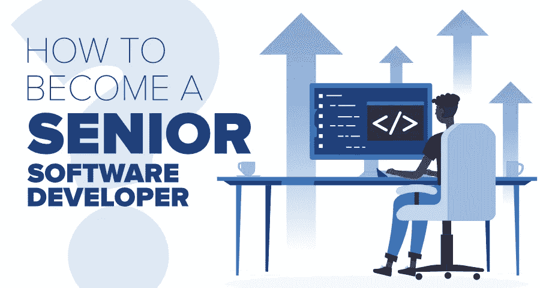

# 如何成为一名高级后端开发者及超越？

> 原文：<https://medium.com/javarevisited/how-to-become-a-senior-backend-developer-and-beyond-846e8a8ae4a0?source=collection_archive---------0----------------------->

图片来源:[https://media . geeks forgeeks . org/WP-content/cdn-uploads/20200608213555/How-to-be-a-Senior-Software-developer . png](https://media.geeksforgeeks.org/wp-content/cdn-uploads/20200608213555/How-to-Become-a-Senior-Software-Developer.png)

大家好！！！在这篇文章中，让我们看看成为高级后端工程师和更高级的工程师需要什么样的技能

如今，我们大多数人都会用 Java8 编码，并且熟悉 Streams、Lambda 等等。甚至我们中的许多人都会是非常优秀的程序员，他们能够很好地处理数据结构，并且能够轻松地解决复杂的问题。但是这些技能并不足以…