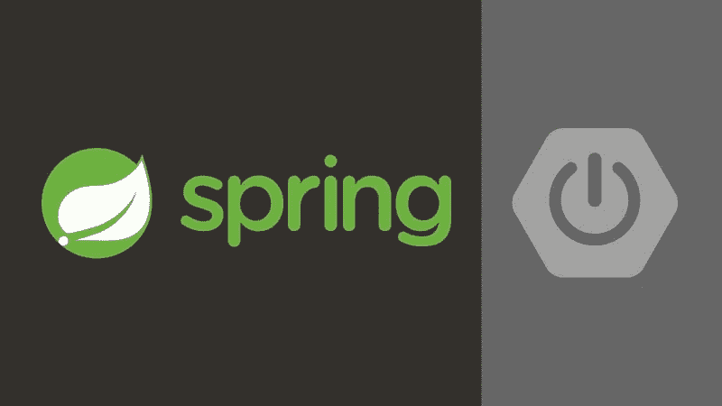
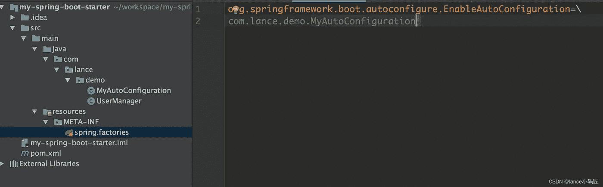
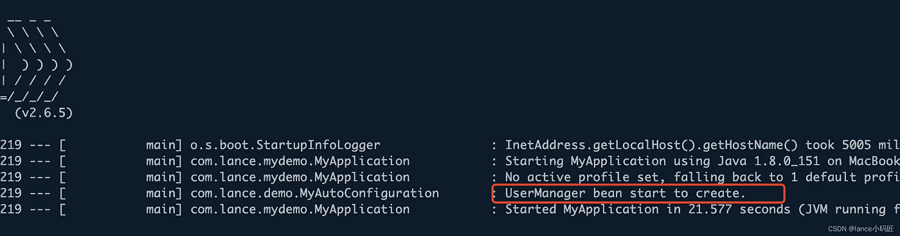

# 如何构建自定义 Spring Boot 启动器

> 原文：<https://medium.com/javarevisited/how-to-build-a-custom-spring-boot-starter-1643fc33a903?source=collection_archive---------1----------------------->

我的代码库可以使用 spring boot 自动配置。太酷了。

[](https://www.java67.com/2017/11/top-5-free-core-spring-mvc-courses-learn-online.html)

作为一个企业 java 程序员，spring boot 太方便了，我离不开它。它的`auto-configuration`特性允许我们通过几个简单的步骤运行您的应用程序。 [Spring boot](/javarevisited/10-free-spring-boot-tutorials-and-courses-for-java-developers-53dfe084587e) 提供了很多入门工具，让你的开发更快更简单。你不必担心复杂的配置和类库引用。以开发一个 [web 服务](/javarevisited/top-5-books-and-courses-to-learn-restful-web-services-in-java-using-spring-mvc-and-spring-boot-79ec4b351d12?source=---------17------------------)为例。

*   使用一些启动器依赖项，如`spring-boot-starter`和`spring-boot-starter-web`
*   添加 Webserver 相关参数，如`server.port`
*   启动服务器

我们可以用 [spring boot](/javarevisited/top-10-courses-to-learn-spring-boot-in-2020-best-of-lot-6ffce88a1b6e) 来封装自己的入门库吗？答案是肯定的。那就是 spring-boot，一个扩展性非常好的框架。

## 了解自动配置

现在我们来试着了解一下 [spring boot 的自动配置功能](https://javarevisited.blogspot.com/2018/11/top-5-spring-boot-features-java.html)的原理。要理解这一部分，需要对春开机豆的生命周期有具体的了解。

Spring boot 使用`[@EnableAutoConfiguration](https://www.java67.com/2018/05/difference-between-springbootapplication-vs-EnableAutoConfiguration-annotations-Spring-Boot.html)` [注释](https://www.java67.com/2018/05/difference-between-springbootapplication-vs-EnableAutoConfiguration-annotations-Spring-Boot.html)实现自动配置。这个注释导入了`autoconfigurationImportSelector`类，它在 spring boot 启动时解析`META-INF/spring.factories`文件，然后文件中的所有配置类都被加载到内存中，并注册到 [spring 容器](https://javarevisited.blogspot.com/2012/12/inversion-of-control-dependency-injection-design-pattern-spring-example-tutorial.html)中。`spring.factories`文件是这样的。

```
# Auto Configure
org.springframework.boot.autoconfigure.EnableAutoConfiguration=\
org.springframework.boot.autoconfigure.aop.AopAutoConfiguration
```

在`[BeanFactory](https://javarevisited.blogspot.com/2012/11/difference-between-beanfactory-vs-applicationcontext-spring-framework.html)` <https://javarevisited.blogspot.com/2012/11/difference-between-beanfactory-vs-applicationcontext-spring-framework.html>被创建后，spring boot 将调用一个特定的`beanFactoryPostProcessor` - `ConfigurationClassPostProcessor`来完成配置类解析。目的是将 spring 容器中配置类的`[@Bean](https://www.java67.com/2021/10/pring-bean-example-what-does-bean-annotation-does.html)` [注释](https://www.java67.com/2021/10/pring-bean-example-what-does-bean-annotation-does.html)修改的方法注册为特殊 beans。配置类中定义的 beans 由 spring 容器管理，我们可以用 [spring](/javarevisited/5-advanced-spring-framework-books-experienced-java-developers-should-read-in-2020-best-of-lot-2a786fc5ad31?source=collection_home---4------4-----------------------) 做任何事情。这就是弹簧靴的自动配置原理。

## 创建自定义初学者库

首先，您需要创建一个 spring 项目。下面是我的例子中的 pom.xml。

然后创建您的自动配置类，并像这样在类上添加 [@configuration](https://javarevisited.blogspot.com/2019/02/difference-between-contextconfiguration-and-springapplicationConfiguration-annotations-in-spring-boot-testing.html#axzz7BnOZ1wuB) 注释。

在这个演示中，我创建了一个`MyAutoConfiguration`类，希望注入一个`UserManager`的 java bean。

最后，在`resources`目录下创建一个名为`META-INF`的目录，并创建一个名为`spring.factories`的文件，这个文件需要配置你的配置类。如下图所示:

[](https://javarevisited.blogspot.com/2021/11/how-to-create-your-first-mvc-application-using-spring-mvc-.html)

恭喜你。你的弹簧靴起动器已经准备好工作了。可以像这样在 maven pom.xml 中使用这个 starter。

```
<dependency>
        <groupId>com.lance.demo</groupId>
        <artifactId>my-spring-boot-starter</artifactId>
        <version>1.0.0-SNAPSHOT</version>
   </dependency>
```

下面是运行这个应用程序的输出。



现在试着用 spring boot 打包你的类库。感谢阅读。

</javarevisited/13-topics-you-should-prepare-for-your-next-spring-boot-interview-5f2993a04ff5>  </javarevisited/21-spring-mvc-rest-interview-questions-answers-for-beginners-and-experienced-developers-21ad3d4c9b82>  </javarevisited/top-22-skills-professional-java-programmers-can-learn-in-2022-to-upgrade-themselves-bc3da73d7491> 