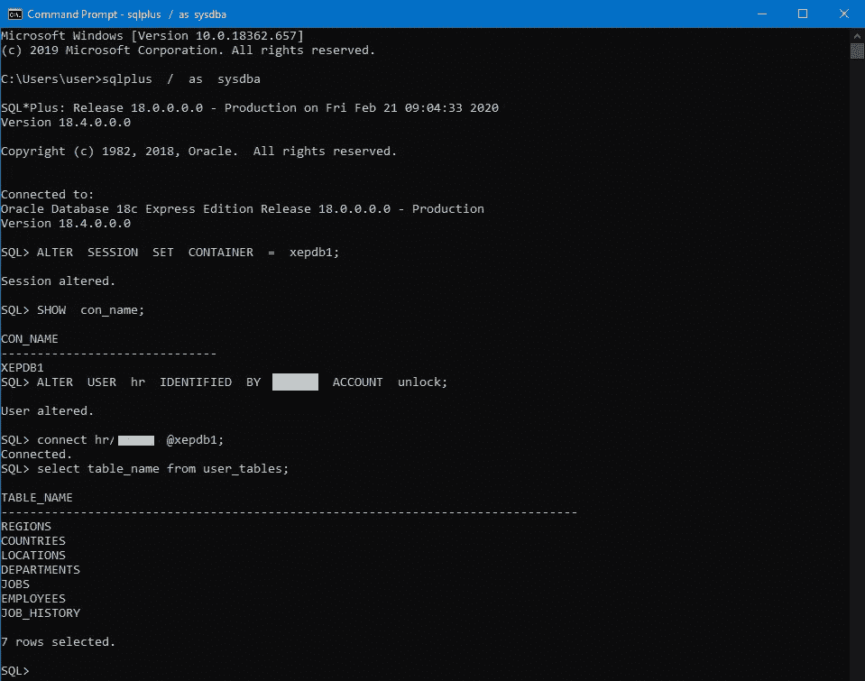
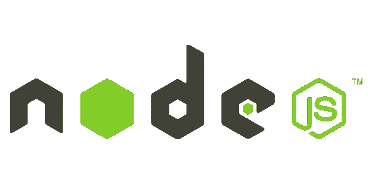

# 用 Node.js 和 Oracle 18c 构建一个 REST API。

> 原文：<https://medium.com/javarevisited/how-to-build-a-rest-api-with-node-js-and-oracle-18c-xe-f57bbbdd9b09?source=collection_archive---------0----------------------->

在本教程中，我们将介绍如何使用 node.js 和 Oracle 18c XE 构建 REST API。


尼古拉·塔拉先科在 [Unsplash](https://unsplash.com?utm_source=medium&utm_medium=referral) 上的照片

# 1.安装和配置 Oracle 18c XE 数据库。

[](https://javarevisited.blogspot.com/2021/05/top-5-oracle-database-and-plsql-online-courses.html#axzz7Bnf7jkFg)

为您的操作系统下载并安装 [Oracle 18c XE](https://www.oracle.com/database/technologies/xe-downloads.html) 。

安装完成后，打开 bash shell 并键入以下命令:

```
//connect to oracle db
sqlplus  /  as  sysdba//change container
ALTER  SESSION  SET  CONTAINER  =  xepdb1;//check for the container
SHOW  con_name;//unlock hr user change <PASSWORD> field with your password
ALTER  USER  hr  IDENTIFIED  BY  <PASSWORD>  ACCOUNT  unlock;//connect to hr schema
connect hr/<PASSWORD> [@xepdb1](http://twitter.com/xepdb1);//query user tables
select table_name from user_tables;
```



上面命令的输出示例

在这个阶段，我们已经解锁了 HR 模式，并准备编写一些代码。

如果您在安装或与数据库的连接方面有问题，请查看一篇有用的文章:

[如何解锁 Oracle 数据库 18c 中的 HR 用户(示例模式)](http://www.rebellionrider.com/how-to-unlock-hr-user-in-oracle-database-18c-by-manish-sharma/)

# 2.使用 node.js 连接到 Oracle 18c XE



创建新文件夹:

```
mkdir nodeOracleRestApi
```

创建一个新的 node.js 项目:

```
cd nodeOracleRestApi
npm init -y
```

使用 npm 安装 **express** 和 **oracledb** 库:

```
npm i express
npm i oracledb
```

我们将 **express** 用于我们的 web 应用程序框架，将 **oracledb** 用于连接 oracle 18c xe。

创建一个名为 checkConnection.js 的文件，并粘贴以下代码:

nodoraclerestapi/check connection . js

运行您的节点应用程序:

```
node checkConnection.js
```

您必须在控制台上看到:

```
connected to database
close connection success
```

恭喜你！您已成功连接到 Oracle 18c XE 数据库。

[](https://javarevisited.blogspot.com/2018/01/top-5-nodejs-and-express-js-online-courses-for-web-developers.html) [## 面向 Web 开发人员的前 5 名 Node.js 和 Express JS 在线课程

### 毫无疑问，JavaScript 是世界上第一编程语言，Node.js 是最大的原因之一…

javarevisited.blogspot.com](https://javarevisited.blogspot.com/2018/01/top-5-nodejs-and-express-js-online-courses-for-web-developers.html) 

# 3.创建您的 Rest API 应用程序。

创建一个名为 index.js 的文件，并粘贴以下代码:

nodoraclerestapi/index . js

## 3.1 让所有员工。

我们的第一个 REST API 端点将发送来自 **hr.employees** 表的所有雇员:

```
//GET request to fetch all employeess
[http://localhost:3000/employees](http://localhost:3000/employees)
```

服务于***/员工*** 终点的代码是:

```
//GET /employessapp.get('/employees', function (req, res) {//fetch all employees from db and send itselectAllEmployees(req, res);})
```

上面的代码在 ***/employees*** 接受 http get 请求，并调用 selectAllEmployees(req，res)函数。

```
async function selectAllEmployees(req, res) {try {connection = await oracledb.getConnection({user: "hr",password: password,connectString: "localhost:1521/xepdb1"});console.log('connected to database');let query = 'SELECT * FROM employees';// run query to get all employeesresult = await connection.execute(query);} catch (err) {//send error messagereturn res.send(err.message);} finally {if (connection) {try {// Always close connectionsawait connection.close();console.log('close connection success');} catch (err) {console.error(err.message);}}if (result.rows.length == 0) {//query return zero employeesreturn res.send('query send no rows');} else {//send all employeesreturn res.send(result.rows);}}}
```

在 **selectAllEmployees(req，res)** 函数中，我们打开一个与数据库的连接，运行一个获取所有雇员的查询，关闭与数据库的连接，最后向客户端发送一个包含查询数据的响应。

运行您的代码:

```
node index.js
```

现在从浏览器点击 REST API 端点[http://localhost:3000/employees](http://localhost:3000/employees)，您将看到所有 106 名雇员。

[](https://javarevisited.blogspot.com/2018/02/top-5-restful-web-services-with-spring-courses-for-experienced-java-programmers.html#axzz61O27yGjY) [## 前 5 名 RESTful Web 服务，为有经验的开发人员提供 Spring 和 Java 课程

### 在上一篇文章中，我已经分享了一些用 Spring 框架学习微服务开发的课程，今天，我将…

javarevisited.blogspot.com](https://javarevisited.blogspot.com/2018/02/top-5-restful-web-services-with-spring-courses-for-experienced-java-programmers.html#axzz61O27yGjY) 

## 3.2 获取带有 id 参数的员工。

第二个 REST API 端点将从 **hr.employees** 表中发送一个带有 **id** 参数的雇员:

```
//GET request to fetch /employee?id=<id employee>
[http://localhost:3000/employee?id=101](http://localhost:3000/employee?id=101)
```

服务于 ***的代码/员工？id =<employee _ id>***终点是:

```
//GET /employee?id=<id employee>app.get('/employee', function (req, res) {//get query param ?idlet id = req.query.id;// id param if it is numberif (isNaN(id)) {res.send('Query param id is not number')return}selectEmployeesById(req, res, id);})
```

上面的代码在 ***/employee 接受 http GET 请求？id =<employee _ id>***调用 selectEmployeesById(req，res，id)函数。

```
async function selectEmployeesById(req, res, id) {try {connection = await oracledb.getConnection({user: "hr",password: password,connectString: "localhost:1521/xepdb1"});let query = 'SELECT * FROM employees where employee_id=:id';// run query to get employee with employee_idresult = await connection.execute(query, [id]);} catch (err) {//send error messagereturn res.send(err.message);} finally {if (connection) {try {// Always close connectionsawait connection.close();} catch (err) {return console.error(err.message);}}if (result.rows.length == 0) {//query return zero employeesreturn res.send('query send no rows');} else {//send all employeesreturn res.send(result.rows);}}}
```

在 **selectEmployeesById(req，res，Id)** 函数中，我们打开一个与数据库的连接，运行一个查询来获取 id 为***id =<employee _ id>***的雇员，关闭与数据库的连接，最后向客户端发送一个包含查询数据的响应。

运行您的代码:

```
node index.js
```

现在从浏览器点击您的 REST API 端点[http://localhost:3000/employee？id=101](http://localhost:3000/employee?id=101) ，您将看到 employee_id=101 的雇员。

# **4。结论**

这是一个示例 REST API 应用程序，它通过 ***Node.js*** 连接到 ***Oracle 18c XE*** ，并接受两个单独的 http GET 请求:

> 获取所有员工
> 
> 获取***/员工***
> 
> 获取 id= <employee_id>的员工</employee_id>
> 
> 得到***/员工？id =<employee _ id>***

您可以从 github 下载示例应用程序:

[https://github.com/petranb2/nodeOracleRestApi](https://github.com/petranb2/nodeOracleRestApi.git)

## 参考资料:

1.  [node.js](https://nodejs.org/en/)
2.  [甲骨文 18c XE](https://www.oracle.com/database/technologies/appdev/xe.html)
3.  [快递框架](https://expressjs.com)

# 您可能还喜欢:

[](/javascript-in-plain-english/learn-to-use-regular-expressions-like-a-ninja-in-node-js-20cfb6806f26) [## Node.js 中的正则表达式备忘单

### 轻松学习、编写和执行正则表达式的详细故事。

medium.com](/javascript-in-plain-english/learn-to-use-regular-expressions-like-a-ninja-in-node-js-20cfb6806f26) [](/@pkoulianos/how-to-schedule-cron-jobs-and-set-health-checks-in-node-js-93cf88d2c247) [## 如何在 Node.js 中调度 Cron 作业和设置健康检查

### 使用 node.js 中的 Cron 作业自动化您的任务

medium.com](/@pkoulianos/how-to-schedule-cron-jobs-and-set-health-checks-in-node-js-93cf88d2c247)