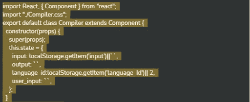
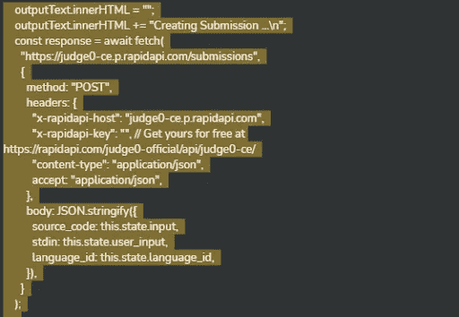
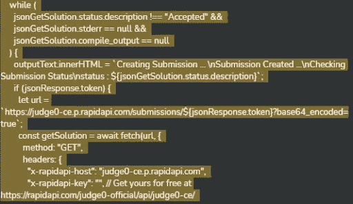
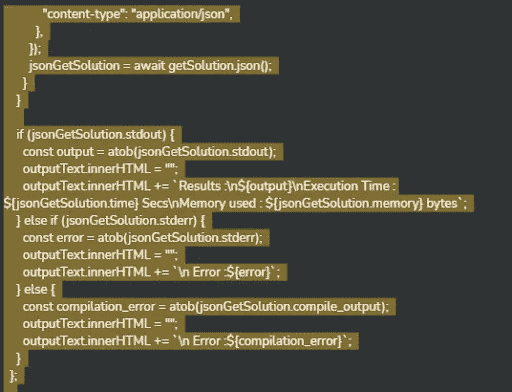
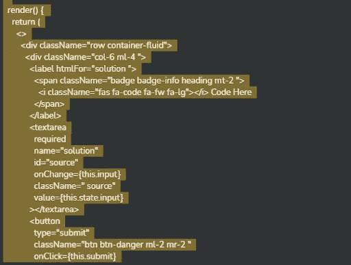
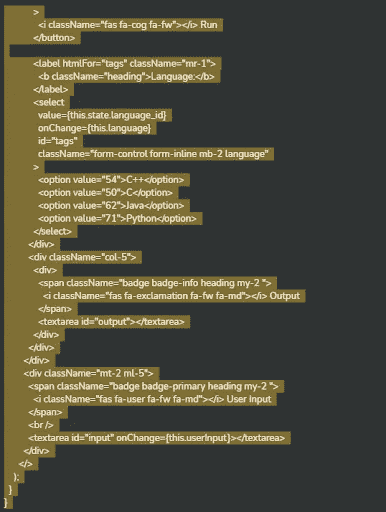
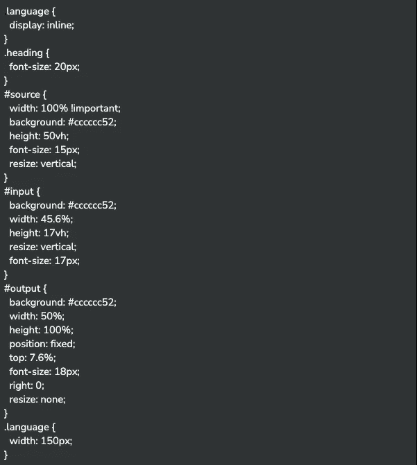
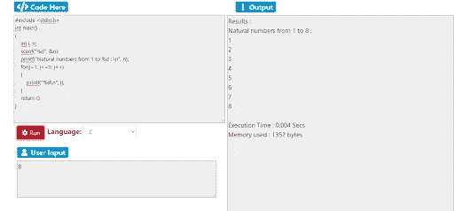

# 如何构建在线 Java 编译器

> 原文：<https://medium.com/javarevisited/how-to-build-an-online-java-compiler-c3210cca1917?source=collection_archive---------0----------------------->

编码可能是一个棘手而漫长的过程，这使得忽略可能影响结果质量的编译错误变得很容易。因此，[开发工具](/javarevisited/10-best-java-development-tools-you-can-learn-66f7d4d837e6)被引入来帮助减轻过程的压力并提高代码的质量。

这些工具可以在线访问，也可以作为桌面应用程序来提高开发人员的工作效率。 [Java](/javarevisited/10-best-places-to-learn-java-online-for-free-ce5e713ab5b2) 被认为是实现和使用最简单的编程语言之一。

然而，错误是不可避免的。在线 Java 开发工具，包括 [IDE](/javarevisited/6-free-best-eclipse-ide-courses-for-java-programmers-1229ee9e5d87) 、代码编辑器、编译器和解释器，可以帮助避免错误。本文将关注如何为开发人员构建一个在线 Java 编译器，并帮助他们完成这个过程。

你希望在没有安装电脑的情况下钻研 Java 编程吗？如果是这样，你来对地方了。我们还将关注不同的在线 java 工具[比如 Java 编译器在线，它允许你修改、设计、调试和运行 Java 代码，等等。](https://javarevisited.blogspot.com/2019/02/10-tools-advanced-java-developers-should-know.html)

在线 java 编译器的功能范围从简单的转换器转换。java 文件到。类文件添加到一个全面的基于云的在线 java IDE 中，该 IDE 可用于管理 java 项目。

# 什么是 Java 编译器？

Java 是一种强类型语言，这意味着变量应该保存正确的数据类型。在强类型语言中，变量不能包含不正确的数据类型。

这是 Java 编程语言中非常好的一个安全特性。Java 编译器负责仔细检查变量，以发现数据类型保存中的任何疏忽。一些[异常](https://javarevisited.blogspot.com/2016/09/2-reasons-of-orgspringframeworkbeansfactory-beanCreationException-Error-creating-bean-with-name.html)可能会在运行时发生，这对于 Java 的动态绑定特性是必不可少的。

[随着 Java 程序的运行，](https://javarevisited.blogspot.com/2011/11/run-java-program-from-command-prompt.html)它可能会引入以前不存在的新对象，因此为了具有一定的灵活性，在变量可以保存的数据类型中允许一些异常。

Java 编译器为那些除了注释之外不会编译的代码段设置了一个过滤器。编译器不解析注释，保持原样。Java 代码支持程序中的三种类型的注释。

*   /*在此评论*/
*   /**此处为文档注释*/
*   //在此评论

Java 编译器会忽略//之后/*和*/或/**和*/或之间的任何内容。

它处理严格检查任何语法违反，并被设计成一个字节码编译器，在实际的程序文件之外，它创建一个纯字节码构造的类文件。

Java 编译器被认为是安全性的第一个阶段，是第一道防线，在这里检查变量中不正确的数据类型。

错误的数据类型会严重损害程序及其外部。此外，编译器会检查是否有任何代码试图强制执行受限制的代码，如私有类。

它限制对代码、类或关键数据的未授权访问。Java 编译器渲染字节码/类文件，这些字节码/类文件在体系结构上与平台无关，并且不需要 JVM ( [Java 虚拟机](/javarevisited/7-best-courses-to-learn-jvm-garbage-collection-and-performance-tuning-for-experienced-java-331705180686))来执行，它将在任何体系结构、平台或设备中运行。

# 在线和离线 IDE 的区别

## 脱机 ide

有许多离线 ide 可供开发人员使用，以保持更高的工作效率、理解能力和工作效率。Eclipse 40 不仅仅是一个 Java 编辑器。它的显著优点是通过跳转方法完成代码，这减少了编写文档的时间。

它带有一个内置的语法检查，以解决在项目编码过程中任何键入错误的单词。我们对 IDE 的期望是它们的模板、与不同 SCMSs 的集成、代码完成以及与构建系统的集成。

IDE 的代码格式化和清理工具非常吸引人，它的构建系统运行良好且直观。此外，它还配备了查找和替换功能，特定项目的变量和类以及重构功能。

一个免费的直观编辑器，NetBeans 32 可以完成所有工作。它有一个简单的“Swing GUI”设计工具，通过拖放组件(例如文本框或按钮)来开发用户界面。一个缺点是，考虑到它的所有特性，与其他 ide 相比，加载时间会增加，并且会占用更多的内存。

[IntelliJ IDEA 7](/javarevisited/7-best-courses-to-learn-intellij-idea-for-beginners-and-experienced-java-programmers-2e9aa9bb0c05) 是最有效的离线编辑器，但不是免费的。它比大多数编辑器都快，但是它有几个问题。一个主要的缺点是它占用太多的内存。

BlueJ 10 是一个简单的编辑器，主要用于教授 java 和[面向对象编程](/javarevisited/6-best-object-oriented-programming-books-and-courses-for-beginners-d46235cbda49)。与其他 ide 相比，这个编辑器的主要优点是它不需要主方法来运行程序。

## 在线 IDEs

一个在线 IDE，CodeRun Studio 64 让你设计 web 应用程序。它允许你在线运行和测试代码，并允许你在付费继续使用之前有 14 天的试用期。

在试用期间，“保存”功能也被禁用，这使得该程序很难使用。Cloud9 IDE 39 Cloud9 IDE 是另一个开源的 3.0 版本，以及更高版本的在线集成开发环境。

它支持好几种编程语言，比如 [JavaScript](/javarevisited/my-favorite-free-tutorials-and-courses-to-learn-javascript-8f4d0a71faf2) 、 [PHP](/javarevisited/10-best-php-courses-for-beginners-and-experienced-developers-db18057a814f) 、 [Ruby](/javarevisited/10-best-ruby-on-rails-courses-for-beginners-dca4d66e9f7b) 、 [Perl](https://javarevisited.blogspot.com/2021/11/top-5-courses-to-learn-perl-programming.html) 、 [Python](/javarevisited/10-free-python-tutorials-and-courses-from-google-microsoft-and-coursera-for-beginners-96b9ad20b4e6) 、with [Node.js](/javarevisited/top-10-online-courses-to-learn-node-js-in-depth-8ef0e31ca139) 、 [Go](https://javarevisited.blogspot.com/2021/12/5-free-courses-to-learn-golang-for.html) 。它允许程序员使用预设的工作区立即开始编码，利用协作编码功能和 [web 开发](/javarevisited/10-of-the-most-popular-javascript-frameworks-libraries-for-web-development-in-2019-a2c8cea68094)功能(如实时预览(“所见即所得”)和浏览器兼容性测试，与他们的同行合作。它几乎完全是用 JavaScript 编写的，并且在后端使用了 Node.js。编辑器组件利用 Ace。

# 如何构建在线 Java 编译器

为你的项目设计一个编译器是一件乏味的工作。在本文中，我们将向您展示如何在 Judge0 的帮助下，用不到 200 行代码在 ReactJs 中创建自己有趣的简单在线编译器。

Judge0 是一个可扩展的、健壮的开源在线代码执行系统，可以设计各种应用程序，包括竞争性编程平台、在线代码编辑器、教育和招聘平台等。

Judge0 支持 50 多种语言，如果你想增加更多的语言支持，你可以浏览官方文档并根据你的需要加入任何语言。我们将设计一个支持 4 种语言的编译器，分别是 [C/C++](/javarevisited/top-10-courses-to-learn-c-for-beginners-best-and-free-4afc262a544e) / [Python](/javarevisited/8-projects-you-can-buil-to-learn-python-in-2020-251dd5350d56) 和 [Java](https://javarevisited.blogspot.com/2018/08/top-5-java-8-courses-to-learn-online.html) 。

建议你按照内容原样，一丝不苟的按照每一步来。设计一个在线代码编辑器和编译器似乎太复杂了，但是我们可以把它分成两部分。

*   运行在后端服务器上的 API，它将占用一段代码和语言作为输入，并在服务器上运行代码后输出答案
*   前端代码编辑器，我们可以在这里选择语言并编辑和更改代码。Post，我们可以向后端 API 发出 post 请求，并在网站上显示输出。

**表格内容:**

*   获取您的 API 密钥
*   设计 React 应用
*   构建您的组件

**后续步骤:**

**-获取您的 API 密钥:**

在[https://rapidapi.com/judge0-official/api/judge0-ce/](https://rapidapi.com/judge0-official/api/judge0-ce/?ref=faun)免费获得您的 API 密钥

**-创建您的 React 应用:**

按照以下步骤创建您的 [React 项目](/javarevisited/5-projects-you-can-build-to-learn-react-js-ffaaac23d4f0)

npx 创建-反应-应用我的应用

cd 我的应用程序

npm 开始

**-创建组件:**

让我们先创建一个编译器文件夹。这个文件夹将保存与编译器相关的文件。

在**编译器**中创建一个名为 **Compiler.js** 的文件

让我们一步步地理解代码:

*   我们已经利用了 4 个状态。
*   用户提供的源代码，输入处理它。
*   从 judge0 编译器导出的输出，提交代码后由 coutput 处理
*   language_id 管理我们希望用来编译源代码的语言
*   user_input 处理用户给出的 stdin 输入。
*   第一个 fetch 请求创建提交给 judge0 编译器的内容，并返回一个惟一的令牌。
*   在第二个获取请求中的惟一标记的帮助下，我们取回了提交的代码的结果/输出。
*   我们在渲染方法中使用了一些 JSX。

**注意:**上面的文件使用了 Font Awesome 和 [Bootstrap](/javarevisited/6-best-bootstrap-online-courses-for-web-designers-and-developers-a688e192b2e2) 实例，所以一定要在 public 文件夹下的 index.js 文件中输入它们的 cdn 链接。

## 说明

从 react 和 acss 文件 Compiler.css 导入包“Component”

从编译器继承组件类并使用构造函数初始化其状态。

下一个任务是捕获已经发生的事件，并记录其目标值。类似地，任何用户输入也被记录为用户事件。

现在，主要任务是获取我们希望编译器识别的编程语言的 language_id。
在本例中，它是 Java，language_Id 是 62。

接下来，使用 REST 调用，我们使用 API 键发布上述信息

提交编译器的上述详细信息后，等待回复，即我们输入的详细信息是否已被接受。

第一个 fetch 请求创建我们提交给 judge0 编译器的请求，并返回一个唯一的令牌。

如果提交被接受，那么使用 REST 调用的 [GET 方法](https://javarevisited.blogspot.com/2012/03/get-post-method-in-http-and-https.html)我们将获得详细信息。

在第二个获取请求中的惟一标记的帮助下，我们取回了提交的代码的结果/输出。

接下来，我们启动 React 应用程序，并将其内容指定为 [JSON](https://javarevisited.blogspot.com/2022/03/3-examples-to-parse-json-in-java-using.html) ，因为前面 GET 调用的输出以 JSON 格式给出了结果。
然后显示来自编译器的解决方案。
如果编译器检测到任何错误，就会抛出一个错误。

接下来，创建一个表单，允许创建编译器的用户对他/她将要创建的编译器进行各种输入和选择。
该表单条目存储在函数 render()中，每当新的编译器细节被接受时，该函数就会被调用。
我们在渲染方法里面有一些 JSX。

编译器功能部分在这里。我们整合了对 C/C++/Python 和 Java 的执行支持。让我们在编译器文件夹下创建一个名为 Compiler.css 的新文件。

因此，我们使用 judge0 在 react 中创建了一个简单的在线编译器。您也可以运行您的程序，从这个[源](https://www.interviewbit.com/online-java-compiler/)构建一个编译器。

# 结论

世界正朝着科技的方向发展，每个人都在寻求至少搞清楚编程的基础，不管他们是哪个领域的。对许多人来说，构建整个系统来运行一些代码片段可能既耗时又无用。

因此，在线现成的编译器和编辑器非常有用。特别是如果你不是编程出身的话。无论如何，建立本地工作站或服务器的传统观念不再受欢迎，在线基于云的开发工具正在成为规范。

这篇文章中提到的 InterviewBit 的在线编译器是最好的，我们真的希望其中一个适合你。