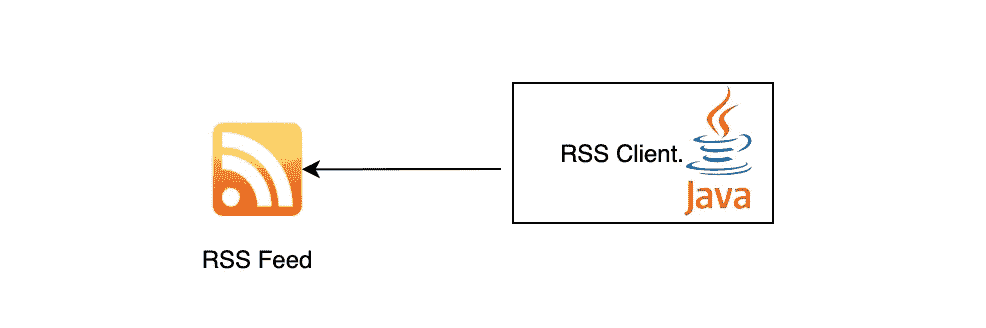

# 如何用 Java 构建 RSS Feed 客户端

> 原文：<https://medium.com/javarevisited/how-to-build-rss-feed-client-in-java-fde5f3fd1569?source=collection_archive---------1----------------------->

## 使用 Java 构建 RSS Feed 定期获取新闻

> 最初发表于<https://asyncq.com/how-to-build-rss-feed-client-in-java>

****

## **介绍**

*   **RSS 提要是从热门网站获取最新新闻文章的常用方式之一。**
*   **在这个博客中，我们将使用 java 库[罗马](https://mvnrepository.com/artifact/com.rometools/rome/1.18.0)库从…**