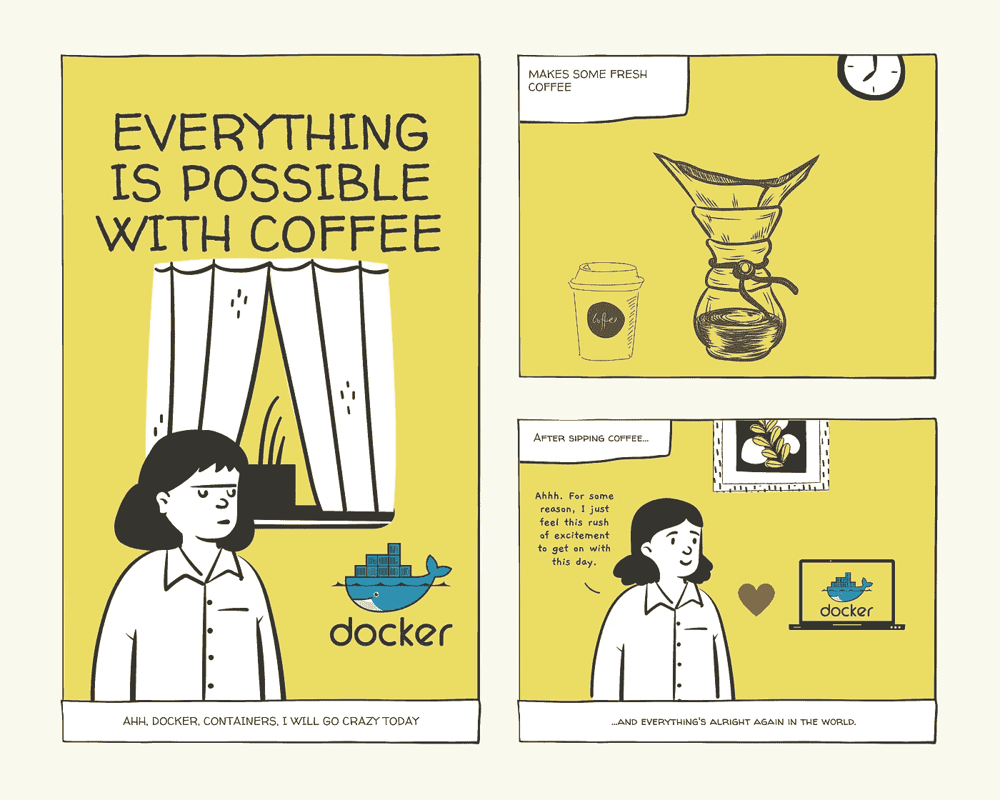

# 如何以 Docker-Lab 测试风格构建、运行和测试一个简单的 SpringBoot 应用程序

> 原文：<https://medium.com/javarevisited/how-to-build-run-and-test-a-simple-springboot-app-in-docker-lab-test-style-e632b57265a8?source=collection_archive---------2----------------------->

像这个小女孩一样喝杯咖啡。

我已经尝试安装和运行 docker 3 次了，但每次都失败了，要么是我的笔记本电脑内存不足，要么是我的 windows 电脑配置不正确。在 windows 机器上安装 Docker 让我头疼，所以这次我试着在…