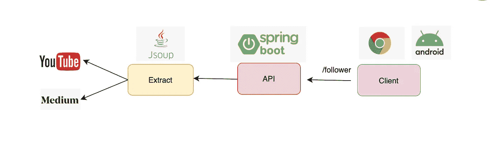

# 如何用 Java 构建社会统计 API

> 原文：<https://medium.com/javarevisited/how-to-build-social-stats-api-with-java-185d8b6dba89?source=collection_archive---------4----------------------->

## 构建 Java API 以提供追随者和订阅者计数

> 最初发表于<https://asyncq.com/how-to-build-social-stats-api-with-java>

****

## **介绍**

*   **如今，我们使用许多社交媒体应用程序。通常，作为内容创建者，我们关心订户数或关注者数。**
*   **在本文中，我们的目标是…**