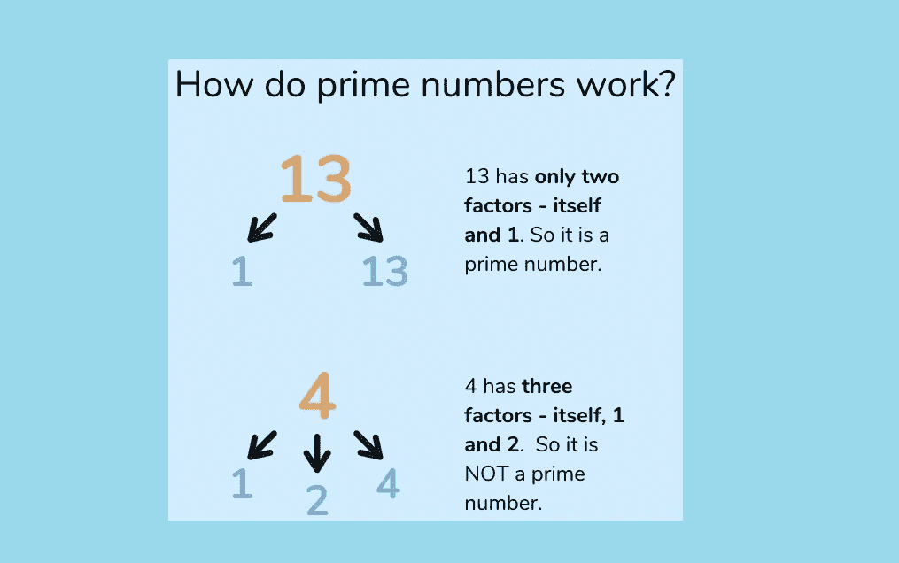

# Java 里怎么查质数？[已解决]

> 原文：<https://medium.com/javarevisited/how-to-check-prime-number-in-java-solved-da08dca780c5?source=collection_archive---------3----------------------->

## 给定一个整数，在 Java 中如何检查它是否是质数？

在写程序检查一个数是否是质数之前，我们先来复习一下**什么是质数？**在数学中，**如果一个数不能被除自身以外的任何数整除，则称该数为素数。**您现在可以将该定义转换成代码并…