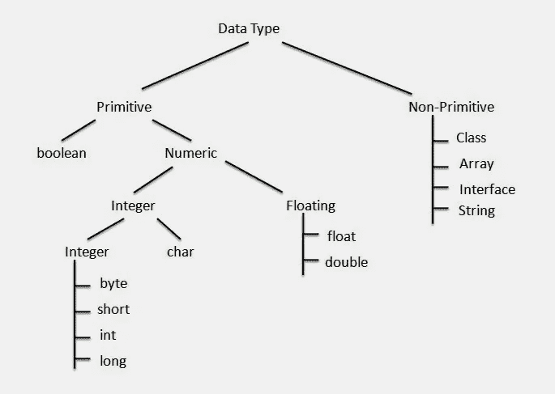

# Java 中如何比较 float 和 double 值？例子

> 原文：<https://medium.com/javarevisited/how-to-compare-float-and-double-values-in-java-example-105a556993c2?source=collection_archive---------6----------------------->

## 在 Java 中比较 float 和 double 值是很棘手的；下面是在 Java 中比较 float 和 double 的正确方法

大家好，如果你一直在做 Java 编程，那么你可能知道在 Java 中使用==运算符不是比较浮点值的正确方法。