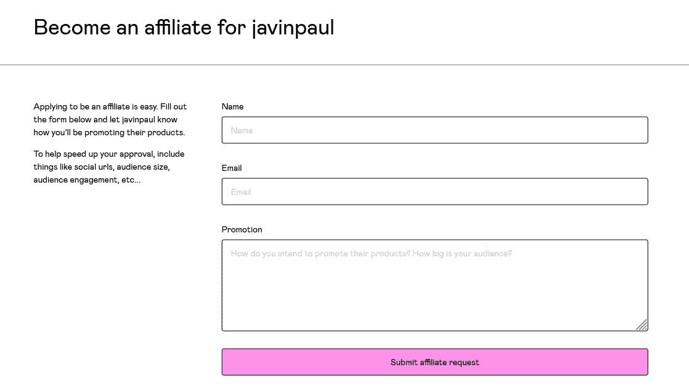

# 如何在 Javarevisited 上发布

> 原文：<https://medium.com/javarevisited/how-to-contribute-to-javarevisited-e95dcb0e8769?source=collection_archive---------0----------------------->

由 [Carli Jeen](https://unsplash.com/@carlijeen?utm_source=medium&utm_medium=referral) 在 [Unsplash](https://unsplash.com?utm_source=medium&utm_medium=referral) 上拍摄的照片

大家好，如果你喜欢写 Java 和其他相关技术，如 Spring、Hibernate、算法、数据结构、设计模式以及你的采访经历，我们很乐意在这里发表你的文章。

只需在 savingfunda@gmail.com 的**上留言**就可以开始了。

你也可以在推特或媒体上联系我，我的 id 是 [javinpaul](https://medium.com/u/bb36d8439904?source=post_page-----e95dcb0e8769--------------------------------)

> 我的目标之一是鼓励 Java 开发人员写他们知道的东西，因为写作能让你成为更好的开发人员。这也有助于你做研究，填补你的知识空白。

这也有助于你的学习，这就是为什么我鼓励许多初级和高级 Java 开发人员写下他们的经历。

## 推广我的书，赚取 50%的佣金

你有一个 Java 或编程博客，想加入我的联盟来推广我的 Java 和 Spring 书籍吗？嗯，你现在也可以加入我提供给我的合伙人 50%的丰厚佣金。

以下是报名链接—[https://javinpaul.gumroad.com/affiliates](https://javinpaul.gumroad.com/affiliates)

## 主题

这里列出了一些我最喜欢的话题，但是你可以随意分享你喜欢的:

1.  Java 语言(一种计算机语言，尤用于创建网站)
2.  编程；编排
3.  编码
4.  设计模式
5.  算法
6.  数据结构
7.  书评
8.  课程回顾
9.  资源
10.  程序员生活
11.  面试问题
12.  程序员的个人故事
13.  排除故障
14.  饭桶
15.  专家
16.  格拉德勒
17.  弹簧框架
18.  冬眠
19.  Spring Boot
20.  云
21.  春天的云
22.  区块链
23.  机器学习
24.  数据科学
25.  Java 8
26.  函数式编程
27.  最佳实践
28.  黯然失色
29.  综合总科
30.  工具
31.  Log4j 和其他日志库
32.  Mockito 和其他单元测试库
33.  结构化查询语言
34.  Linux 操作系统
35.  测试

那么，您还在等什么，准备好与世界各地的 Java 开发人员分享您的想法吗？

万事如意。

## 如果您希望被添加为 Javarevisited 的作者并贡献您的故事，您也可以对本文发表评论。

> 随着出版物的增长，我也在寻找可以帮助编辑和审查故事的人。如果你想成为一名编辑，请在这里评论或给我发电子邮件。

# 小贴士:

一旦你被添加为作者，这里有一些提示，你可以遵循，以获得最大的出版物和媒体本身

1.  **对于新的故事，总是提交草稿给出版社，**这样所有的出版社订阅者都会看到你的帖子，媒体也会推广新的故事。
2.  **前 10 个掌声是最重要的，这就是为什么提交草稿给出版社是重要的。**
3.  *你也可以提交旧的故事，所有的 Java 访客都会看到，这意味着你会获得更多的页面浏览量。*
4.  我还通过我的推特账号[**【http://twitter.com/javinpaul】**](http://twitter.com/javinpaul)**和 Javarevisited 推特账号**[**【http://twitter.com/javarevisited,】**](http://twitter.com/javarevisited,)**关注他们，这样你就可以知道你的故事何时发布，然后你可以转发它们以制造轰动。
    这会给你的故事一个初步的推动**
5.  伟大的故事也在[**Java 访问脸书页面**](https://www.facebook.com/javarevisited) 上分享，该页面拥有 40000 多名粉丝。我也建议你做同样的事情，只要在你做的时候标记@javareivisited，这样我们就知道了，并且可以重新分享。
6.  它们也将在[**javarestived LinkedIn 页面**](https://www.linkedin.com/company/javarevisited) 和[**javarestived 的 Flipboard 页面**](https://amp.flipboard.com/@javinpaul/java-ij6eibilz) 上共享，如果您在 LinkedIn 和 Flipboard 上，那么在您的故事被共享时跟随这些页面以获得通知，然后从您的角色帐户重新共享以放大。
7.  总是在文章的顶部使用一个很棒的特写图片。
8.  始终使用 5 个标签，2 个更具体，3 个宽泛，如编程、Web 开发、编码等。
9.  如果你知道任何对你有帮助的技巧，请随意分享，我可以把它加在这里，这样我们都能从中受益。
10.  将你的故事分享到 Reddit、HackerNew、Twitter、脸书和 LinkedIn，以获得更多曝光率。
11.  与社区中的其他用户接触，阅读他们的故事，评论他们，交朋友，为你喜欢的故事鼓掌，所有这些加起来，当你发布你的故事时，你会收到类似的反馈。

> 在媒体上发表需要很多努力，我们的目标是你应该获得尽可能多的观点和读者。所有伟大的故事都应该得到应有的关注。

祝一切顺利，欢迎来到 Javarevisited！！。