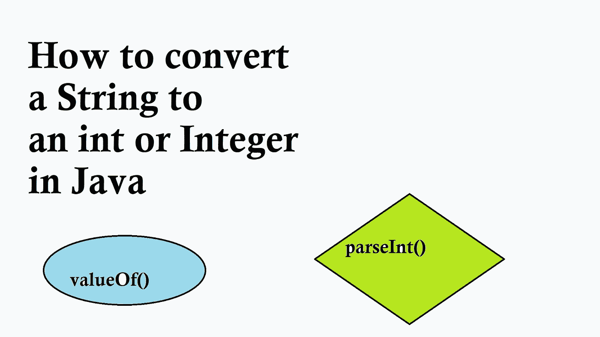

# 如何在 Java 中将 String 转换为 Integer 和 int(附 Example + Pro 提示)

> 原文：<https://medium.com/javarevisited/how-to-convert-string-to-integer-and-int-in-java-with-example-pro-tips-330f0d1deabe?source=collection_archive---------6----------------------->

## 这里有一些简单的编码技巧，用 Java 把一个给定的字符串转换成 int 原语或 Integer 对象，并附有例子。

Java 中有两种主要方法将字符串转换成 int 原语和 Integer 对象:

1)**Integer . parse int()**，它接受一个字符串并返回一个 int…