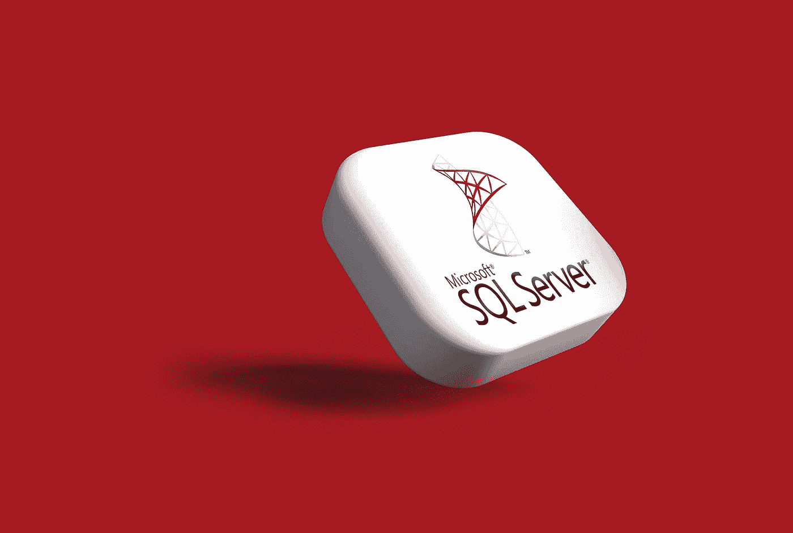

# 如何在 SQL Server 中将 YYYYMMDD 整数值转换为日期时间？

> 原文：<https://medium.com/javarevisited/how-to-convert-yyyymmdd-integer-value-to-datetime-in-sql-server-49bfca8af03e?source=collection_archive---------0----------------------->

## 在 SQL Server 中将 int 日期值转换为正确的 DATETIME 值的一个简单技巧

[Rubaitul Azad](https://unsplash.com/@rubaitulazad?utm_source=medium&utm_medium=referral) 在 [Unsplash](https://unsplash.com?utm_source=medium&utm_medium=referral) 上拍摄的照片

在编写存储过程或 SQL 查询时，我们经常需要将 VARCHAR 转换为 DATETIME，或者将 INT 值转换为 DATETIME。在本文中，我将与大家分享**如何在 YYYYMMDD** 中转换 INT 值…