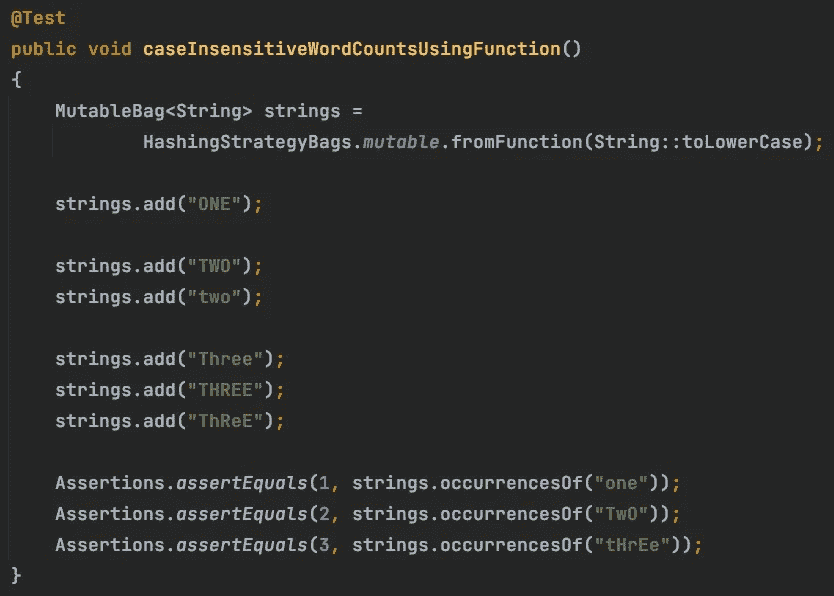
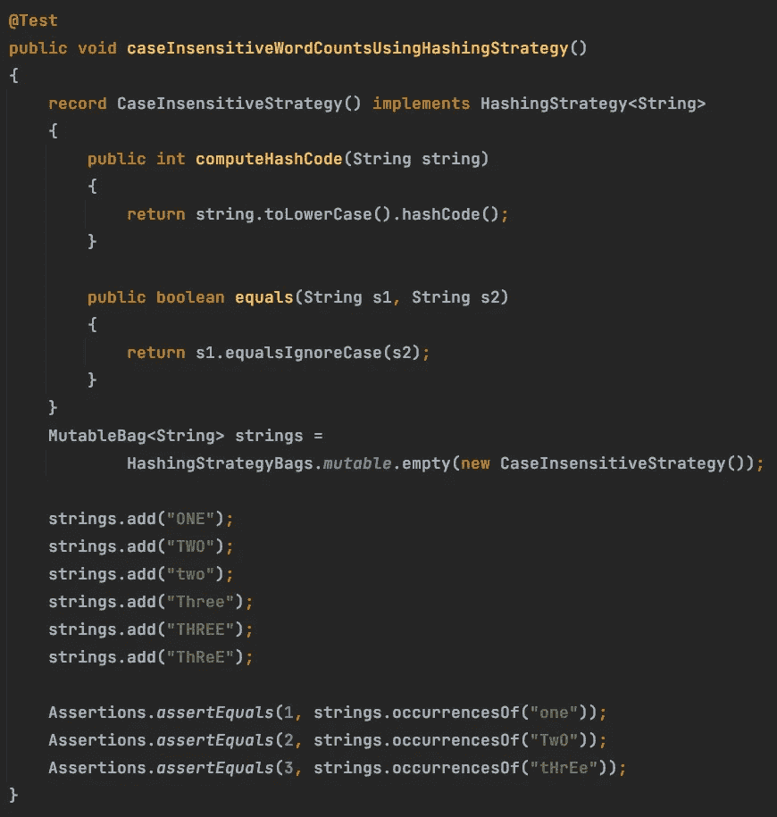

# 如何使用 Eclipse 集合创建不区分大小写的包

> 原文：<https://medium.com/javarevisited/how-to-create-a-case-insensitive-bag-using-eclipse-collections-9dbc2495796c?source=collection_archive---------4----------------------->

学习如何在 Java 中计算字符串而不用担心它们的大小写。



Eclipse 集合中的 HashingStrategyBags 允许为对象定制 HashingStrategy

# 不考虑大小写如何计算字符串？

使用`HashingStrategyBags`工厂很容易构建 [Eclipse 集合](https://github.com/eclipse/eclipse-collections)中的`HashBagWithHashingStrategy`。上例中的`HashingStrategy`将基于方法引用`String::toLowerCase`指定的`Function`。然后，我们可以将`String`实例添加到`strings`变量中的`MutableBag`中，并在不考虑大小写的情况下查找它们的出现。`hashCode`和`equals`将以先转换每个`String`和`toLowerCase`为基础。

## 什么是哈希策略？

一个`HashingStrategy`是一个接口，它可以被实现来为另一个对象指定一个`hashCode`和`equals`实现。`HashingStrategy`定义了两个必须实现的方法。

```
public interface HashingStrategy<E>
{
int computeHashCode(E object);

boolean equals(E object1, E object2);
}
```

## 我如何定义哈希策略？

您可以使用名为`HashingStrategies`的工厂类从`Function`构建一个`HashingStrategy`。

```
HashingStrategy<String> hashingStrategy = 
        HashingStrategies.*fromFunction*(String::toLowerCase);
```

这就是上面例子中的代码所做的。但是，您可能希望对实现有更多的控制，以减少潜在的垃圾生成。实现不区分大小写的`HashingStrategy`的另一种方法是生成更少的垃圾，如下所示。



使用实现 HashingStrategy 接口的记录创建 HashingStrategyBag

这个`HashingStrategy`将比基于`Function`的更有效，因为它不会转换`equals`方法中的两个`String`实例`toLowerCase`。相反，equals 方法将基于`equalsIgnoreCase`方法。我将把它作为一个练习留给读者，让他们以更优化的方式实现`computeHashCode`。

我希望你觉得这很有用。Eclipse 集合也有基于`HashingStrategy`的`Sets`和`Maps`。您可以在下面的博客中找到更多关于这些鲜为人知的数据结构的信息。

</javarevisited/the-missing-java-data-structures-no-one-ever-told-you-about-part-1-f45b6d0ee969>  

感谢您的阅读！

*我是由*[*Eclipse Foundation*](https://projects.eclipse.org/projects/technology.collections)*管理的*[*Eclipse Collections*](https://github.com/eclipse/eclipse-collections)*OSS 项目的创建者和提交者。Eclipse Collections 为* [*投稿*](https://github.com/eclipse/eclipse-collections/blob/master/CONTRIBUTING.md) *打开。*

## 您可能喜欢的其他 Java 文章

</javarevisited/the-java-programmer-roadmap-f9db163ef2c2>    <https://faun.pub/20-dynamic-programming-interview-questions-with-solutions-2a144b1a1e07> 