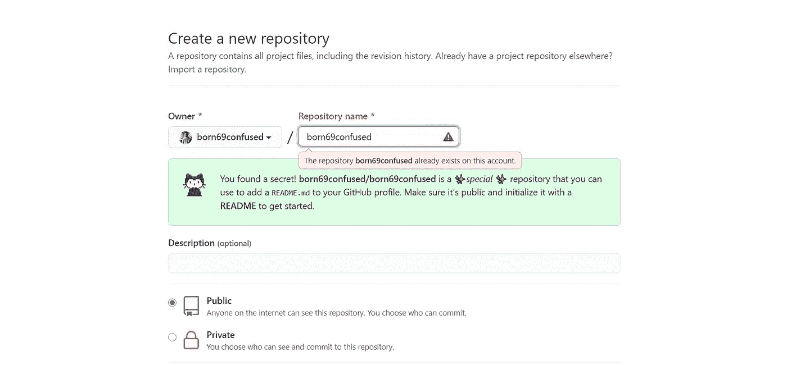
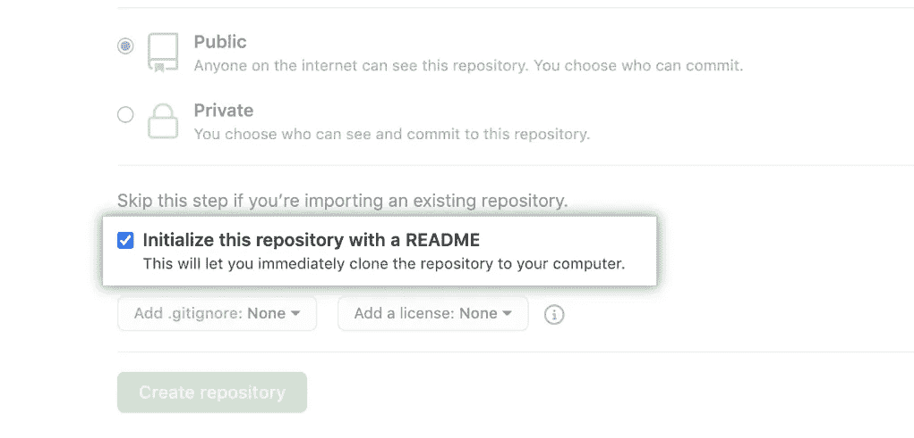
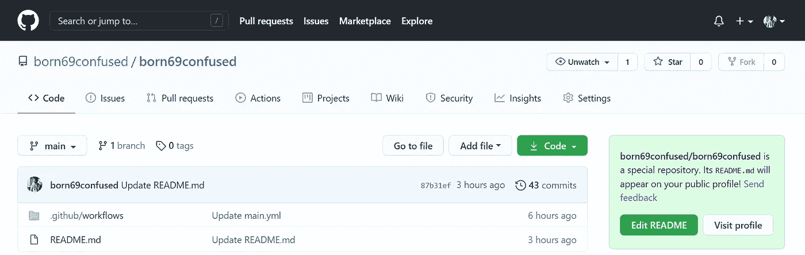
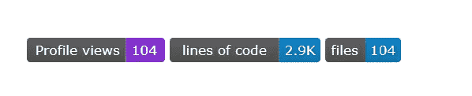
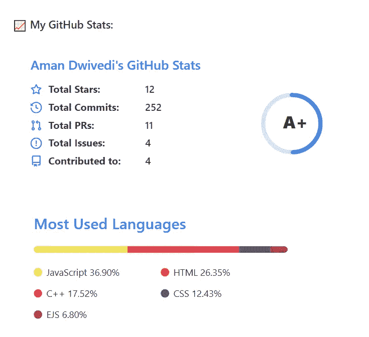

# 如何创建一个娴熟且令人印象深刻的 Github README.md 简介？

> 原文：<https://medium.com/javarevisited/how-to-create-an-adept-and-impressive-github-readme-md-profile-a0466e208a5b?source=collection_archive---------4----------------------->

*最佳小工具+指南。*

众所周知 Github 增加了*一个特殊的资源库*。它的`README.md`会出现在你的*公众号*上！

我们可以修改它，让它尽可能有表现力。它可以包含所有与你的技能、贡献项目等相关的信息。本文将指导您如何创建您的`*Github*` *个人资料。*

# 请遵循以下步骤:

> 第一步:用你的`*Github*`用户名创建一个新的存储库。
> 
> 选择 public 选项并选择 Initialize this repository with a`README`。

比如:born 69 confused/[born 69 confused]

我已经创建了一个存储库，因此显示了已经存在的警告。

创建新的存储库

选择用自述文件初始化

> **第二步:**点击左上方的编辑自述文件按钮。其中将预先填充一些初始内容。

单击编辑自述文件按钮

> **第三步:**你会找到一些预填的东西，加上你的名字，去掉[ <的评论！-]和[->]和`*commit*`，并将更改推至`Github.`
> 
> 打开您的`*Github*`档案，您将看到变化！！！

# 现在美化您的个人资料:

## 徽章

*你可以在这里找到*

*例如:对于 LinkedIn 徽章，请键入 this，*不要忘记键入您的 LinkedIn URL* 来代替`{your-linkedin-url}`，对其他人也是如此。*

> **

**

*不同的徽章*

*   ***访客卡:**只用一行代码就能统计出`README.md`中的`README.md`号、期、PRs 的访客数量。要使用它，您必须用您的`*Github Username*`替换`{username}`。*
*   *片段看起来像这样-*

> *！【访客】(https://visitor-badge . glitch . me/badge？用户名=用户名)*

**

*访客徽章*

*   ***代码、注释、文件的行数标记:**统计代码、文件和注释的行数。要使用它，你必须用你的`*Github Username*` *替换`{username}`，用你的`*Github repository*` *替换`{repository}`，用你的`*code*` *或* `*comment*` *或* `*blanks*` *替换* `{type}`。***
*   片段看起来像这样-

> ！

例如，你应该有这样的东西

！

代码行，文件标记

# GitHub 自述文件统计

*你可以在这里找到*

*这将生成您的`GitHub`档案的总体统计数据。要使用它，你必须用你的`*Github Username*` *替换`{username}`。**

*   *片段看起来像这样-*

> *
> *

**

*我的 Github 统计*

*最后，您应该能够创建您的个人资料。*

*[我的 Github 简介](https://github.com/born69confused)，*

**

*我的概要*

> *以下是一些资源: [Giphy](https://giphy.com/) ，[矢量图像](http://freepik.com/vectors/graphics)，[简介示例](https://github.com/abhisheknaiidu/awesome-github-profile-readme)， [SVG 徽章](https://github.com/badges/shields)*

# *结论*

*感谢阅读，希望这篇文章对你有用。请随意叉我的储存库，不要忘记给一个明星⭐。*