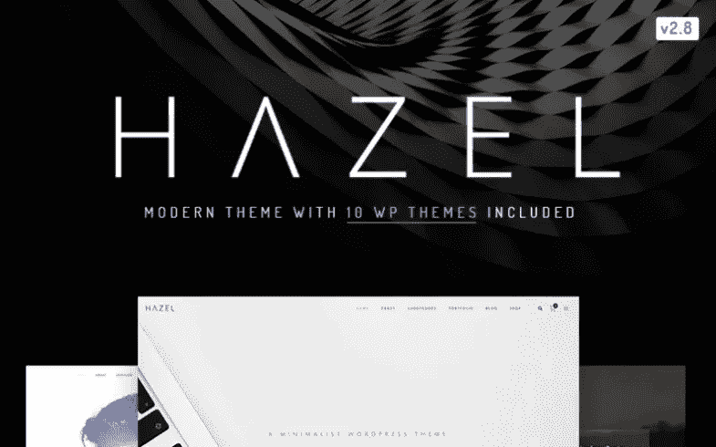
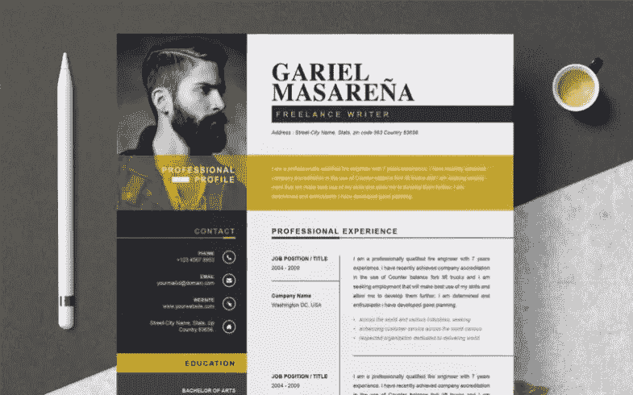
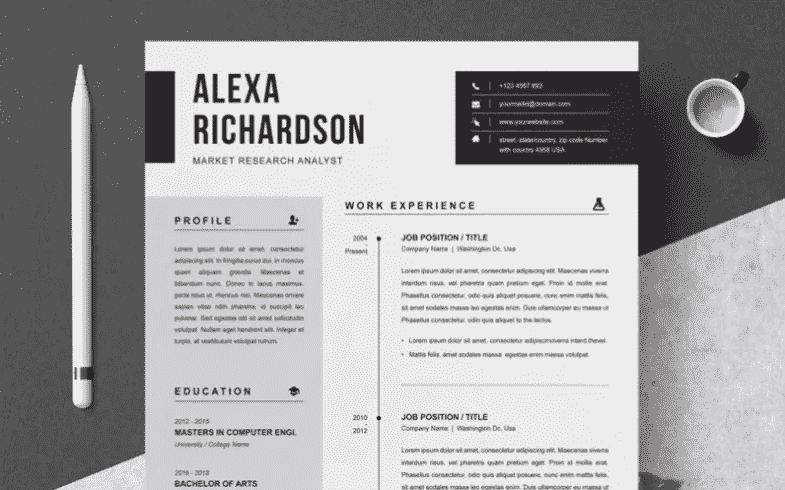
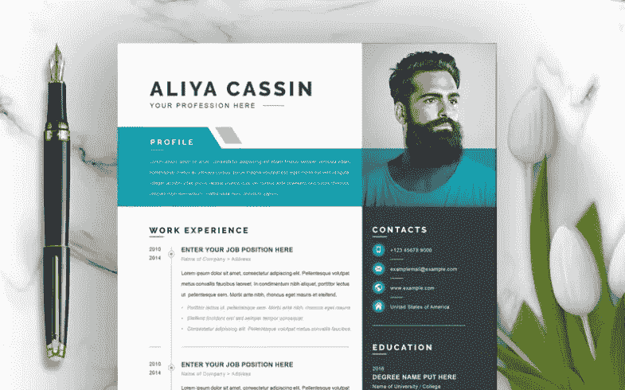
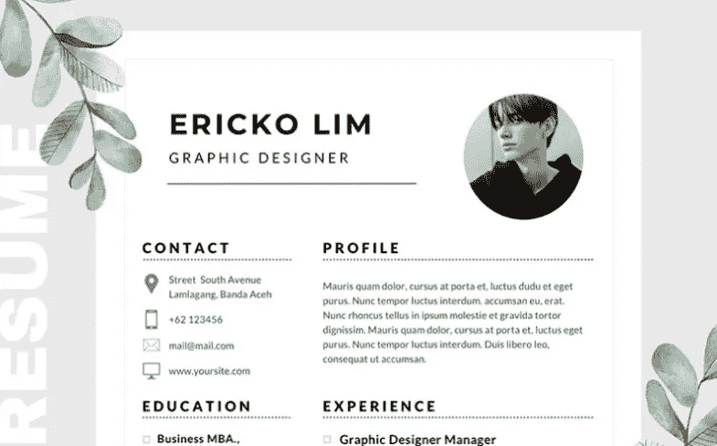

# 如何创建一份优秀的简历:需要了解的主要细节

> 原文：<https://medium.com/javarevisited/how-to-create-an-excellent-cv-main-details-to-know-9626d4527235?source=collection_archive---------2----------------------->

当一个人申请工作时，他或她可能会面临挑战。一位雇主要求写一份简历。另一个要求有你的简历。这样，许多人不明白他们应该做什么。许多资料解释了这种差异:

*   *CV 是英国申请文件；*
*   *简历是美国的申请文件。*

然而，有更多的细节每个人都应该记住。今天，我们将了解他们独特的能力以及如何从中受益…

我已经准备好创建一个令人敬畏的简历了！

## 谁需要写简历？

一般来说，有两种情况下人们会要求简历。这些是研究和教育领域。顺便说一下，如果你不知道的话，简历是一份课程表。

总的来说，它**展示了你的教育和职业**。有了它，你可以谈论你的:

*   该领域的主要成就；
*   奖项；
*   出版物。

举个例子，如果你想进入学术界，简历会是你的助手。除此之外，您可能需要此文件来申请:

*   一个老师；
*   学术研究者；
*   艺术策展人；
*   以及其他与教育相关的职位。

## CV vs 简历:如何理解区别？

现在，我们应该关注这两种类型的文档。

你的雇主需要你做什么？

*怎么可能不尴尬？*

我想给大家解释一下**如何区分简历和履历表。**

1.  正如我说过的，简历是展示你学历的一种方式。此外，它允许谈论你的工作和经验。活动、出版物和奖项等因素也是相关的。
2.  如果你想分享许多信息，你可以这样做。该文档可以有两页或多页。
3.  它有一个**时序结构**。有了它，浏览你职业生涯的概况变得很容易。
4.  简历旨在帮助你在求职时脱颖而出。一个人应该根据他或她使用的位置来调整它。
5.  该文件**不应超过两页**。换句话说，你只需要包括引起雇主兴趣的关键信息。
6.  简历不需要有按时间顺序排列的结构。此外，它并不代表你职业生涯的全部。

## 简历 vs 投资组合:这里的重点是什么？

在了解了什么是简历之后，我还应该说一下作品集。

作品集是展示你的技能、教育、经验、资格和其他工作方面的一种方式。

感谢他们，你可以自由地展示你的个性和想法。你可以展示一些形象，让你的潜在客户或雇主对你感兴趣。它应包括:

*   职业目标；
*   技能领域；
*   工作理念；
*   关于你作品原创性的声明。

有很多作品集和 CV 现成的解决方案。举个例子，你可以利用这个 [**CV WordPress 主题**](https://www.templatemonster.com/wordpress-themes.php?text=portfolio&sort=trendiness?aff=javarevisited&utm_campaign=create_cv&utm_source=javarevisited&utm_medium=referral) 。

## 淡褐色

这个现代的主题可以成为你的投资组合或简历在线项目的基础。它有 10 多个演示可供选择。无限的定制选项允许改变你的网站外观，因为你的灵魂想要的。该软件包还提供了一套广泛的引人注目的滑块。

榛子文件夹 WordPress 主题

主要特点:

*   投资组合类型和风格；
*   巨型菜单；
*   多种博客变体；
*   谷歌字体；
*   奖励图像；
*   跨浏览器兼容设计；
*   照片库。

# 获得成功简历的 10 大技巧

## 如果你想给雇主留下深刻印象，忘掉这 5 件事

## 1.复杂结构

不要让你的简历难以阅读。最好分成四个要点。其中包括以下几项:

*   你的资历概要；
*   教育和其他认证；
*   你的工作经历；
*   技术技能。

然而，如果你决定进入一个创造性的领域，有可能做出一些改变。

## 2.过度使用的单词

不要用普通的词语来描述你自己和你的特点。一个勤奋的团队成员，有很多抱负。最好想出一些更让人放心的东西。

## 3.表格中的信息

这一点很简单。有些人认为，当简历有表格时，阅读简历很容易。除此之外，在不丢失格式的情况下编辑它会更加困难。

## 4.所有可能的信息

试着写一份不超过两页的简历。经理只需要几秒钟就可以浏览你的信息。为此，您需要尽可能精确。

## 5.最古老的成就

如果你有一些发生在 15 年前的老经验，不要把它包括在内。再者，你需要去掉所有不相关的专业知识和成就。

## 如果你想给雇主留下深刻印象，记住这 5 件事

## 6.权力话语

举个例子，你需要讲一些大的成就。你可以用影响、产生、发动、增加等词来描述它们。

## 7.真相

回旋镖的原理在这种情况下可能会起作用。不要撒谎，只说关于你的职业和技能的真相。

## 8.首先是要点

招聘经理不会错过最必要的信息。出于这个原因，在简历的开头就说明你的学位。

## 9.可读性

创建简历时，请确保:

*   选择大于 11pt 的 Arial 或 Times New Roman 字体；
*   页边距应该大于 5 英寸；
*   选择信纸大小的纸张；
*   创建可打印版本。

## 10.相关技能

你列出的技能应该适合你申请的工作。

## 满足您需求的 5 种简历模板

当你有一个结构良好的简历模板，它可以节省你很多时间。我们准备了一小部分印象最深刻的。

## 加里埃尔·马萨雷纳

## [阿列克谢·理查森](https://www.templatemonster.com/resumes/alexa-richardson-resume-template-82538.html?aff=javarevisited&utm_campaign=create_cv&utm_source=javarevisited&utm_medium=referral)

## [本·黄邦贤](https://www.templatemonster.com/resumes/ben-jonathon-editable-resume-template-95670.html?aff=javarevisited&utm_campaign=create_cv&utm_source=javarevisited&utm_medium=referral)

## [阿丽娅](https://www.templatemonster.com/resumes/aliya-resume-template-97961.html?aff=javarevisited&utm_campaign=create_cv&utm_source=javarevisited&utm_medium=referral)

## [Ericko Lim](https://www.templatemonster.com/resumes/ericko-lim-resume-template-89679.html?aff=javarevisited&utm_campaign=create_cv&utm_source=javarevisited&utm_medium=referral)

# 几句话作为结论

没有人想被潜在雇主拒绝。正因如此，你要好好打理你的简历或履历，以显示你适合某个职位。

由于我们的建议，我希望你能做到这一点。

也就是:)欢迎在下面的评论里分享你的简历、履历、作品集例子，这些让你印象深刻！