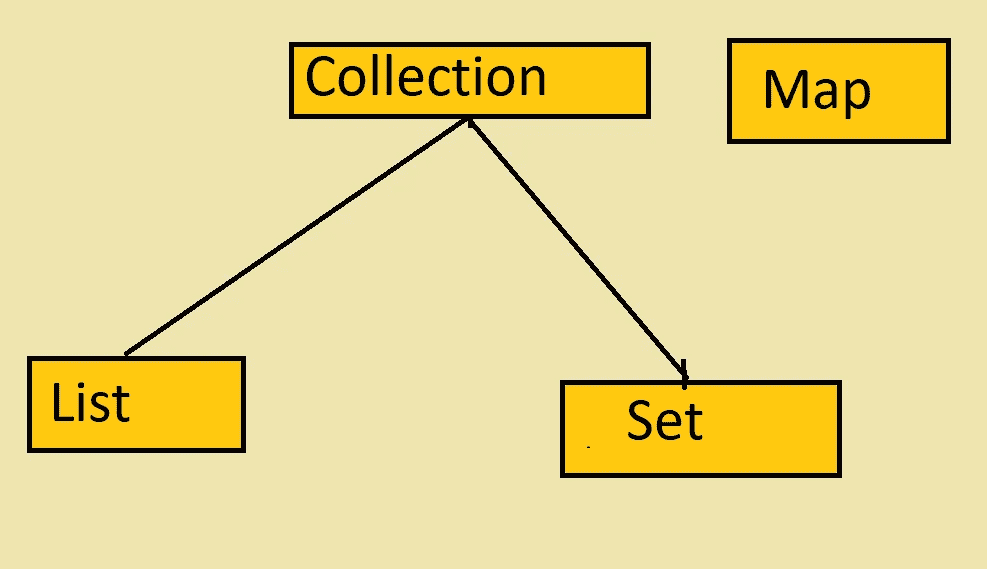
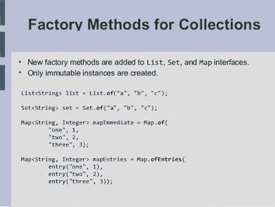

# 如何在 Java 中创建一个不可变的列表、集合和映射？

> 原文：<https://medium.com/javarevisited/how-to-create-an-immutable-list-list-and-map-in-java-5ac1254c128?source=collection_archive---------0----------------------->

## 每个 Java 开发人员都应该知道的 Java 9 特性

[](https://click.linksynergy.com/fs-bin/click?id=JVFxdTr9V80&subid=0&offerid=323058.1&type=10&tmpid=14538&RD_PARM1=https%3A%2F%2Fwww.udemy.com%2Fjava-the-complete-java-developer-course%2F)

大家好，今天，我将分享我最喜欢的 Java 9 特性**“集合的工厂方法”**，它是 JEP 269 的一部分。

如果你曾经在 Groovy 或者 Kotlin 中工作过，你就会知道使用集合文字创建一个包含元素的列表是多么容易，就像创建一个包含 1，2，3 的列表一样，你可以简单地编写。

不幸的是，Java 还不支持这一点，但是在 JDK 9 中，工厂收集方法已经得到了改进，差不多就是这样了。JDK 在基本的集合接口上添加了类似于`of()`的[静态工厂方法](http://javarevisited.blogspot.sg/2017/02/5-difference-between-constructor-and-factory-method-in-java.html)，你可以用它来创建一个条目列表。

它允许你在一行中创建一个列表、集合和一个值映射，就像你在 [Kotlin](http://www.java67.com/2017/12/10-programming-languages-to-learn-in.html) 、 [Scala](http://javarevisited.blogspot.sg/2018/01/10-reasons-to-learn-scala-programming.html#axzz550Ppgfxg) 或 [Groovy](http://javarevisited.blogspot.sg/2016/09/10-basic-differences-between-java-and-groovy-programming.html#axzz560Mbbw3w) 中所做的一样:

```
**List<String> list = List.of("Java", "Kotlin", "Groovy");**
```

但是唯一的问题是你可以创建一个不可修改的或者**不可修改的列表、集合或者映射。**

由`of()`静态工厂方法返回的`List`、`Set`或`Map` 在结构上是不可变的，这意味着一旦添加了元素，就不能添加、删除或更改元素。

调用任何 mutator 方法都会导致抛出一个`UnsupportedOperationException`。但是，如果所包含的元素本身是可变的，这可能会导致集合的行为不一致，或者其内容似乎发生了变化。

顺便说一句，如果你不熟悉 Java 9 和最近版本中添加的新 API 变化，那么我建议你先学习一门全面的最新 Java 课程，比如 Udemy 上的 [**完整的 Java MasterClass**](https://click.linksynergy.com/fs-bin/click?id=JVFxdTr9V80&subid=0&offerid=323058.1&type=10&tmpid=14538&RD_PARM1=https%3A%2F%2Fwww.udemy.com%2Fjava-the-complete-java-developer-course%2F) 。

<https://click.linksynergy.com/fs-bin/click?id=JVFxdTr9V80&subid=0&offerid=323058.1&type=10&tmpid=14538&RD_PARM1=https%3A%2F%2Fwww.udemy.com%2Fjava-the-complete-java-developer-course%2F>  

它涵盖了 Java 开发人员的所有重要主题，并定期更新到最新的 Java 版本。它也很便宜，你可以在一年四季的几次 Udemy flash 销售中只花 10 美元就能买到。

# 如何在 Java 8 及之前版本中创建不可变列表、集合、映射？

这与您在 JDK 6 或 7 中创建的[不可修改列表](http://javarevisited.blogspot.sg/2012/07/create-read-only-list-map-set-example-java.html#axzz55lrMRnNC)相同，如下所示:

```
**List<String> listOfString = new List<>();****listOfString.add("Java");****listOfString.add("Kotlin");****listOfString.add("Groovy");****listOfString.add("Scala");****listOfString = Collections.unmodifiableList(listOfString);**
```

由`unmodifiableList()`方法返回的列表也不支持 add、remove 或 set 操作，如果你调用它们，就会抛出一个`UnsupportedOperationException`。

两个代码片段之间的唯一区别是，以前，创建一个不可变的集合需要 6 行以上的代码，比如不可变的列表、集合或映射，但是现在只需要一行代码就可以完成。

List 接口上也有几个重载版本的`List.of()`可用，比如允许你创建 1-10 个元素的不可变列表和一个[可变参数方法](http://javarevisited.blogspot.sg/2011/09/variable-argument-in-java5-varargs.html#axzz560Mbbw3w)，它允许你创建任意数量元素的列表。

对于`Set.of()`和`Map.of()`方法也是如此。下面是一个在 Java 9 中创建不可变集合的例子:

```
Set<Integer> primes = Set.of(2,3,5,7);
```

您可以看到，只用一行代码就可以创建一个不可变的集合。类似地，为了创建不可变的地图，JDK 9 提供了两种方法— `Map.of(K k1, V v1)`和`Map.ofEntries()`。通过使用这两个，您可以创建一个不可变条目的映射(参见 Sander Mak 的[Java 9 中的新特性](https://pluralsight.pxf.io/c/1193463/424552/7490?u=https%3A%2F%2Fwww.pluralsight.com%2Fcourses%2Fjava-9-whats-new))来了解更多这方面的内容。

[](https://click.linksynergy.com/fs-bin/click?id=JVFxdTr9V80&subid=0&offerid=562016.1&type=10&tmpid=14538&RD_PARM1=https%3A%2F%2Fwww.udemy.com%2Fwhats-new-in-java-9%2F)

这个方法被重载来创建最多 10 个键-值对的映射，但是如果您需要一个更大的映射，那么您应该使用`Map.ofEntries()`方法。

对了，你知道这个功能是怎么实现的吗？以及为什么之前没有？

如果你看一下 JDK 9 代码或者 Javadocs，那么你会发现这个特性是通过在 Java 集合框架的关键接口上添加静态工厂方法来实现的，比如`List`、`Set`和`Map`。

这在 JDK 8 之前是不可能的，因为在接口上添加一个方法意味着破坏它所有的客户端——而且接口上不允许静态方法。随着接口上[默认](http://javarevisited.blogspot.sg/2014/07/default-defender-or-extension-method-of-Java8-example-tutorial.html#axzz560Mbbw3w)和[静态方法](http://javarevisited.blogspot.sg/2013/11/difference-between-static-vs-non-static-method-java.html#axzz560Mbbw3w)的引入，Java 8 中的情况发生了变化，这为评估 JDK API 铺平了道路。

我希望将来会有更多类似的魅力，让使用 JDK API 变得更加容易。

此外，适用于不同集合使用的规则在使用这些工厂方法时也适用(正如您所期望的)。

因此，在创建集合时不能传递重复的元素，因为*集合不允许重复*。

类似地，创建映射时不能传递重复键，因为映射不允许重复键。如果你这样做，那么一个`IllegalArgumentException` 将被抛出

此外，您不能将一个`null` 值传递给集合工厂方法。

以上就是关于**如何在 Java 9** 中创建不可变列表、集合和映射的全部内容。集合上的静态方法确实使得使用 Java 集合 API 变得更加容易，至少它现在类似于 [Kotlin](/javarevisited/top-5-courses-to-learn-kotlin-in-2020-dfc3fa7706d8) 或 [Groovy](/javarevisited/6-best-resources-to-learn-groovy-and-grails-for-java-developers-18c04e88fa8a) 所提供的。JDK 9 充满了这些有用的特性，请继续关注更多这样的文章。

如果您迫不及待，请查看 Java 9 中的新特性[——模块和更多](https://click.linksynergy.com/fs-bin/click?id=JVFxdTr9V80&subid=0&offerid=562016.1&type=10&tmpid=14538&RD_PARM1=https%3A%2F%2Fwww.udemy.com%2Fwhats-new-in-java-9%2F) ，它很好地概述了 JDK 9 的所有特性。

其他**文章你可能喜欢**探索
[完整的 Java 开发者路线图](https://javarevisited.blogspot.com/2019/10/the-java-developer-roadmap.html)
[Java 和 Web 开发者应该学习的 10 件事](http://javarevisited.blogspot.sg/2017/12/10-things-java-programmers-should-learn.html#axzz53ENLS1RB)
[Java 开发者应该知道的 10 个测试工具](http://javarevisited.blogspot.sg/2018/01/10-unit-testing-and-integration-tools-for-java-programmers.html)
[5 个框架 Java 开发者应该学习的 5 门课程](http://javarevisited.blogspot.sg/2018/04/top-5-java-frameworks-to-learn-in-2018_27.html)
[学习 Java 中的大数据和 Apache Spark](http://javarevisited.blogspot.sg/2017/12/top-5-courses-to-learn-big-data-and.html)
[10 门课程学习 DevOps for Java 开发者](https://javarevisited.blogspot.com/2018/09/10-devops-courses-for-experienced-java-developers.html)
[10 本书](http://www.java67.com/2018/02/10-books-java-developers-should-read-in.html)
[Java 开发人员在日常工作中使用的 10 个工具](http://javarevisited.blogspot.sg/2017/03/10-tools-used-by-java-programming-Developers.html#axzz55lrMRnNC)
[成为更好的 Java 开发人员的 10 个技巧](https://javarevisited.blogspot.com/2018/05/10-tips-to-become-better-java-developer.html)
[10 个框架全栈 Java 开发人员应该学习的](/javarevisited/top-10-frameworks-full-stack-java-developers-can-learn-in-2020-5995021401e5)
[我最喜欢的免费课程学习 Spring framework](/javarevisited/top-10-free-courses-to-learn-spring-framework-for-java-developers-639db9348d25)
[Java 开发人员的 10 门高级 Spring Boot 课程](/javarevisited/10-advanced-spring-boot-courses-for-experienced-java-developers-5e57606816bd?source=collection_home---4------0-----------------------)

感谢阅读这篇文章！如果你喜欢这篇文章，那么请分享给你的朋友和同事。此外，如果您有任何问题或反馈，请在下面的评论中留言！

</javarevisited/top-5-java-online-courses-for-beginners-best-of-lot-1e1e240a758>  </javarevisited/these-are-the-highest-paying-tech-jobs-programmers-can-aim-to-increase-their-pay-c59e1eeb6904>  </javarevisited/top-10-free-courses-to-learn-maven-jenkins-and-docker-for-java-developers-51fa7a1e66f6> 