# 如何创建捐赠 WordPress 网站:终极指南

> 原文：<https://medium.com/javarevisited/how-to-create-donation-wordpress-website-ultimate-guide-62049aefdc9f?source=collection_archive---------0----------------------->

在美国，超过 20%的努力在第一年开始并失败，在五年内达到 50%的门槛。幸运的是，有一种方法可以克服这个问题并检查任何项目的相关性。我指的是众筹。

众筹项目由来已久。还记得自由女神像、Pebble Time 智能手表、Peak Design 的日常背包、免刹车超亮 LED 信号灯和许多其他产品吗？如果你有一个伟大的想法，你不仅可以通过这种方式筹集资金，还可以为你的业务需求创建一个筹资平台:

*   全面掌控设计、内容、SEO 等。；
*   促进未来的项目；
*   调整广告活动和跟踪分析；
*   安装某些小部件和插件作为弹出窗口，让你的想法更容易理解；
*   根据现代趋势修改它。

It looks too complicated only at first glance 一 you need just [WordPress](/javarevisited/5-best-wordpress-courses-for-beginners-and-experienced-website-developers-b45f7976ee40), free Elementor, some plugins, and a good tutorial.

今天，我想解释一下如何使用 Crocoblock 插件来构建一个众筹网站，特别是 [JetEngine](https://crocoblock.com/plugins/jetengine/?ref=2817) 、 [JetFormBuilder](https://jetformbuilder.com/) 、 [JetThemeCore](https://crocoblock.com/plugins/jetthemecore/?ref=2817) 、 [JetPopup](https://crocoblock.com/plugins/jetpopup/?ref=2817) 、 [JetTabs](https://crocoblock.com/plugins/jettabs/?ref=2817) 和 [Elementor 免费版](https://crocoblock.com/blog/elementor-free-vs-pro/)。这些插件兼容许多免费和付费的 WordPress 慈善主题，你可以在其他项目中进一步使用它们。

> 你可以在 [**捐赠演示网站**](https://crocoblock.com/donation-engine/?ref=2817) 上查看结果如何。

# 众筹平台通用规范

你可以为一个项目建立一个众筹网站，也可以为多个项目建立一个平台。这些站点/平台设想了一个复杂的结构和许多功能:

*   用于统计和财务(即详细的项目信息、统计数据和关于募集资金的报告)；
*   用于处理货币(包括不同的支付系统)；
*   管理用户凭证(包括注册)；
*   整体管理筹款活动/项目。

众筹平台的**主要特征**是:

*   筹集的资金数额；
*   成功交易的数量；
*   平台出席人数；
*   使用的融资模式(众筹的类型)；
*   项目发起人收取的费用；
*   一些平台对其成员有要求，即特定的公民身份或法律地位。

# 这个众筹平台是怎么运作的？

所有众筹网站/平台都设想了类似的设计和功能特征(下图显示了大致方案):

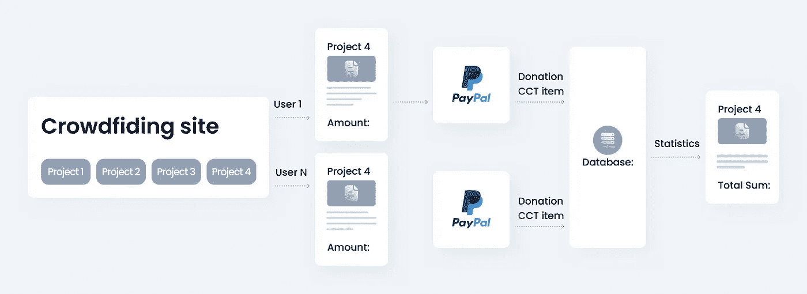

*   主页提供了一个项目列表或一个包含所有项目的列表网格。
*   每个项目都有自己的页面/帖子，详细介绍其任务、团队、开发阶段、可能的利润等信息。此外，每个项目的页面都有一个弹出的捐赠表格。
*   用户选择他们想要捐赠的项目，然后输入金额。
*   然后，该网站将用户重定向到 PayPal 进行支付。
*   成功付款后，该网站将向数据库添加一个 CCT 项目，以进行进一步的统计处理，并显示每个项目的捐赠总额。

# 自定义帖子类型和您需要的其他功能

根据前面介绍的方案，您需要以下内容:

*   *自定义帖子类型*存储项目信息，包括元数据(描述、捐赠目标)；
*   *定制内容类型*收集所有捐赠的一般信息:项目、金额、日期、用户名等。；
*   *表单*接受捐赠并向捐赠库添加凭证；
*   *单页*存储每个项目的信息，包括元数据(描述、捐赠目标)；
*   [*查询生成器*](/javarevisited/comprehensive-queries-made-easy-jetengine-query-builder-review-26b8c148e8f6) 从[数据库](/hackernoon/top-5-sql-and-database-courses-to-learn-online-48424533ac61)中拉取并处理数据(即用于项目的统计)；
*   *PayPal Gateway* 通过将 [WordPress](https://javarevisited.blogspot.com/2020/08/top-5-courses-to-learn-wordpress-in.html) 表单与 PayPal 账户连接进行支付；
*   *表格生成器*显示所有成功捐赠的信息；
*   *动态标签*显示各种动态计算的数据，包括来自 SQL 查询的数据。

让我们详细考虑一下。

# 构建网站结构

让我们建立由 CPT 项目、CCT 捐赠和表单组成的站点结构。

**CPT 项目**(根据其名称)旨在存储每个项目的详细数据(描述、照片、团队成员、所需数量等。).

**CCT 捐款**(根据其名称)是指捐款数据，按项目、日期、用户数据等分组。

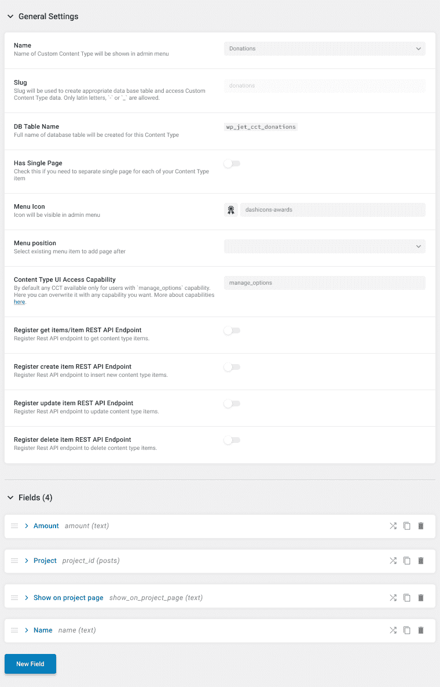

**表单**是为了给捐赠库添加捐赠记录。

# 项目

让我们使用 [JetEngine](https://crocoblock.com/plugins/jetengine/?ref=2817) 插件来创建一个定制的文章类型。该 CPT 具有以下元字段:

*   *总计*显示该项目需要收取的总金额；
*   *短 Desc* 呈现显示在主页上的短项目描述；
*   *描述*在单页上展示项目的完整信息。

我们只添加了必要的元字段，但你可以添加所有你需要的元字段，包括照片、视频、社交网络链接等。

# 捐款

这种自定义内容类型旨在存储捐款数据，以用于进一步的统计过程(即，捐款的人数、所需总数的百分比、收集的金额等)。).以下是使用的字段及其包含的数据:

*   *金额*——呈现用户向特定项目捐赠的金额；

*   *项目*——代表要筹集资金的项目；

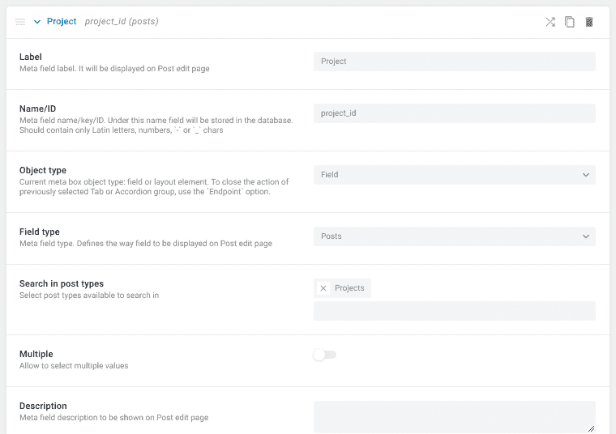

*   *在项目页面显示* —指定是否在统计中显示捐赠；

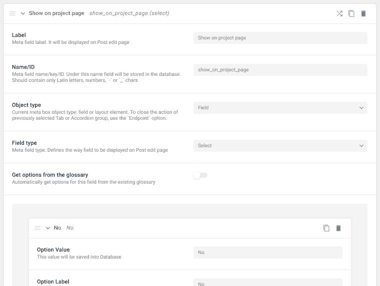

*   *姓名* —显示在捐赠列表中捐赠的用户姓名。

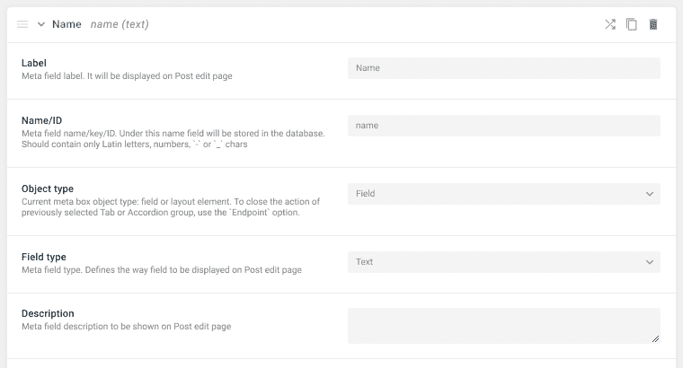

# WordPress 表单

为了构建捐赠表单，我们将使用 [JetFormBuilder](https://jetformbuilder.com/) 插件。该表单将显示在项目的页面上，并收集与项目相关的数据。

有了它，就有可能:

*   通过 PayPal 筹集资金；
*   保存每次捐赠给 CCT 的数据；
*   将保存的数据添加到捐赠库。

该表单应包含以下字段:

*   *项目 ID* 是存储项目 ID 的隐藏字段。该字段将“当前帖子 ID”作为**字段值**。

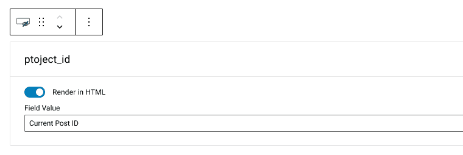

*   *金额*是一个文本字段，显示要捐赠的金额。
*   在捐款名单中显示你的名字？这是一个选择字段，有两个可能的选项(是/否)。

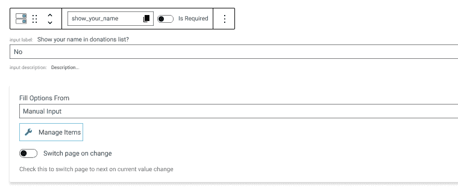

*   *姓名*是一个文本字段，用于指示用户并显示他们的姓名。

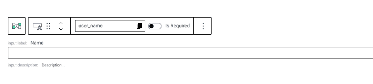

> Here is a pitfall 一 some users would like to save their anonymity and do not show their names among other contributors.

对于这种情况，您应该将*名称*字段包装在一个**条件块**中。请参见下面的截图以正确配置它。

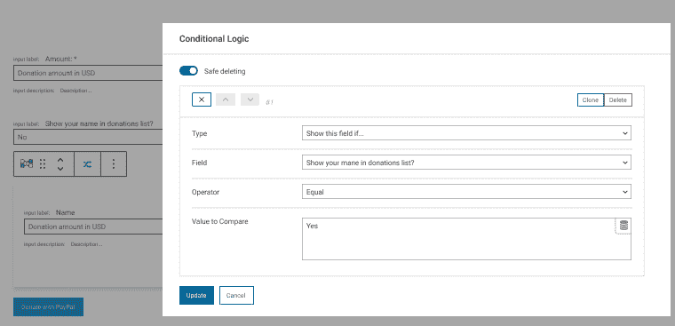

因此，下一步是设置 [PayPal 网关](https://jetformbuilder.com/features/how-to-configure-payment-gateways/)。

最后一步是配置**表单**以在每次捐赠通过后保存对**捐赠 CCT** 的支付。为此，添加提交后操作*插入/更新>自定义内容类型项目*。然后按下“**编辑**按钮，将适当的表格字段与 CCT 字段匹配。

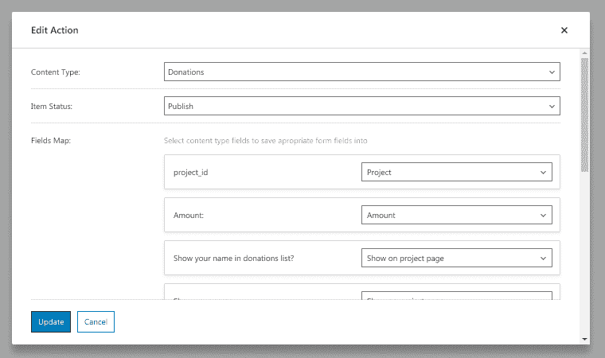

为插入/更新提交后操作打开“成功支付”选项。

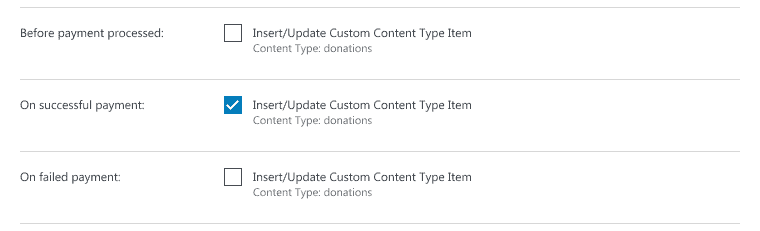

# 项目单页

由于众筹网站/平台设想了许多具有相同领域的项目，让我们使用 jethemecore 创建一个[单一模板，并尝试 Elementor *的 *Flexbox 容器*。*](https://crocoblock.com/knowledge-base/articles/how-to-add-a-single-post-page-template-with-elementor/#create-single-post-page-template-in-elementor/?ref=2817)

*   我们需要使用一个 flexbox 容器来创建一个带有特色图像和文本的盒子，以显示项目统计数据。

如下编辑 flexbox 容器:特色图像的**背景**与网格的左侧对齐。

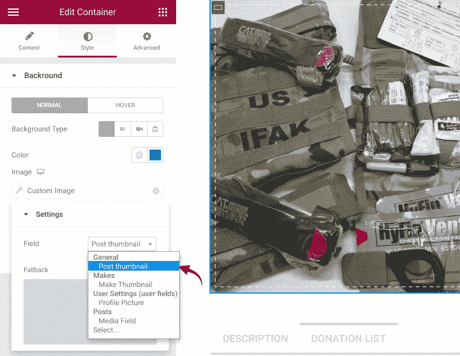

*   要显示*项目名称*，请使用**动态字段**小部件。

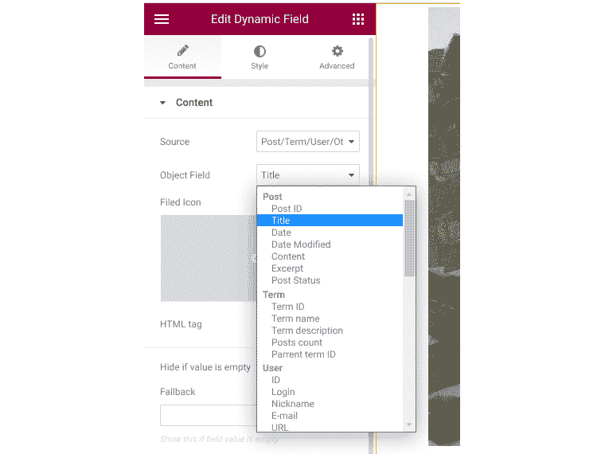

总之，你可以添加任何图像、文本或视频。使用 JetPopup 将此表单放入[弹出窗口，以避免表单在视觉上过载。因此，当用户单击“**捐赠**”按钮时，将出现带有表单的弹出窗口。](https://jetformbuilder.com/features/how-to-store-paypal-payments-from-wordpress-form-in-database-tables/#add-form-to-page)

基本上，你可以应用任何你想美化表单的东西。例如，使用 **JetTabs** 插件在任何帖子位置添加标签(即描述、捐赠列表和统计按钮)。

# 项目统计

项目统计是至关重要的，因为仅仅收集信息是不够的；一个人应该处理它。众筹项目设想了以下统计数据:捐赠金额、总额和募集资金的百分比。

*   *捐赠金额*是项目 ID 字段中有当前项目 ID 的 CCT 项目的捐赠金额；
*   *总募集资金*是特定项目 ID 的所有捐赠 CCT 项的 sum all 金额字段；
*   *收集捐款的百分比*是项目所需金额的百分比，数学上是所有资金的总和除以当前项目的*总计*元字段值，再乘以 100。

您可以使用 SQL 查询来执行这些计算。由于众筹网站设想实时数据输入，所以使用 [**动态函数**标签](https://crocoblock.com/knowledge-base/articles/jetengine-using-the-pre-designed-section-templates-to-display-dynamic-content/?ref=2817)。

因此，该站点将显示通过 SQL 查询拉取数据获得的实时数据和动态计算。

## 创建 SQL 查询

使用[查询构建器](https://crocoblock.com/plugins/jetengine/query-builder/?ref=2817)创建 SQL 查询并不是一项简单的任务，所以让我们来详细了解一下。在这里，您必须从数据库中获取输入数据，将它们分组，并进行计算。

添加以下选项:

*   *查询类型:*选择“SQL 查询”类型*，*不自定义内容类型(即使我们从 CCT 获取数据)，因为这些数据将被进一步计算。

*   *From Table* :指定从中获取数据的表—jet _ CCT _ donovans。此表存储有关 CCT 捐赠的信息(检查 CCT 设置中的表命名)。

*   *Where (query 子句)*:仅从所需项目中选择文章，并使用**对象 ID 宏**获取项目 ID。

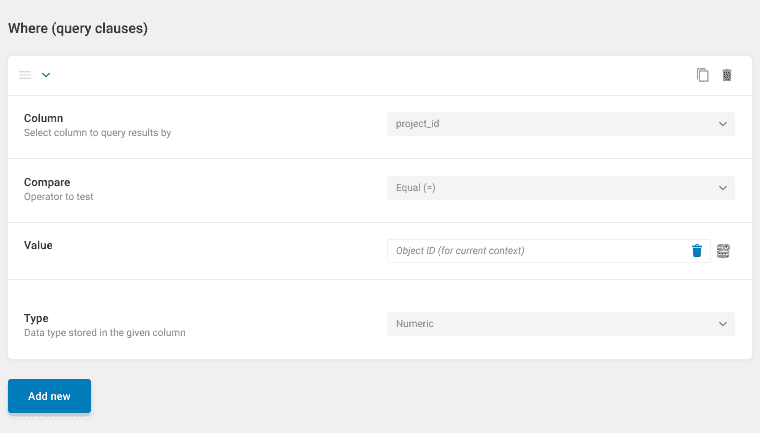

*   *按*项目 ID* 对结果*分组:打开此开关并选择 project_id 列，这样我们接下来可以使用计算列选项。

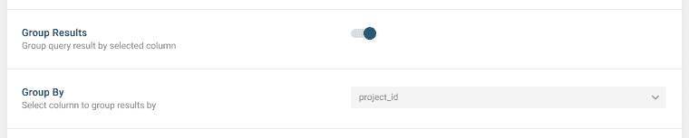

## 配置计算列选项

设置完所有选项后，可以使用**计算列**选项。此选项将列添加到 SQL 查询中，以存储必要的计算结果。

说句题外话:*查询结果表*的常规列存储来自数据库的静态数据。您需要额外的功能(计算列)来向查询结果添加包含动态数据的新列。要计算这样的动态数据，可以使用其他 SQL 查询结果列中的数据。此功能最好与 [**配合使用，通过**](https://www.freecodecamp.org/news/sql-group-by-clauses-explained/) 选项进行分组。

对于众筹网站/平台，按照**项目 ID** 字段对所有项目进行分组。此外，指定只显示特定**项目 ID** 的项目。因此，可以计算具有相同项目 ID 字段的所有 CCT 项目的金额、总和以及最大/最小值。

为了计算每个项目的捐赠总额，添加新列ー *计算列*。该列使用 **Column _ID** 字段，并根据请求应用函数 COUNT 来计算所有 CCT 项目的总金额。

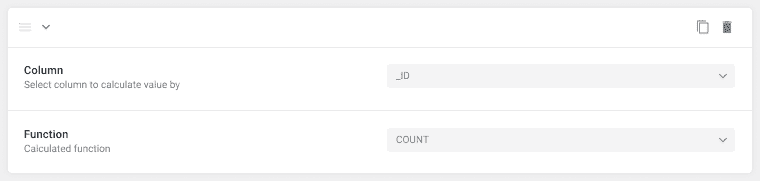

添加计算列以计算所有捐赠的总和。该列使用表中的**金额列**数据，并应用函数 SUM。因此，您将得到特定项目中所有 CCT 项目的所有**金额**字段的总和。

百分比计算更复杂。我们必须从元字段中获取数据。为此，再次使用 **Amount** 列，并为结果处理应用自定义函数。然后将要计算的数学表达式*SUM(% 1＄s)*添加到自定义函数体中。

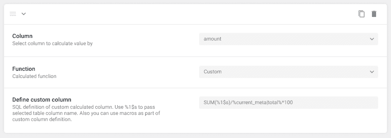

对于所考虑的情况，自定义函数 SUM(%1$s)计算符合请求的所有 CCT 项目的总额。下一步是将这个值除以当前项目的**总计**元字段中的数据。为此，请使用 current_meta 宏:%current_meta|total%。

项目统计管理的最后一步是使用动态标签显示计算的数据:

*   捐赠金额；

*   总和；

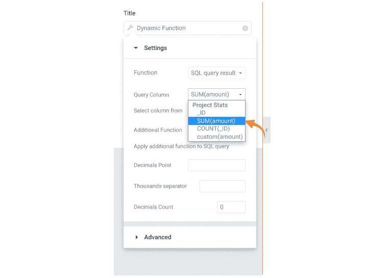

*   百分比。

# 捐赠表

要对这一小节中的捐赠列表进行排序，请创建一个新的查询来获取要在列表中显示的数据。然后将**查询类型** 字段指定为“CCT 捐赠自定义内容类型查询”。另外，在 **Where(查询子句)**字段中设置需要的条件。

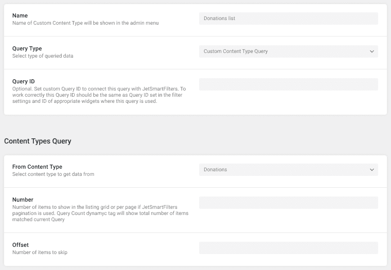

项目页面上显示的**字段**的“是”值打开，可以获取特定项目的捐赠金额数据。下一步是显示选择在捐赠列表中显示姓名的用户的所有捐赠。

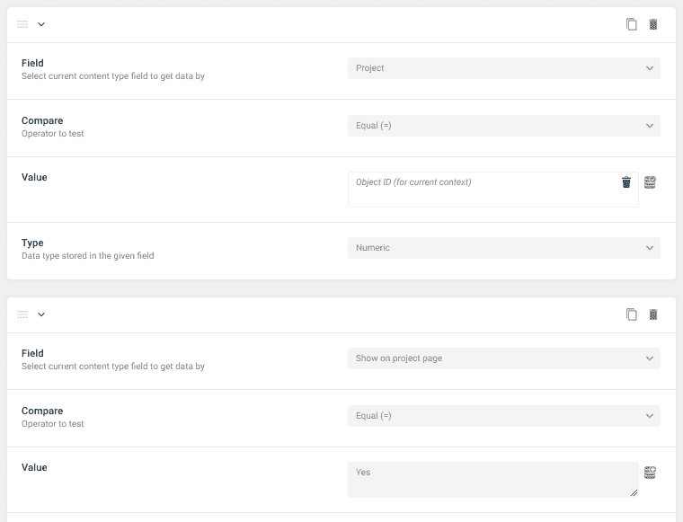

因此，使用[动态表格构建器模块](https://crocoblock.com/plugins/jetengine/tables-builder/?ref=2817)创建查询并显示表格中的所有数据。

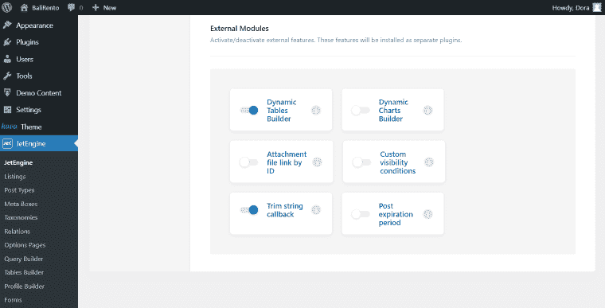

然后在**数据查询**字段中选择之前创建的“捐赠清单”。

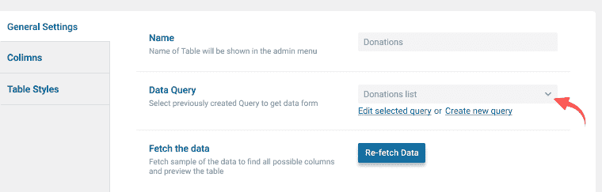

下一步是设置所需的列，并将表格添加到**单页**中。

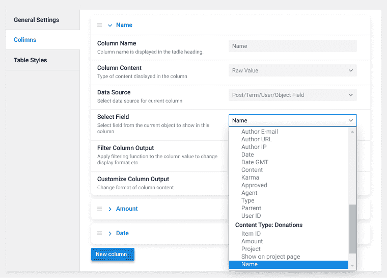

最后，将项目信息添加到主页上的列表网格中。

## **结论**

如今，众筹不仅是筹资，还是了解一个项目是否相关和令人兴奋的一种方式。如果你把一个项目放在 Kickstarter 或 Indiegogo 这样的大平台上，很有可能会在其他像样的项目中失去它。

幸运的是，不需要开发一个结构复杂、代码多页的众筹网站。

你有两个选择:

*   安装任何免费/付费的 WordPress 主题或免费插件，根据所使用的主题/插件，构建你的具有功能性的众筹平台；
*   使用多功能插件和主题根据你的需求开发许多站点(不考虑其用途)因为众筹站点设想了 CCT、CPT、统计和计算、资金转移等。

第二种方式更合适，因为成功的众筹项目需要很多附加功能，而免费插件并不提供这些功能。通常，专注于有限功能的主题和插件不能用于众筹项目推广的所有阶段(规划、推介、推广、津贴和永久联系)。因此，成熟的插件给你更多的自由，使搜索引擎优化和更新成为可能。