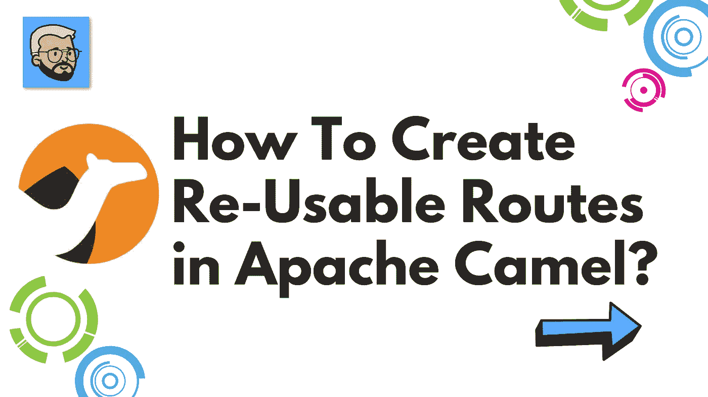

# 如何在 Apache Camel 中创建可重用的路线？

> 原文：<https://medium.com/javarevisited/how-to-create-re-usable-routes-in-apache-camel-c4e57956e6e3?source=collection_archive---------2----------------------->

## 阿帕奇骆驼

你好，🖐，我自己 [Rohan Ravindra Kadam](https://medium.com/u/a1b33b7cda75?source=post_page-----c4e57956e6e3--------------------------------) ，全栈开发者，印度

欢迎，开发者社区！！在本文中，我们试图使用 Apache Camel 来理解可重用的路线。在直接进入文章之前，让我们试着理解与主题相关的某些问题或疑问。我们可能会有类似[什么是阿帕奇骆驼](https://javarevisited.blogspot.com/2022/02/top-5-courses-to-learn-apache-camel-in.html)这样的问题？为什么用阿帕奇骆驼？如何在 Apache Camel 中创建可重用的路线？

[](https://javarevisited.blogspot.com/2022/02/top-5-courses-to-learn-apache-camel-in.html)

如何在 Apache Camel 中创建可重用的路线？

嘿，社区，让我们深入到我们的问题中去，找到问题的答案。

> 嘿 DevCommunity 别忘了在 Instagram 上查看更多内容，网址为[**@ rohankadam _ codes**](https://www.instagram.com/rohankadam_codes/)

## ⚡什么是阿帕奇骆驼？

Apache Camel 是基于已知的[企业集成模式](https://camel.apache.org/components/3.15.x/eips/enterprise-integration-patterns.html)的通用开源集成框架。

Camel 使您能够用各种特定于领域的语言( [DSL](https://camel.apache.org/manual/dsl.html) ，比如 [Java](/javarevisited/10-best-places-to-learn-java-online-for-free-ce5e713ab5b2) ，XML， [Groovy](/javarevisited/6-best-resources-to-learn-groovy-and-grails-for-java-developers-18c04e88fa8a) ， [Kotlin](/javarevisited/top-5-courses-to-learn-kotlin-in-2020-dfc3fa7706d8) ，以及 [YAML](https://javarevisited.blogspot.com/2021/11/top-5-courses-to-learn-yaml-in-2022.html) )来定义路由和中介规则。这意味着您可以在 IDE 中智能地完成路由规则，无论是在 Java 还是 XML 编辑器中。

Apache Camel 使用 [URIs](https://camel.apache.org/manual/uris.html) 来直接处理任何类型的传输或消息模型，如 [HTTP](https://camel.apache.org/components/3.15.x/http-component.html) 、 [ActiveMQ](https://camel.apache.org/components/3.15.x/activemq-component.html) 、 [JMS](https://camel.apache.org/components/3.15.x/jms-component.html) 、【JBI】SCA、 [MINA](https://camel.apache.org/components/3.15.x/mina-component.html) 或 [CXF](https://camel.apache.org/components/3.15.x/cxf-component.html) ，以及可插拔的[组件](https://camel.apache.org/manual/component.html)和[数据格式](https://camel.apache.org/manual/data-format.html)选项。Apache Camel 是一个很小的库，具有最少的[依赖性](https://camel.apache.org/manual/what-are-the-dependencies.html)，可以很容易地嵌入到任何 Java 应用程序中。Apache Camel 允许您使用相同的 [API](https://camel.apache.org/manual/exchange.html) 工作，不管使用哪种传输方式——所以学习一次 API，您就可以与开箱即用的所有[组件](https://camel.apache.org/components/3.15.x/index.html)进行交互。

Apache Camel 支持 Bean 绑定以及与 CDI、 [Spring](https://camel.apache.org/manual/spring.html) 等流行框架的无缝集成。Camel 也广泛支持[单元测试](https://camel.apache.org/manual/testing.html)你的路线。

## ⚡为什么使用阿帕奇骆驼？

让我们试着列出 Apache Camel 的一些用例

1.  为**企业集成模式(EIP)** 提供支持
2.  **随处运行** :- Apache Camel 是独立的，可以作为库嵌入到 [Spring Boot](/javarevisited/10-advanced-spring-boot-courses-for-experienced-java-developers-5e57606816bd) 、 [Quarkus](/javarevisited/10-best-free-dropwizard-vert-x-micronaut-and-quarkus-online-courses-for-java-developers-9c2b4161f17) 、应用服务器和云中。Camel 子项目致力于简化您的工作。
3.  **挤满了组件** :-挤满了数百个组件，用于访问[数据库](/javarevisited/7-free-courses-to-learn-database-and-sql-for-programmers-and-data-scientist-e7ae19514ed2)，消息队列，API 或天底下的任何东西。帮助你融入一切。
4.  **支持超过 50 种数据格式** :- Camel 支持大约 50 种数据格式，允许翻译多种格式的消息，并支持金融、电信、医疗保健等行业标准格式。

## ⚡如何在 Apache Camel 中创建可重用的路线？

嘿，🖐Community，在文章的前一部分，我们试图解释为什么会有阿帕奇骆驼？在第节中，我们将尝试理解相同的实现。

在直接进入实现之前，不要忘记看看如何使用 Apache Camel 编写第一条路线？从下面的链接

<https://rohankadam965.medium.com/apache-camel-how-to-write-first-route-7f7767c86c2a>  

## 步骤 1:如何使用 Spring Initializr 创建项目？

<https://start.spring.io/>  

## 步骤 2:项目中包括哪些依赖项？

[](https://www.java67.com/2022/02/5-best-apache-camel-courses-for-java.html)

信用:[洛汗·拉温德拉·卡达姆](https://medium.com/u/a1b33b7cda75?source=post_page-----c4e57956e6e3--------------------------------)属地

## 步骤 3:如何在 apache camel 中创建可重用的路线？

经常需要在多条路线中执行相同的处理步骤。Apache Camel 为我们提供了一种在共享路径中调用路由步骤的机制。然后，我们可以以一种与普通的 Java 程序[中的方法等同的方式重用该路由。](https://javarevisited.blogspot.com/2017/07/top-50-java-programs-from-coding-Interviews.html)

这个菜谱将向我们展示一种开发我们的路由的技术，通过这种方式，可以在从其他路由调用的共享路由中定义类似的路由任务。

**让我们开始吧:-**

让我们首先确定想要重用的路由逻辑。在我们的例子中，我们将创建一个路由名**消息路由**

```
 import org.apache.camel.builder.RouteBuilder;
import org.springframework.stereotype.Component;

@Component
public class MessageRoute extends RouteBuilder {

    @Override
    public void configure() throws Exception { from("direct:StartMessage")
                .log("Received Message is ${body}")
                .end();
    }
}
```

让我们为使用的或共享的路由创建一个顶级路由

```
 import org.apache.camel.Exchange;
import org.apache.camel.Processor;
import org.apache.camel.builder.RouteBuilder;
import org.springframework.stereotype.Component;

@Component
public class ReusableRoute extends RouteBuilder {

    @Override
    public void configure() throws Exception {
        from("direct:ReusableRoute")
                .routeId("direct:ReusableRoute")
                .process(new Processor() {
                    @Override
                    public void process(Exchange exchange) throws Exception {
                        exchange.getIn().setBody(" Reusable Route ");
                    }
                })
                .to("direct:StartMessage")
                .end();
    }
}
```

共享路由可以视为顶级路由的一部分。它在同一个[交换对象](https://javarevisited.blogspot.com/2020/04/how-to-use-exchanger-in-java-with-example.html)上工作，并参与顶级路由发起的任何事务。

## 第四步:测试我们的骆驼路线？

为了测试我们的骆驼路线，将使用控制器端点

```
package com.example.apachecameltest;import org.apache.camel.CamelContext;
import org.apache.camel.Exchange;
import org.apache.camel.ProducerTemplate;
import org.apache.camel.builder.ExchangeBuilder;
import org.springframework.beans.factory.annotation.Autowired;
import org.springframework.web.bind.annotation.GetMapping;
import org.springframework.web.bind.annotation.RestController;@RestController
public class Controler {@Autowired
    private ProducerTemplate producerTemplate;@Autowired
    private CamelContext camelContext;@GetMapping
    public void function() {
        final Exchange
                requestExchange = ExchangeBuilder
                .*anExchange*(camelContext)
                .build();producerTemplate
         .send("direct:ReusableRoute",requestExchange);}
}
```

嘿，🖐，想了解更多关于 ProducerTemplate & Camel 的内容，请点击下面的链接

  <https://camel.apache.org/manual/camelcontext.html>  

## 第五步:骆驼路线输出？

```
direct:StartMessage  : Received Message from   Reusable Route
```

## 🖐Conclusion:-

在本文中，我们试图在 apache camel 中创建可重用的路线。我们也试图了解一些关于阿帕奇骆驼的事情。请分享和喜欢💕如果你觉得文章有用。在媒体上关注我 [Rohan Ravindra Kadam](https://medium.com/u/a1b33b7cda75?source=post_page-----c4e57956e6e3--------------------------------) 在 Twitter 上关注我**[**rohankadam 25**](https://twitter.com/rohankadam25)**&**[**insta gram**](https://www.instagram.com/rohankadam_codes/)**

## **⚡Bibliography**

**<https://camel.apache.org/>  </javarevisited/how-to-implement-exception-handling-using-apache-camel-26faad831e8f>  </javarevisited/how-to-consume-public-api-using-apache-camel-70f7382959ab>  

谢谢观众们— [罗汉·拉温德拉·卡达姆](https://medium.com/u/a1b33b7cda75?source=post_page-----c4e57956e6e3--------------------------------)**