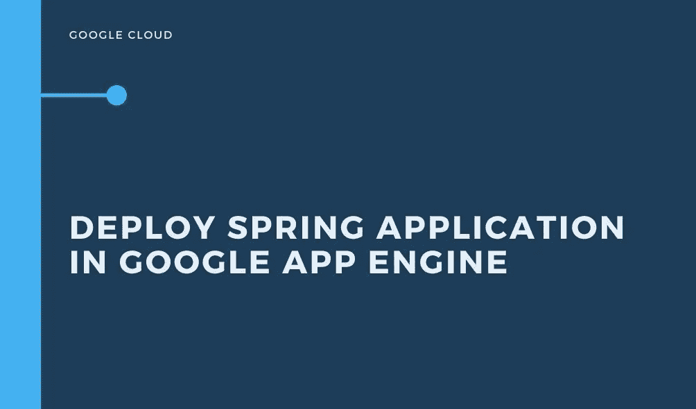

# 如何在 Google App Engine 中部署一个基本的 Spring 应用程序

> 原文：<https://medium.com/javarevisited/how-to-deploy-a-basic-spring-application-in-google-app-engine-9a7842c943d5?source=collection_archive---------1----------------------->

在 Google App Engine 中部署的分步指南

如何在 Google App Engine 中部署一个基本的 Spring 应用程序

# 为什么**谷歌应用引擎**

**谷歌应用引擎**(通常被称为 **GAE** 或简称为**应用引擎**)是一个[云计算](https://en.wikipedia.org/wiki/Cloud_computing)平台，用于在谷歌管理的[数据中心](https://en.wikipedia.org/wiki/Data_center)中开发和托管[网络应用](https://en.wikipedia.org/wiki/Web_application)。