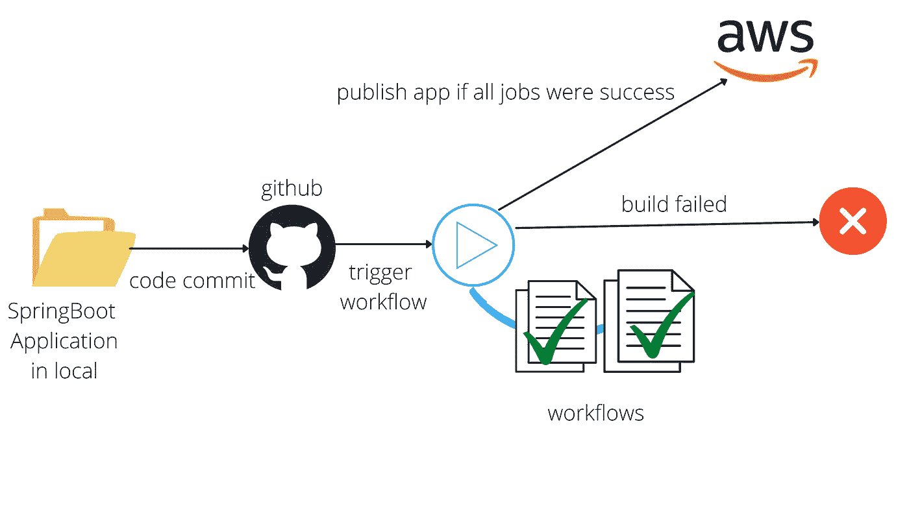

# 如何使用 Github Actions CI/CD 将 SpringBoot 应用程序部署到 Elastic Beanstalk

> 原文：<https://medium.com/javarevisited/how-to-deploy-springboot-app-to-elastic-beanstalk-using-github-actions-ci-cd-30b4557b4fb8?source=collection_archive---------0----------------------->

Github 操作

上图给出了这篇文章的概述。

我们将使用 Java 和 Maven 构建一个 spring-boot 应用程序，并将其部署到 AWS Elastic Beanstalk。我们将使用 GitHub 动作创建一个 [CI/CD 管道](/javarevisited/how-to-build-a-ci-cd-pipeline-to-your-spring-boot-app-with-jenkins-x-and-kubernetes-93dffae5bd58)进行部署，而不是手动将我们的应用程序部署到 AWS。