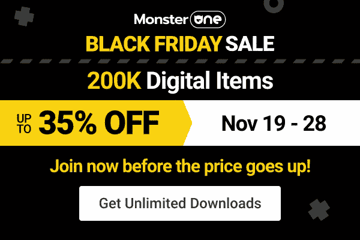
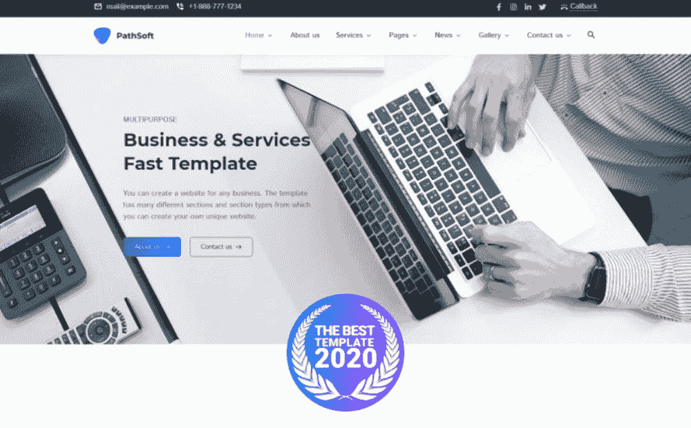
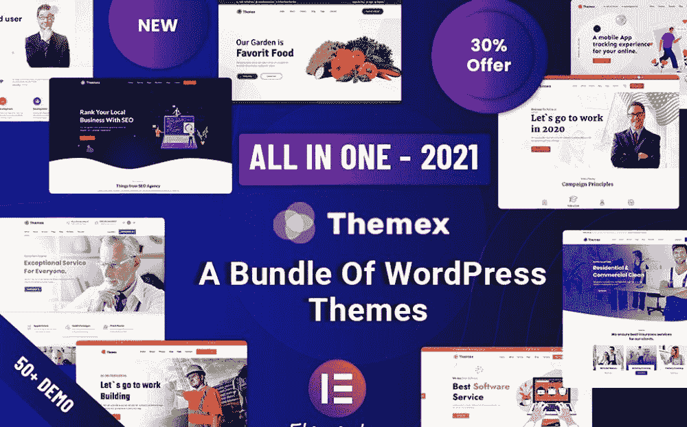
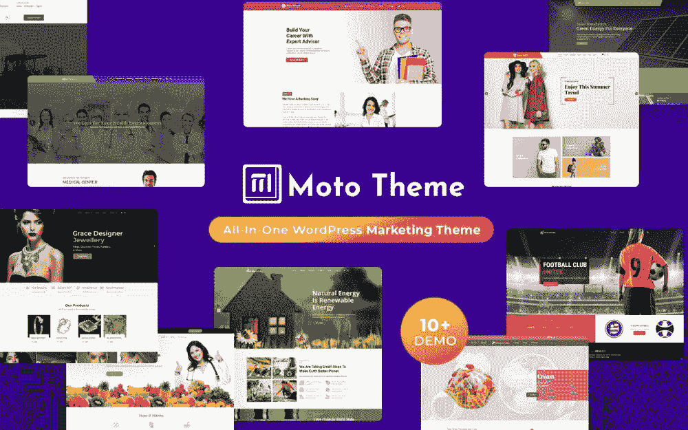
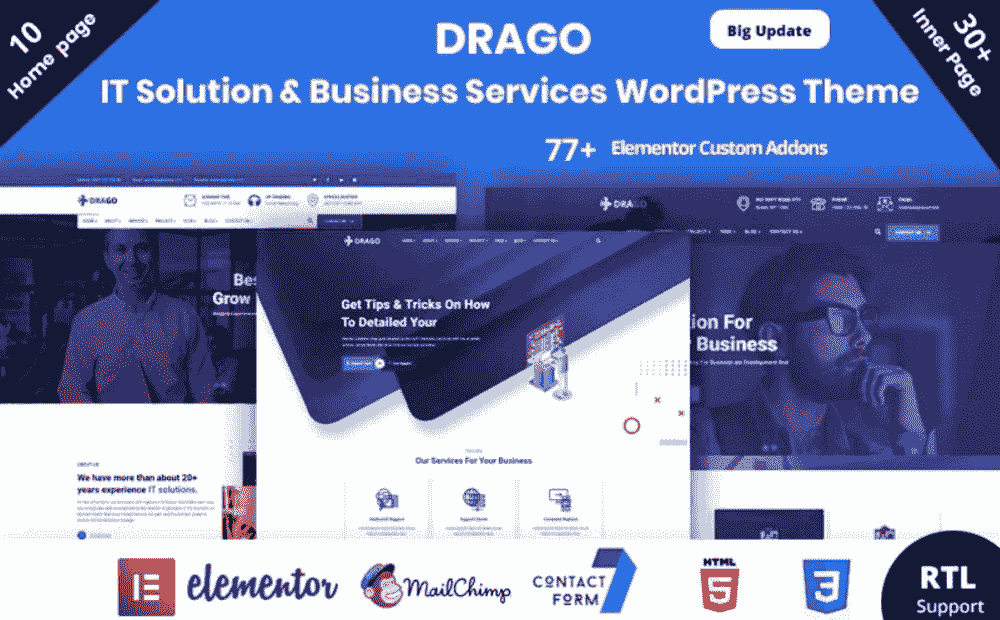
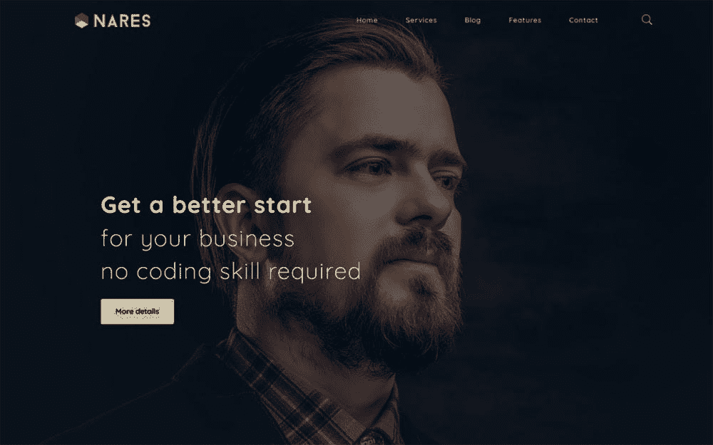
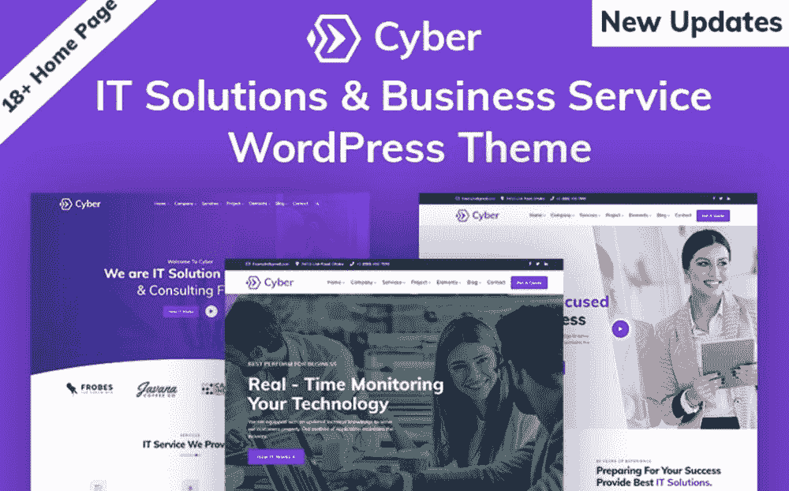

# 如何用 WordPress 开发一个网站:使用这 5 个步骤铺平道路

> 原文：<https://medium.com/javarevisited/how-to-develop-a-website-with-wordpress-pave-the-way-using-these-5-steps-75858f2b261e?source=collection_archive---------3----------------------->

忘记让多个企业主创建他们的网站的原因是愚蠢的。如今，要找到一家没有网站的知名公司是不可能的。

然而，这并不意味着构建一个随机的在线项目而不付出任何努力就是聪明的。关键是要有一个专业设计的资源，随时准备吸引注意力。

这是一种吸引潜在客户和促进销售的资源。今天，我们收集了回答一个非常流行的问题的所有信息: [**如何用 WordPress 开发一个网站？**](https://www.templatemonster.com/?aff=javarevisited&utm_campaign=tmwordpressthemes&utm_source=mediumjavarevisited&utm_medium=referral) 如果你有兴趣完成这个任务，就让我们从此时此地开始吧。

[**MonsterONE 黑色星期五交易**](https://www.templatemonster.com/monsterone/?aff=javarevisited&utm_campaign=blackfriday2021&utm_source=javarevisited&utm_medium=referral)

# 为什么你的企业需要一个坚实的网站？

除此之外，人们习惯于把所有东西都放在银盘上。我们生活在技术和自动化的时代，所以这样的情况并不奇怪。一般来说，一个功能齐全的站点可以确保:

*   人们可以很容易地进入你的企业，了解它的特点，熟悉各种服务或产品；
*   与你的目标受众建立牢固的关系是可能的；
*   你的公司可以成为一个从众多竞争者中脱颖而出的品牌；
*   你的企业更可信，激发信心。

# 如何用 WordPress 开发一个网站:你的小指南

## 你的网站的理想定位是什么？

不幸的是，很多人在第一步就被卡住了。什么话题会有利可图且引人入胜？我应该怎么做才能确保我的网站不会被忽视？你可以理解，这是不可能的选择第一个网站利基来你的脑海中。在做出最后决定之前，有必要考虑一系列的细节。出于这个原因，研究互联网和检查潜在利基的范围是必要的。

1.  首先，试着说明你的能力、爱好和技能。此外，看看你有着非凡经历的一些领域也是至关重要的。找到一个你最了解的领域会让你更容易做出正确的决定。
2.  可惜你的能力和热情都不足。也有必要考虑你想在市场上有一个地方。如果你想创业，那一定是盈利的。它不能像某些爱好那样，只给你带来快乐。在这种情况下，您需要使用不同的小众关键字。然后，你将准备好理解他们的搜索量，竞争水平和其他因素。在此之后，专注于引起你更多兴趣的细分市场将是明智之举。换句话说，限制你的选择。
3.  经过上述步骤后，不要忘记考虑竞争的程度。如果你发现大量的网站都是关于同一件事的，那该怎么办？在这种情况下，最好转向另一个领域。如果你偶然发现几个都是关于同一件事的网站，该怎么办？这可能意味着其他人明白市场上没有他们的位置。如果你偶然发现一些网站都是关于同一件事的，那该怎么办呢？那么，更有可能的是不会有很多的竞争。

## 如何为你的网站选择合适的平台和现成的模板？

选择最佳电子商务平台的过程可能需要一些时间。许多因素会影响你的最终决定。您应该考虑速度、可伸缩性、安全性、定制选项、支持等因素。

此外，你必须计算所有的成本。很明显，每个公司都有自己的预算。因此，确保你意识到你将为选择的平台支付多少钱。

你不应该忘记，你需要购买域名和主机。购买一个新域名将花费你每年大约 10-20 美元。说到主机提供商，你需要支付 3-30 美元。一切都取决于你想选择的托管类型。

如你所知，我们建议你选择 WordPress。有几个主要原因可以保证你这样做。

1.  它是免费的开源软件。
2.  你可以自由创建不同的网站类型。这个平台可以适应博客、网上商店、商业项目、作品集和其他网站。
3.  它还支持允许呈现多样化内容的各种媒体类型。
4.  WordPress 因其庞大的社区而广受欢迎。它定期改进平台，并帮助其他人更多地了解它的特性。
5.  即使它不需要一些天才的编程技能，你也可以完全控制你的网站。

有哪些因素会帮助你选择合适的现成模板？我们不会争辩说品味是无法解释的。一个人可能喜欢全宽设计，而另一个人喜欢全宽设计。

一些人喜欢浏览极简设计，而另一些人则寻找有创意和活力的东西。在主页方面也有不同的偏好。

可以添加各种元素。这些包括一个吸引人的滑块，一个无内容的标题图像，或者一个幻灯片。除此之外，关注菜单也是必要的。

记住，许多 WordPress 设计允许一键设置。这意味着你不会在这个过程中花费任何时间。之后，您将需要添加您的内容和个性化的多个方面。

准备好所有相关的内容会让你的工作进行得更快。此外，拥有编程背景将有助于你尽快获得你的在线项目。

互联网已经准备好为你提供大量现成的 WordPress 模板。一个高质量的选择将花费你大约 29-159 美元。对于那些预算紧张的人来说，还有一种选择。这些人总是可以浏览 [**最好的免费主题**](https://www.templatemonster.com/free-wordpress-themes.php?aff=javarevisited&utm_campaign=tmwordpressthemes&utm_source=mediumjavarevisited&utm_medium=referral) 并选择他们需要的东西。

谈到定制过程，有必要记住几件事。首先，有些现成的解决方案不会给你想要的个性化自由。因此，您的网站可以让人们想起其他具有相同结构的在线项目。如果你不介意缺乏创意，这可能适合你。

## 如何处理你的网站内容？

现在，当你知道如何用 WordPress 开发一个网站的一些基础知识时，是时候谈谈内容了。当您制定内容计划时，必须考虑以下事项:

*   哪些人会访问你的网站并阅读展示的内容；
*   你的内容会解决什么问题；
*   你能为观众提供什么独特的内容；
*   您希望关注哪些最常用的内容类型；
*   你管理内容的方法是什么(例如，你多久在网站上发布一次新帖子)；
*   你准备在内容(高质量的股票图片、社交媒体模板和其他有用的助手)上花多少钱？

创建内容计划后，您可以开始添加第一个材料。如果我们要谈论文本，尽可能使它们相关、清晰、受欲望驱动。

包括照片、gif、视频材料、音频和其他内容。信息图、图表和图形可以让你更容易理解你的信息。

你也可以考虑给消费者不同种类的内容，比如播客。换句话说，一个更信息化的网站会吸引更多的访问者和潜在客户。CTA(号召行动)按钮也不容忽视。

他们会激起人们对你网站的兴趣，并鼓励他们一次又一次地访问你的网站。如你所见，你的内容是一个真正的诱惑。不要忘记开发一个内容日历，以便人们可以定期获得所需的信息。

## 关于站点推广你应该知道什么？

当你的网络项目完成后，你必须设计一个有效的营销方法。有七个主要的策略来增加你的网站的人气和流量。

1.  考虑电子邮件营销。这是与你的目标受众沟通的绝佳方式。你可以获得更多的订户，并与他们分享最新的新闻。
2.  转向客座博文。与有影响力的人合作将让你接触到更广泛的受众。然后，流行的社交媒体网络上的额外流量和份额可能会带来有效的结果。
3.  强调社交媒体的重要性至关重要。它能够获得期望的品牌认知度，并与更广泛的受众合作。
4.  创建一个博客，向你的客户展示你的技能和知识。你的受众会因为你独特的高质量的内容而扩大。
5.  你也可以选择在 Quora、Reddit 等网站上参与论坛对话。
6.  不要忘记搜索引擎优化。不要在优化图片、页面名称、元描述和 URL 上粗心大意。
7.  还有一种方式是从付费推广中获益。为了锁定你的受众并增加受欢迎程度，使用像谷歌广告或商业脸书这样的平台。

# 如何以 7 个现成的解决方案为基础建立一个网站

## PathSoft — FastSpeed 多用途商业和服务 WordPress 主题

首先，我们希望您熟悉这个与业务相关的多用途主题。它的软件包包括四种主页风格。此外，您可以自由地使用各种各样的预制页面和页眉变体。它还具有完全响应的设计。换句话说，人们可以通过所有设备查看你的内容。

主要特点:

*   易于定制的性质；
*   谷歌地图；
*   图库功能；
*   社交媒体整合；
*   下拉菜单。

[立即购买](https://www.templatemonster.com/wordpress-themes/pathsoft-it-solutions-for-your-business-services-wordpress-theme-99496.html?aff=javarevisited&utm_campaign=tmwordpressthemes&utm_source=mediumjavarevisited&utm_medium=referral) | [试玩](https://www.templatemonsterpreview.com/demo/99496.html?aff=javarevisited&utm_campaign=tmwordpressthemes&utm_source=mediumjavarevisited&utm_medium=referral)

## 主题——响应多用途 WordPress 主题

Themex 是另一个多用途主题，它的大量演示将会给你的想象力留下深刻印象。这些可以成为维修服务、营销、教育、创业、软件和其他主题的完美匹配。

您将获得一个名为 Elementor 的可视化构建器，它允许编辑所有站点部件，而无需处理代码。还有 80 多种定制元素或元素、18 多种页眉样式和 10 多种页脚变体。您还将有机会添加动态内容、联系方式和 WooCommerce 功能。

主要特点:

*   一键演示导入；
*   WPML 支持；
*   视差效应；
*   背景视频；
*   博客功能。

[立即购买](https://www.templatemonster.com/wordpress-themes/themex-multipurpose-responsive-wordpress-theme-122890.html?aff=javarevisited&utm_campaign=tmwordpressthemes&utm_source=mediumjavarevisited&utm_medium=referral) | [演示](https://www.templatemonsterpreview.com/demo/122890.html?aff=javarevisited&utm_campaign=tmwordpressthemes&utm_source=mediumjavarevisited&utm_medium=referral) | [在 MonsterONE](https://monsterone.com/wordpress-themes/themex-multipurpose-responsive-o40418/?aff=javarevisited&utm_campaign=tmwordpressthemes&utm_source=mediumjavarevisited&utm_medium=referral) 下载

## Moto 主题——多用途 WordPress 主题

有了这个时尚的主题，你就可以为你的客户创建一个顶级的网站。它有十个针对各种流行领域的结构良好的布局。

这些是珠宝，有机农业，足球，太阳能装置，等等。你可以安装他们在一个单一的点击，没有任何努力。它还兼容 WooCommerce、Revolution Slider 和 WPML。

主要特点:

*   巨型菜单；
*   背景视频；
*   谷歌地图；
*   投资组合和博客功能；
*   谷歌地图。

[立即购买](https://www.templatemonster.com/wordpress-themes/moto-theme-multipurpose-wordpress-theme-183729.html?aff=javarevisited&utm_campaign=tmwordpressthemes&utm_source=mediumjavarevisited&utm_medium=referral) | [演示](https://www.templatemonsterpreview.com/demo/183729.html?aff=javarevisited&utm_campaign=tmwordpressthemes&utm_source=mediumjavarevisited&utm_medium=referral) | [在 MonsterONE](https://monsterone.com/wordpress-themes/moto-theme-multipurpose-wordpress-theme-o99304/?aff=javarevisited&utm_campaign=tmwordpressthemes&utm_source=mediumjavarevisited&utm_medium=referral) 下载

## Drago — IT 解决方案和商业服务 WordPress 主题

你有兴趣开办一个网上商店，使你的 IT 相关业务增长吗？在这种情况下，看看这个多功能的选择将是聪明的。

有 35+内页，10+主页风格，65+预制块。也可以使用 15 个以上的页眉变体和 4 个以上的页脚选项。您可以使用用户直观的元素或页面生成器来管理所有元素。

主要特点:

*   一键演示导入；
*   联系方式；
*   自定义小部件；
*   视差效应；
*   超大菜单。

[**立即购买**](https://www.templatemonster.com/wordpress-themes/drago-it-solution-business-services-wordpress-theme-104270.html?aff=javarevisited&utm_campaign=tmwordpressthemes&utm_source=mediumjavarevisited&utm_medium=referral) **|** [**试玩**](https://www.templatemonsterpreview.com/demo/104270.html?aff=javarevisited&utm_campaign=tmwordpressthemes&utm_source=mediumjavarevisited&utm_medium=referral)

## nares——带有 WordPress 元素或主题的多用途商业服务

现在是时候看看另一个可能符合你口味的创意主题了。它适用于不同的业务类型，包括金融和咨询。像其他选择一样，由于 Elementor 的可用性，它不需要任何编码知识。

您将准备好控制所有站点组件。这是可能的，由于无限的颜色选择，一个 Mansory 组合与过滤器，和五个标题的变化。

主要特点:

*   框式和宽布局；
*   高级博客；
*   可定制的背景；
*   WooCommerce 支持；
*   动画效果。

[**立即购买**](https://www.templatemonster.com/wordpress-themes/nares-multipurpose-business-services-with-elementor-wordpress-theme-126436.html?aff=javarevisited&utm_campaign=tmwordpressthemes&utm_source=mediumjavarevisited&utm_medium=referral) **|** [**试玩**](https://www.templatemonsterpreview.com/demo/126436.html?aff=javarevisited&utm_campaign=tmwordpressthemes&utm_source=mediumjavarevisited&utm_medium=referral) **|** [**在 MonsterONE**](https://monsterone.com/wordpress-themes/nares-multipurpose-business-services-with-wordpress-elementor-theme-o43655/?aff=javarevisited&utm_campaign=tmwordpressthemes&utm_source=mediumjavarevisited&utm_medium=referral) 下载

## 网络信息技术解决方案&多用途 WordPress 主题

关于如何用 WordPress 开发一个网站的问题，还有另外一个答案。举个例子，可以求助于这个不可思议的现成解决方案。它可以帮助您尽可能好地展示您的 It 服务。有 20 多个原创演示会吸引你的注意力。除此之外，您还可以使用拖放构建器来添加内容。不要忘记使用 15 种以上的页眉样式、10 种以上的页脚样式和无限的颜色选项。

主要特点:

*   联系方式；
*   谷歌字体；
*   王者作曲家；
*   增加了旋转木马；
*   WPML 支持。

[立即购买](https://www.templatemonster.com/wordpress-themes/cyber-it-solutions-it-startup-wordpress-theme-100700.html?aff=javarevisited&utm_campaign=tmwordpressthemes&utm_source=mediumjavarevisited&utm_medium=referral) | [试玩](http://www.templatemonsterpreview.com/demo/100700.html?aff=javarevisited&utm_campaign=tmwordpressthemes&utm_source=mediumjavarevisited&utm_medium=referral)

## WordPress 主题的多用途商业咨询元素

如何用 WordPress 开发一个网站，并确保你的企业与众不同？你可以选择这个复杂的主题作为你在线项目的基础。它适用于展示金融、保险、投资和咨询服务。该软件包包括一些基本功能，如 Elementor 页面生成器和一键式演示安装。此外，它也有一个博客砖石布局，社会媒体图标，和一些自定义部件。

主要特点:

*   视差效应；
*   跨浏览器兼容设计；
*   联系方式；
*   谷歌字体；
*   不同目标的预制页面。

[立即购买](https://www.templatemonster.com/wordpress-themes/bizup-multipurpose-business-consulting-elementor-wordpress-theme-182981.html?aff=javarevisited&utm_campaign=tmwordpressthemes&utm_source=mediumjavarevisited&utm_medium=referral) | [演示](https://www.templatemonsterpreview.com/demo/182981.html?aff=javarevisited&utm_campaign=tmwordpressthemes&utm_source=mediumjavarevisited&utm_medium=referral) | [在 MonsterONE](https://monsterone.com/wordpress-themes/bizup-multipurpose-business-consulting-elementor-wordpress-theme-o98072/?aff=javarevisited&utm_campaign=tmwordpressthemes&utm_source=mediumjavarevisited&utm_medium=referral) 下载

[**TemplateMonster 的黑色星期五交易**](https://www.templatemonster.com/sale/?sort=bestsellers/?aff=javarevisited&utm_campaign=blackfriday2021&utm_source=javarevisited&utm_medium=referral)

## 几句话作为结论

当互联网刚开始流行时，创建一个像样的网络资源需要大量的时间和工作。有必要掌握相关的技术知识。

近年来一切都变了。你不需要成为编程专家。每个用户都有机会通过使用 WordPress 和特殊的现成解决方案来创建一个完全专业的网站。

他们允许创建你梦想的网站，让你所有的想法变成现实。毫无疑问，学习基础知识需要一些时间。然而，你的最终产品将是壮观的。不要忘记，你可以下载一流的 [**WordPress 小企业主题**](https://www.templatemonster.com/category/business-wordpress-themes/?aff=javarevisited&utm_campaign=tmwordpressthemes&utm_source=mediumjavarevisited&utm_medium=referral) 来实现你的梦想。感谢阅读！

<https://www.templatemonster.com/category/business-wordpress-themes/?aff=javarevisited&utm_campaign=tmwordpressthemes&utm_source=mediumjavarevisited&utm_medium=referral> 