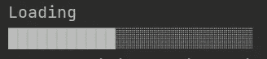
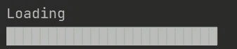

# 如何使用 Java 在标准控制台上显示进度条

> 原文：<https://medium.com/javarevisited/how-to-display-progressbar-on-the-standard-console-using-java-18f01d52b30e?source=collection_archive---------1----------------------->

你有没有想过一个进度条是如何在标准控制台上显示的(特别是当像 npm 这样的包管理器被用来下载包的时候)？我确信，即使你没有想过这个问题，你也会喜欢了解这个问题。请注意，这篇文章不会涉及跟踪任务的进展或类似的事情。事不宜迟，让我们来探索解决方案。

首先，让我们创建一个名为`printMsgWithProgressBar()`的方法，它接受要打印的`[String](https://www.java67.com/2019/11/how-to-remove-duplicate-characters-from-string-in-java.html)`消息、`[int](https://www.java67.com/2016/01/3-ways-to-convert-int-value-to-string-in-java.html)` <https://www.java67.com/2016/01/3-ways-to-convert-int-value-to-string-in-java.html>进度条的长度和`long`决定动画应该多快出现的时间间隔。因为我们要从`static main()`方法中调用该方法，所以我们必须给`printMsgWithProgressBar()`方法添加`static`修饰符。该方法类似于:

`public static void printMsgWithProgressBar(String message, int length, long timeInterval){ }`

我们将使用 Java 中的`[StringBuilder](https://javarevisited.blogspot.com/2017/08/10-differences-between-stringbuffer-and-StringBuilder-in-java.html)` <https://javarevisited.blogspot.com/2017/08/10-differences-between-stringbuffer-and-StringBuilder-in-java.html>类将进度条构造为`String`。你可能想知道`String`看起来会像一个进度条。现在，神奇的部分来了；-).我们将使用两个 **Unicode 字符:**

1.  用于显示未完成进度的**u+2591**t19】unicode 字符 ░。
2.  用于显示完成进度的**u+2588**t23】unicode 字符 █。

请注意，不支持 **Unicode 字符的控制台可能不支持这些字符。**您可以考虑使用其他符号，如`=`或`-`作为进度条字符。

我们还需要一个`[StringBuilder](https://www.java67.com/2014/05/difference-between-stringbuilder-and-StringBuffer-java.html)` <https://www.java67.com/2014/05/difference-between-stringbuilder-and-StringBuffer-java.html>实例来构建进度条。我们将使用 Java `[Stream](/javarevisited/7-best-java-tutorials-and-books-to-learn-lambda-expression-and-stream-api-and-other-features-3083e6038e14)` </javarevisited/7-best-java-tutorials-and-books-to-learn-lambda-expression-and-stream-api-and-other-features-3083e6038e14>API 中的工厂方法`generate()`来生成带有不完整 Unicode 字符的进度条。我们也可以使用一个简单的循环来达到同样的目的。在这个阶段，您的代码应该看起来像这样:

```
public static void printMsgWithProgressBar(String message, int length, long timeInterval)    
{        
char incomplete = '░'; // U+2591 Unicode Character        
char complete = '█'; // U+2588 Unicode Character        StringBuilder builder = new StringBuilder();
Stream.generate(() -> incomplete).limit(length).forEach(builder::append);
}
```

现在，我们需要在显示进度条之前先打印消息。我们必须用一个从`0`迭代到`length-1`的`int`迭代器声明一个`[for](https://www.java67.com/2014/05/3-examples-to-loop-map-in-java-foreach.html)` [循环](https://www.java67.com/2014/05/3-examples-to-loop-map-in-java-foreach.html)。在循环内部，我们必须用完整的块 Unicode 字符替换`builder`的第`i`个字符，并打印进度条。现在，代码应该看起来像这样:

```
public static void printMsgWithProgressBar(String message, int length, long timeInterval)    
{        
char incomplete = '░'; // U+2591 Unicode Character        
char complete = '█'; // U+2588 Unicode Character        StringBuilder builder = new StringBuilder();
Stream.generate(() -> incomplete).limit(length).forEach(builder::append);
for(int i = 0; i < length; i++)        
{            
builder.replace(i,i+1,String.valueOf(complete));
System.out.print(builder);
}
}
```

现在，如果您使用`[main()](https://www.java67.com/2016/01/main-method-interview-questions-in-java-answers.html)`方法执行这个方法，它将不会打印进度条，而是在每个循环中重新打印`String`，甚至可能会转到新的一行。那么，如何在每次迭代中将更新后的进度条打印在同一行呢？这里我们要使用的技巧是**回车** `\r` **转义序列**。打印完`String`后，强制控制台将光标移动到行首。我们必须在打印之前将`\r`转义序列字符附加到`builder`上。现在，代码应该看起来像这样:

```
public static void printMsgWithProgressBar(String message, int length, long timeInterval)    
{        
char incomplete = '░'; // U+2591 Unicode Character        
char complete = '█'; // U+2588 Unicode Character        StringBuilder builder = new StringBuilder();
Stream.generate(() -> incomplete).limit(length).forEach(builder::append);
for(int i = 0; i < length; i++)        
{            
builder.replace(i,i+1,String.valueOf(complete));
String progressBar = "\r" + builder;
System.out.print(progressBar);
}
}
```

现在，如果您运行代码，您将在一行中看到进度条，但它看起来不像动画，因为在填充进度条时不会有任何延迟。为了增加填充的延迟，我们将使用作为方法参数得到的`timeInterval`值。我们将使用带有`timeInterval`参数的`Thread.sleep()`方法定期暂停执行。

**就这样**！现在，如果您运行代码，您将在控制台上看到一个动画进度条。下面是完整的代码:

在控制台上显示进度条的完整代码

当进度条不完整时，它看起来像这样:



控制台上的进度条不完整

动画结束后，看起来会像这样:



控制台上带有已完成进度的进度条

这是我第一篇关于 Medium.com 的文章！我希望在这篇文章的帮助下，你能学到一些新的东西。感谢阅读这篇文章！请关注我，获取更多有趣的文章！祝您愉快:-)！