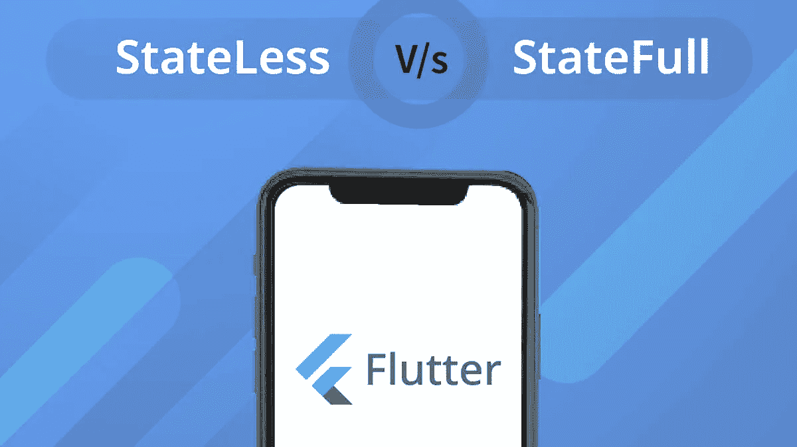

# 如何区分有状态和无状态的小部件？

> 原文：<https://medium.com/javarevisited/how-to-distinguish-between-stateful-and-stateless-widgets-b57a421d2017?source=collection_archive---------1----------------------->

**图片由**提供:米兰**来源**:自创

Flutter 由小部件组成，允许您使用和重用可定制的小部件。您可以使用各种小部件从头开始开发应用程序。这里是小部件；有小部件。Flutter 开发者可能已经知道了小部件的类型。但如果我们谈论 Flutter 新秀，他们更有可能在这个 widget 森林中迷失。

那时我觉得有必要写一个快速指南来了解各种小部件之间的区别。因为当你使用基于小部件的框架构建一个应用时，了解它的核心小部件会有很大帮助。你将知道在哪里使用哪些部件，这将引导你创建高度互动的应用程序。

**颤振必备小工具**

所以，新手们，你们必须知道 Flutter 中有三种类型的小部件:有状态小部件、无状态小部件和继承小部件。当您在任何屏幕上编写代码时，它要么位于有状态的小部件中，要么位于无状态的小部件中。简单来说，有状态和无状态是 [**Flutter app 开发**](https://kodytechnolab.com/flutter-app-development) 中最重要的部分。

那么，继承的小部件是干什么用的呢？继承的小部件是有状态和无状态的组合。您可以使用它来允许您的子部件访问父部件中的数据。因此，它将您从在小部件树中传递数据的混乱中解救出来。最终，您不必在每个类中都键入代码来将状态传递给其子类。

现在让我们来谈谈国家。为什么？因为它是我们最重要的小部件——[**有状态和无状态**](https://kodytechnolab.com/blog/stateless-vs-stateful-widget/) **的基础。**

任何小部件的状态都只是对象的数据。数据基本上是在创建时由小部件属性维护的，也就是说当它被绘制在屏幕上时。状态不是静态的。当用户与它交互时，它也可以在小部件的生命周期中改变。例如，当单击 CheckBox 小部件时，复选框上会出现一个复选标记。

**现在回到有状态和无状态小部件之战。**

**有状态窗口小部件:**

听起来“完整”，有状态小部件完全可以被修改。这种小部件是可变的，在其生命周期中可以多次更改。换句话说，应用程序的状态在运行时会随着不同的输入、变量和数据发生多次变化。例如，当用户选中复选框或填写表单时，小部件的状态会在运行时发生变化。

接下来是技术部分:有状态小部件覆盖 createState()并返回一个状态。当你的应用程序的 UI 动态变化时，你可以使用它。

继承“有状态小部件”的类是不可变的。但是状态是可变的，当用户与之交互时，状态会在运行时发生变化。

**无状态小工具:**

与有状态小部件不同，无状态小部件在运行时不会改变它们的状态。无状态小部件是不可变的，一旦它们被构建，你就不能改变变量、按钮、图标或检索数据。

无状态小部件没有直接的用户交互——例如，文本、RaisedButton、图标、图标按钮。当用户按下这些按钮中的任何一个时，这些小部件的属性都不会改变。

在技术部分，无状态小部件的基本结构无状态小部件覆盖 build()方法并返回一个小部件。如果您的应用程序的 UI 依赖于对象本身的信息，您可以使用这样的小部件。

最后，

# 总结有状态和无状态小部件之间的主要区别

**无状态小工具:**

*   它们是静态小部件；它们仅在创建过程中更新。
*   它不依赖于数据变化或行为变化。
*   例如文本、图标或升起的按钮。
*   不包括 setState()。
*   它不能在应用程序运行时更新。触发器需要外部事件。

**有状态小工具:**

*   它们本质上是动态的。
*   它是有条件的，在用户交互时会改变。
*   例如复选框、单选按钮或滑块。
*   它有一个内部 setState()。
*   它可以在运行时更新。

我希望这篇文章能帮助你开始使用 [**Flutter 应用程序开发**](/javarevisited/my-favorite-flutter-and-dart-programming-courses-for-beginners-9e8355710d78) 中的**无状态和有状态小部件。再见！**