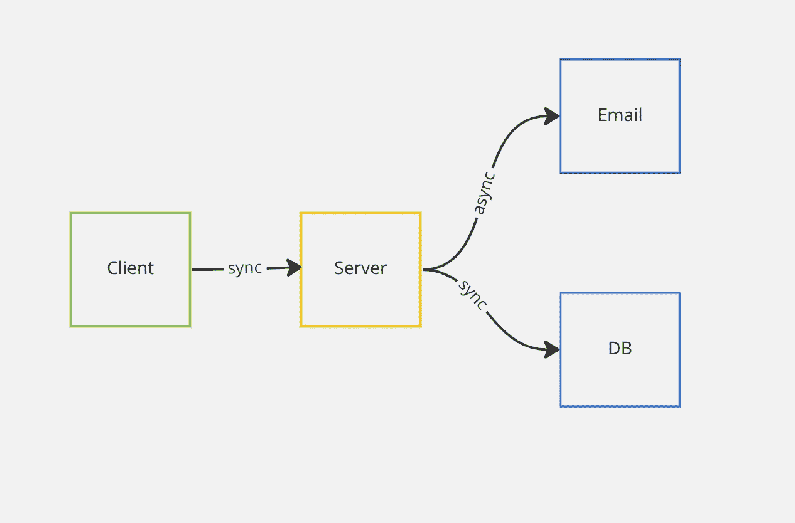

# 如何用 Java 进行异步编程

> 原文：<https://medium.com/javarevisited/how-to-do-asynchronous-programming-with-java-66bd27ceaf1b?source=collection_archive---------0----------------------->

## 使用 CompletableFuture 实现异步用例

> 最初发表于

****

## **介绍**

*   **当我们写代码的时候，通常我们会在大多数时候写[同步代码](https://javarevisited.blogspot.com/2020/04/difference-between-atomic-volatile-and-synchronized-in-java-multi-threading.html)。**
*   **但在许多情况下，不阻止是有意义的…**