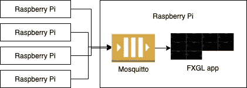
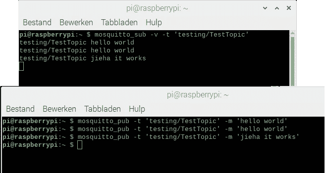
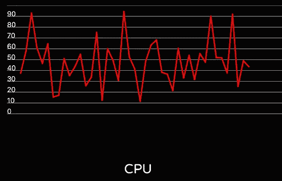
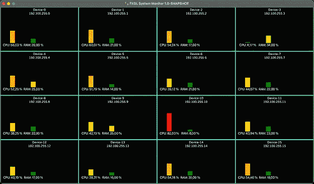

# 如何使用 JavaFX、FXGL 和 Mosquitto | foojay 进行设备监控

> 原文：<https://medium.com/javarevisited/how-to-do-device-monitoring-with-javafx-fxgl-and-mosquitto-foojay-548ed96948e7?source=collection_archive---------2----------------------->

在之前的帖子[“FXGL 游戏开发入门”](https://foojay.io/today/category/java/javafx/)中，我们已经了解了由 [Almas Baimagambetov](https://twitter.com/AlmasBaim) 开发的 [FXGL 游戏开发框架](https://github.com/AlmasB/FXGL)。

但是，这个游戏引擎也可以用于其他用例。在本帖中，我们将构建一个可以在 Raspberry Pi 上运行的系统监控仪表板。仪表板可以用来监视任何可以向队列报告其状态的设备。而且，对我个人来说，当我的路由器决定洗牌时，它终于解决了找到我所有树莓派的 IP 地址的问题…😉

# 应用程序描述

已经建立了一个概念验证，使用一个 Raspberry Pi 作为“中央系统”来托管队列(Mosquitto)。在这个 Raspberry Pi 和其他平台上，运行一个 Python 脚本来每秒向队列发送设备状态。
对于列表中出现的每个新设备(由 IP 地址决定),都会创建一个新的仪表板“标题”来显示一些数据。通过单击此区块，我们可以放大区块视图，以包含所有正在接收的数据。

[](https://javarevisited.blogspot.com/2020/06/top-5-courses-to-learn-java-fx-in-2020.html)

当应用程序启动时，您可以在“模拟数据”或带有队列的板的 IP 地址之间进行选择。这个视频展示了被嘲笑的结果:

这个项目的源代码可以在 FXGLSystemMonitoring 库的 [GitHub 上找到。](https://github.com/FDelporte/FXGLSystemMonitoring)

# 莫斯基托

Eclipse Mosquitto 是一个实现 MQTT 协议的开源消息代理，它是轻量级的，适用于从低功耗单板计算机到完整服务器的所有设备。因此，用在树莓派上是一个完美的搭配。

# 在树莓墩上安装 Mosquitto

安装 Mosquitto 可以用下面的命令来完成，这也将把它配置成一个服务，只要你的 Raspberry Pi(重新)通电就启动。

```
$ sudo apt update 
$ sudo apt install -y mosquitto mosquitto-clients 
$ sudo systemctl enable mosquitto.service
```

我们可以通过请求版本来检查它是否正确安装并运行:

```
$ mosquitto -v 
1569780732: mosquitto version 1.5.7 starting 
1569780732: Using default config. 
1569780732: Opening ipv4 listen socket on port 1883\. 
1569780732: Error: Address already in use
```

错误信息的最后一行可以忽略。

# 在码头上测试蚊子

通过打开两个终端窗口，可以使用已安装的 mosquito 客户端轻松测试 mosquito 在 Pi 上是否运行正常。在第一个示例中，我们启动了一个主题为“测试/测试主题”的监听器:

```
$ mosquitto_sub -v -t 'testing/TestTopic'
```

在第二个终端中，我们为这个特定主题发送多个命令和一条消息，如下所示:

```
$ mosquitto_pub -t 'testing/TestTopic' -m 'hello world' 
$ mosquitto_pub -t 'testing/TestTopic' -m 'hello world' 
$ mosquitto_pub -t 'testing/TestTopic' -m 'jieha it works'
```

第二个终端窗口中的每个“发布”都会出现在第一个窗口中，正如您在这些屏幕截图中看到的:

[](https://www.java67.com/2020/07/top-5-courses-to-learn-linux-in-depth.html)

# 从 Raspberry Pi 发送状态

为了将状态从我们所有的 Raspberry Pi-boards 发送到 Mosquitto，GitHub 项目中提供了一个[脚本。对于这个脚本，我们使用 Python，因为我们只需要一些最小的示例数据，这些数据很容易从“psutil”库中获得。当然，Java 也可以做到这一点，但是让我们拥抱 Python 一次吧😉](https://github.com/FDelporte/FXGLSystemMonitoring/blob/main/python/statsSender.py)

# 额外的依赖性

如果你从默认的 Raspberry Pi 操作系统开始，那么 [Python](/javarevisited/my-favorite-books-to-learn-python-in-depth-77465633b46e) 已经安装好了。所以我们只需要用 pip-命令添加两个额外的库来发送数据到队列(用 paho)和获取设备状态信息(用 psutil)。

```
pip install paho-mqtt 
pip install psutil
```

在本例中，我们仅使用 psutil 提供的所有数据的子集作为概念验证。在[pypi.org/project/psutil](https://pypi.org/project/psutil/)上可以看到完整的概述。

一小部分 [Python 代码](https://javarevisited.blogspot.com/2019/09/5-websites-to-learn-python-for-free.html)展示了如何使用虚拟内存信息来构建 json-message:

```
virtual = psutil.virtual_memory() jsonString = "{" 
... 
jsonString += " 'virtual_memory': {" 
jsonString += " 'total':'" + str(virtual.total) + "'," 
jsonString += " 'available':'" + str(virtual.available) + "'," 
jsonString += " 'used':'" + str(virtual.used) + "'," 
jsonString += " 'free':'" + str(virtual.free) + "'," 
jsonString += " 'percent':'" + str(virtual.percent) + "'" 
jsonString += " }," 
... 
jsonString = "}"
```

使用 paho-library，我们可以向队列发送这样的消息:

```
client = paho.Client(hostname + ":" + str(address)) 
client.connect(mosquitto) 
client.publish(topicName, jsonString)
```

# 在监控应用程序内部

该应用程序在 MonitorApp 中启动，它扩展了一个 FXGL 游戏应用程序。

[Java/JavaFX/FXGL Maven 项目](https://github.com/FDelporte/FXGLSystemMonitoring)被组织成数据包、队列包和视图包，以使代码易于理解。除了预期的特定于 FXGL 的覆盖(initSettings，initGame)，我们可以找到一些 FXGL 提供的额外特性的好例子。

例如，启动时的对话框要求用户选择模拟或真实模式:

```
runOnce(() -> { var choiceBox = getUIFactoryService().newChoiceBox( FXCollections.observableArrayList("192.168.0.223", "Mock Data") ); choiceBox.getSelectionModel().selectFirst(); var btnOK = getUIFactoryService().newButton("OK"); btnOK.setOnAction(e -> { var result = choiceBox.getSelectionModel().getSelectedItem(); if ("Mock Data".equals(result)) { startWithMockData(); } else { getExecutor().startAsync(() -> startWithClient(result)); } }); getDialogService().showBox("Select mode", choiceBox, btnOK);}, Duration.seconds(0.01));
```

另一个是`run()`方法，它每秒运行一次提供的代码。在这种情况下，代码使用[柏林噪声](https://en.wikipedia.org/wiki/Perlin_noise)为“模拟”模式生成随机数据:

```
run(() -> monitors.forEach(m -> { 
   var t = random(0.5, 150000.0);    var reading = new Reading( 
      noise1D(t * 7) * 100, 
      (long) (noise1D((t + 1000) * 2) * 40), 
      (long) (noise1D((t + 3000) * 3) * 75) 
   ); 
   m.onReading(reading); 
}), DATA_UPDATE_FREQUENCY);
```

# 输入数据

通过使用 JSONB，传入的数据被转换成 Java 对象。例如，让我们看看将 Python 数据映射到 Java 对象的`VirtualMemory`类。每个 JsonbProperty 都有一个 name-value，如果变量具有相同的名称，这不是必需的，但是为了清楚起见，我还是喜欢定义它，以避免以后在重命名 Java 变量时出现错误。

```
public class VirtualMemory { @JsonbProperty("total") private long total; @JsonbProperty("available") private long available;   @JsonbProperty("used") private long used; @JsonbProperty("free") private long free; @JsonbProperty("percent") private double percent; public VirtualMemory() { // NOP needed for JSON mapping } // Getters - Setters}
```

# 长队

通过使用[" org . eclipse . PAHO . client . mqttv 3 "依赖关系](https://www.eclipse.org/paho/)，我们可以很容易地连接到队列:

```
MqttClient client = new MqttClient(
   "tcp://" + ipAddress + ":1883", 
   MqttClient.generateClientId()); 
client.setCallback(new ClientCallback(readings)); 
client.subscribe(topicName);
```

每当我们前面提到的主题有可用的消息时，就会调用`ClientCallBack` 。

```
@Override public void messageArrived(String s, MqttMessage mqttMessage) { 
   String data = new String(mqttMessage.getPayload()); 
   System.out.println("Message received: " + data); 
}
```

# 视图组件

所有视图都被分割到单独的 JavaFX 节点中。总`MonitorView`负责处理`CollapsedView`和`ExpandedView`两者，这两者又分别将其职责委托给`LoadView`
和`CanvasLineChart`。这些关系的示例如下:

```
App uses MonitorView MonitorView uses CollapsedView and ExpandedView CollapsedView uses LoadView ExpandedView uses CanvasLineChart
```

所有这些视图都实现了`ReadingHandler`回调，当队列中有新的读数可用时，回调会通知每个视图。因此，所有视图都可以在收到通知后轻松更新。

# 动画片

单击时，每个控制面板平铺会展开以填充整个窗口。这种扩展以动画的形式出现，无缝地将`CollapsedView`转换为`ExpandedView`。动画本身使用 FXGL 动画系统，该系统使用“fluent”API，我们可以在其中配置各种属性，如持续时间和插值。我们还提供了我们正在制作动画的 [JavaFX](/javarevisited/6-free-courses-to-learn-servlet-jsp-and-java-fx-in-2020-best-of-lot-720201c84f63) observable 属性(`bg.widthProperty()`)以及动画开始和结束时的值:

```
animationBuilder() 
   .duration(ANIMATION_DURATION) 
   .interpolator(Interpolators.EXPONENTIAL.EASE_OUT()) 
   .animate(bg.widthProperty()) 
   .from(MONITOR_WIDTH) 
   .to(APP_WIDTH) 
   .buildAndPlay();
```

# 使用模拟数据运行应用程序

当应用程序启动时，您可以选择带有 Mosquitto 队列的 Raspberry Pi 的 IP 地址和“模拟数据”。选择第二个选项后，将在应用程序中创建 16 个设备，每个设备由随机生成的数据驱动。这是测试所有应用程序功能的理想选择。

[](https://medium.com/javarevisited/6-free-courses-to-learn-servlet-jsp-and-java-fx-in-2020-best-of-lot-720201c84f63)[](https://javarevisited.blogspot.com/2020/06/top-5-courses-to-learn-kubernetes-for-devops-and-certification.html)[](https://javarevisited.blogspot.com/2019/04/top-5-courses-to-learn-jvm-internals.html)

# 使用真实数据运行应用程序

重启应用程序并选择 IP 地址。一旦从具有新 IP 地址的设备接收到数据，就会创建一个新的切片来可视化数据。在几个设备上启动 [Python 脚本](/javarevisited/10-free-python-tutorials-and-courses-from-google-microsoft-and-coursera-for-beginners-96b9ad20b4e6)，查看结果，如下面的视频所示。

正如你在视频中看到的，我的 Pi 不是很忙。通过使用压力工具，我们可以在设备上触发额外的负载，以测试仪表板中的可视化效果。

在我的 Raspberry Pi (B4 8Gb 内存)上，cpu 命令只影响 CPU 值，而 vm 命令会导致更高的 CPU 和内存使用率。

```
$ sudo apt install stress 
$ stress --cpu 2 
$ stress --vm 4 --vm-bytes 1024M
```

# 结论

应该注意的是，Gerrit 格伦瓦德的华丽的 [TilesFX 库也可以做类似的事情，但是我们特意采用了另一种方法来向您展示如何使用 JavaFX 和 FXGL 自己创建可视化组件。](https://github.com/HanSolo/tilesfx)

结合正确的 JsonB 和 Paho 库，Java 再次证明了可以用最少的易于阅读和扩展的代码创建非常强大的应用程序。

由于这只是一个概念验证，仍有很大的改进空间…只是一些想法:

*   指示在过去 X 秒内未发送数据的设备，并将视图背景变为红色
*   组合图表上的多个值
*   在扩展视图中提供附加信息
*   添加一个对话框，询问用户队列 IP 地址

**非常感谢 Almas 对范例项目和这篇文章的贡献！**

随意使用这个项目作为一个起点或作为一个灵感，但请分享你创造了什么！

*原载于 2021 年 1 月 11 日*[*https://foojay . io*](https://foojay.io/today/device-monitoring-with-javafx-and-fxgl/)*。*