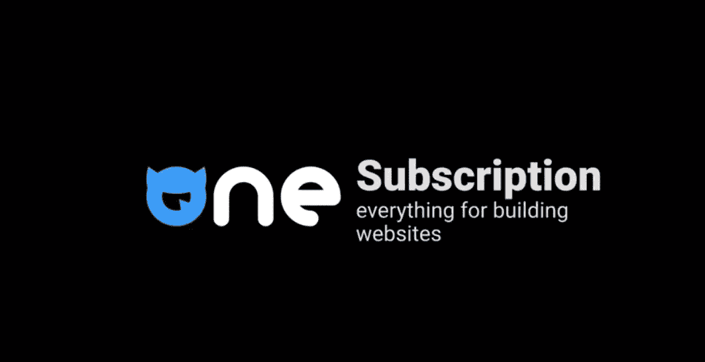
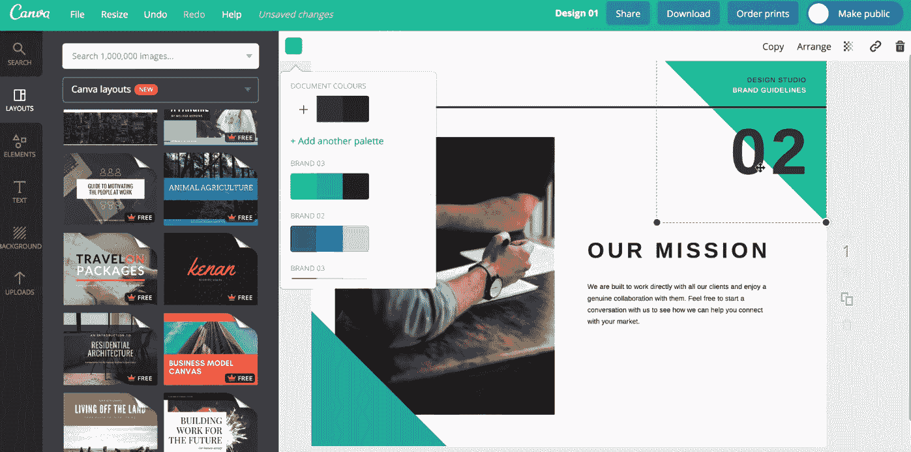
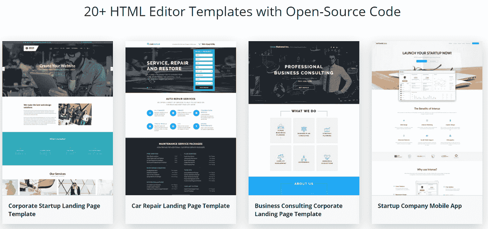
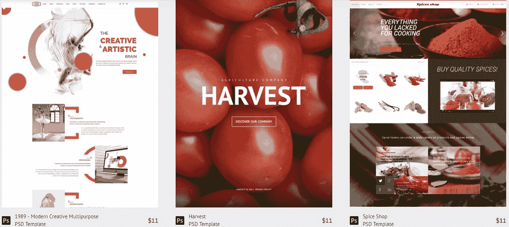
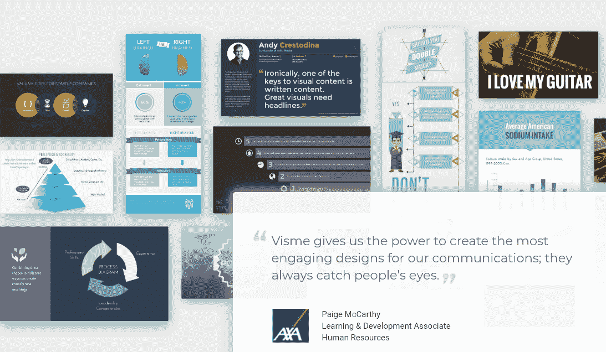
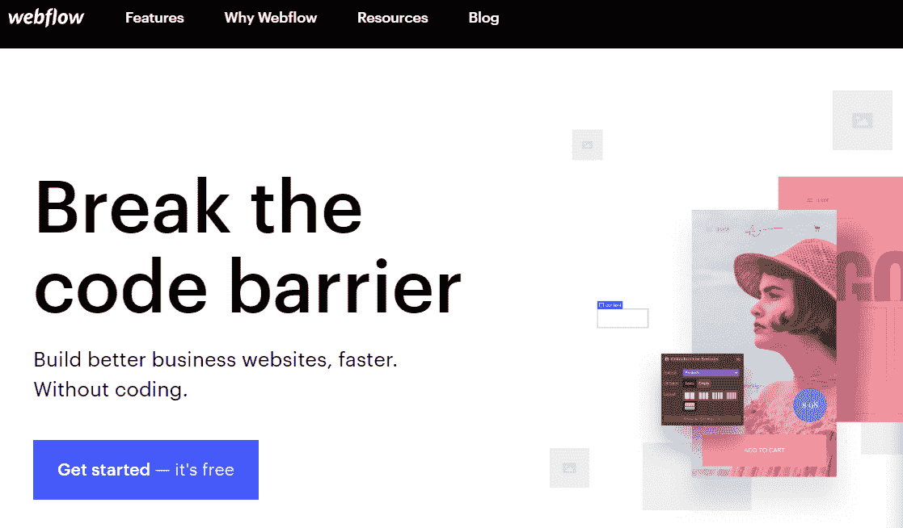
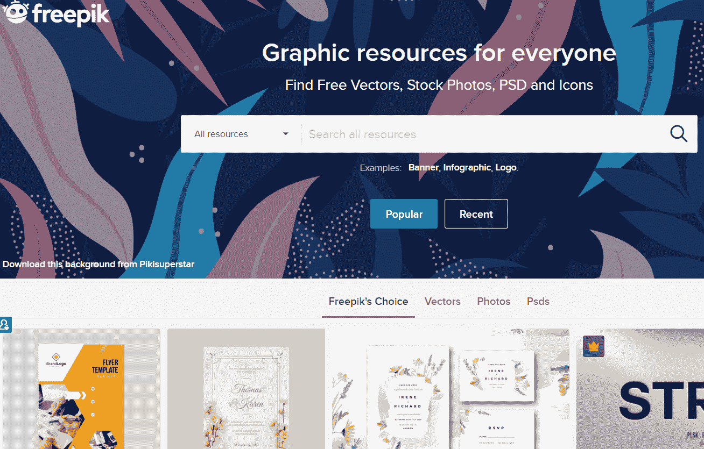
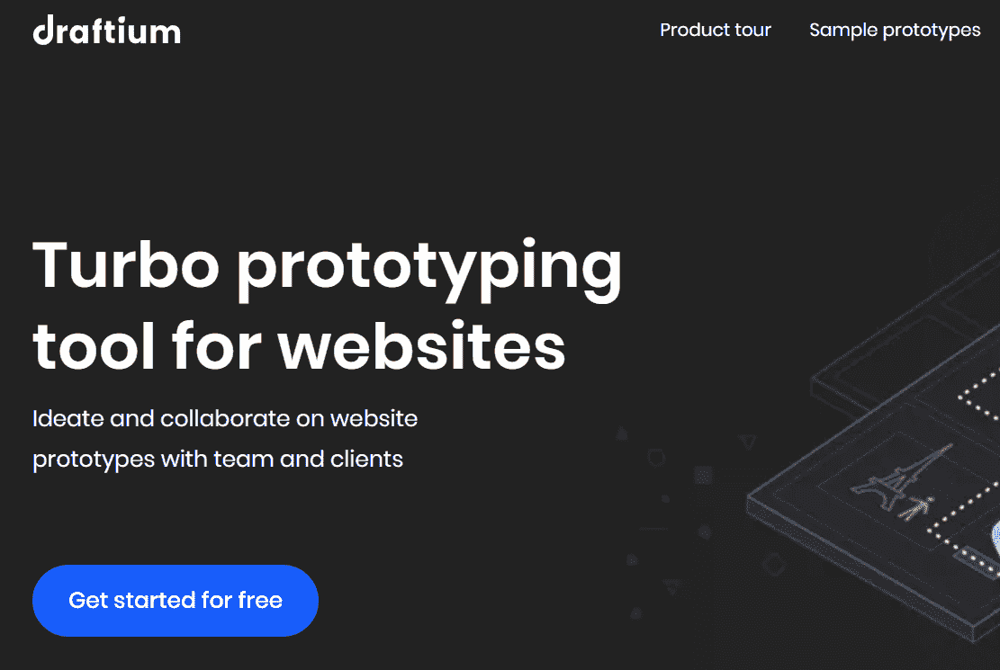
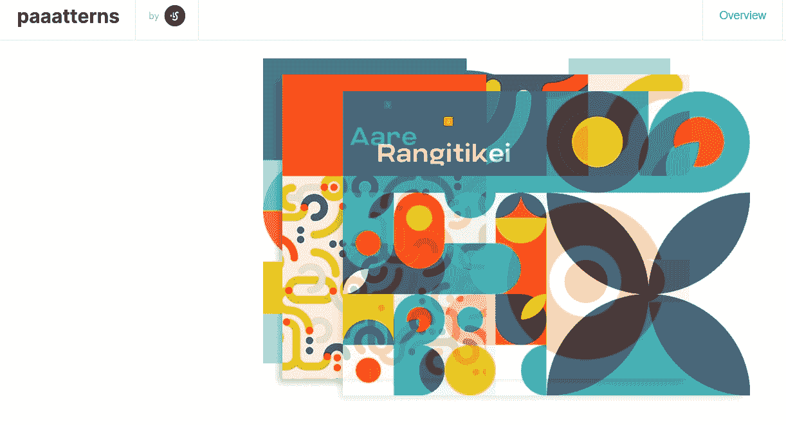
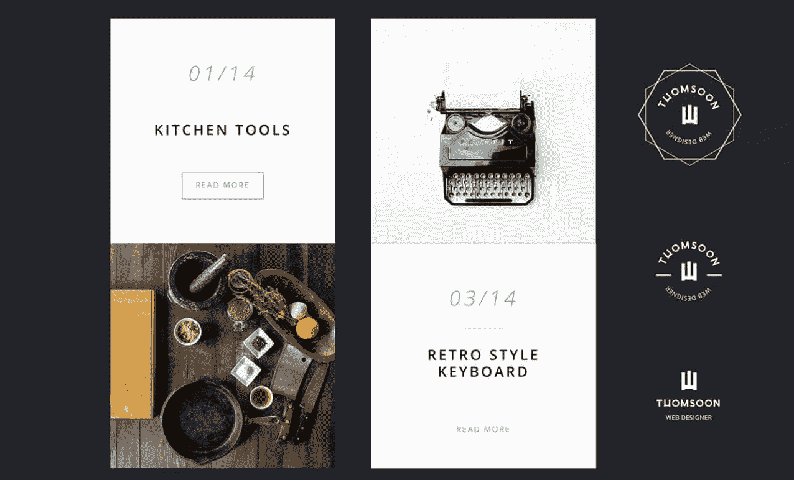

# 如何利用 10 多种免费和优质的网络开发资源轻松完成工作

> 原文：<https://medium.com/javarevisited/how-to-ease-a-work-with-10-free-premium-web-development-resources-bfb20f202ade?source=collection_archive---------0----------------------->

## 因为开发者和他的工具一样好…

塞萨尔·卡利瓦里诺·阿拉贡在 [Unsplash](https://unsplash.com?utm_source=medium&utm_medium=referral) 上拍照

想找一个高档的**网页开发工具**？其中几十个可以让你的概念变成现实。尽管如此，我知道选择一个有多难。

虽然选择范围很广，但有些应用还是很突出的。它们为实现任何复杂的想法提供了更多的机会。他们有更容易的导航。此外，现代专业仪器供您使用。

尽管如此，亲自测试所有工具是不可能的。市场上充满了有价值的选择。

在这篇文章中，你会发现*是最流行的*和*最有价值的*高级&免费网页设计工具。有开发者和设计者应用，颜色和字体工具，还有 [**编码资源**](/javarevisited/20-books-java-developers-can-read-in-2019-aabf2878c496?source=collection_home---4------1-----------------------) 。

此外，你还可以获得一系列 PSD 网站模板、几个网页设计工具包和高级视觉编辑工具。

好奇吗？更少的单词，更多有用的信息。我们走吧！

# 高级 Web 设计和开发工具和编辑器

网页设计赠品有萌芽功能。**搜索高级功能？**那么，我会建议关注优质产品。他们通常有更多的模板，主题，插件，字体，视觉元素，图形。**高级 web 开发套件**提供了广泛而独特的工具选择。

以下 6 个网页设计工具值得网页开发者关注。

## [一个成员](https://one.templatemonster.com/?aff=javarevisited&utm_campaign=blog_site_javarevisited&utm_source=javarevisited&utm_medium=referral&utm_content=article)

一个是订阅服务。包括 10300+用于网站建设的数码产品。它既有新手也有畅销书。有了这个套餐，你可以节省很多。一起买得起，分开买，这些产品价格更高。

因此，开发套件包括:

*   WordPress 和电子商务主题；
*   HTML 和 CSS 模板；
*   演示模板；
*   丰富的图形选择；
*   插件。

*而且，你得到:*

*   1 年免费托管；
*   无限制的年度许可证；
*   全天候支持。

**价格:**每月 17 美元，每年 199 美元。作为一项特别优惠，除了会员之外，您还可以享受 TemplateMonster 产品 50%的折扣。

**适合**适合**适合:**

*   任何复杂性和专题重点的项目；
*   初级和[高级 web 开发人员](https://hackernoon.com/the-2019-web-developer-roadmap-ab89ac3c380e)。

## [Canva Pro](https://www.canva.com/pro/)

我打赌你已经认识 Canva 了。Canva Pro 包括免费版本的所有内容。另外:

*   无限存储；
*   无限的设计文件夹；
*   400，000 个设计、模板、照片、图标和形状；
*   将设计导出为动画 gif 的机会；
*   轻松将设计调整为定制尺寸；
*   为品牌设置调色板的机会；
*   优先支持。

这个图形设计工具以其简单性脱颖而出。此外，它还有一个拥有 150 万张免费照片的图书馆。您可以编辑所有设计和模板。

**价格:** $9.95 每月。提供 30 天试用期。

**适用于:**

*   初级和高级 web 开发人员；
*   多用途项目；
*   任何主题的项目(商业、教育、营销、娱乐、旅游、艺术)；
*   没有时间的人(拖拉的天性)。

## [Novi HTML 可视化构建器](https://novibuilder.com/visual-html-real-time-editor/?aff=javarevisited&utm_campaign=blog_site_javarevisited&utm_source=javarevisited&utm_medium=referral)

创建一个 HTML 网站，寻找网页设计工具？Novi Builder 是个不错的选择。这是一个拖放式可视化编辑器。不过，它有一个方便的代码编辑器。在那里，您可以更改 [HTML](https://hackernoon.com/top-5-free-online-courses-to-learn-html-css-web-development-in-2020-ae8e7466dfa7) 、 [CSS](https://javarevisited.blogspot.com/2019/05/top-5-html-5-and-css-3-courses-for-web-developers.html) 和 [JS](https://hackernoon.com/10-of-the-most-popular-javascript-libraries-for-frontend-and-backend-development-ph1h0326n) 代码。

此外，您将获得:

*   图标和字体管理器；
*   全面的文本编辑器；
*   媒体和预置库；
*   页面管理器。

另外，它有一个直观的上下文菜单。在这个过程中，它给你网站设计的提示。

*使用 Novi，您可以:*

*   创建和设计登录页面；
*   创建和设计多页面和多用途网站；
*   创建和销售您的模板；
*   使用时尚的设计。

**价格:**启动计划每年 29 美元。高级计划每年 49 美元。开发者计划一次 149 美元。你也可以免费试用**。**

****适用于:****

*   **网页开发者和设计者；**
*   **任何主题的项目和网站。**

## **[PSD 模板](https://www.templatemonster.com/psd-templates.php?aff=javarevisited&utm_campaign=blog_site_javarevisited&utm_source=javarevisited&utm_medium=referral)**

**这里有 3770+PSD 网站模板。他们只有图形设计源文件。每个模板都有主页和子页。每个子页面都已经包含了标准元素(例如图标和文本、联系表单、新闻提要)。**

****

**除此之外，这些 Photoshop 网站模板设计独特，排版质量高。**

**你处理原始源文件。这意味着你可以不受限制地做任何改变，不像在 CMS 平台设计中那样。**

****价格:**10 美元起。**

****适合:****

*   **任何技能水平的网页开发者和设计者；**
*   **任何类型的项目。**

## **[视觉](https://www.visme.co/)**

**Visme 有助于创建:**

*   **报告**
*   **信息图表**
*   **聊天和地图**
*   **任何类型的文件**
*   **图形和印刷品。**

****

**它有一个以最吸引人的方式包装内容的工具包。它具有:**

*   **带附件的演示模板(时间线、部分、服务、产品比较等。);**
*   **现成的可编辑幻灯片；**
*   **带有现成的块、页眉和页脚的信息图表模板。**
*   **用于处理数据的工具(Microsoft Office 集成)；**
*   **调色板；**
*   **字体库；**
*   **数百万张免费图片。**

**此外，Visme 的导航很简单。**

****价格:**针对个人、学生、商人有不同的 [**方案**](https://www.visme.co/pricing/) 。另外，你可以免费试用 Visme。**

****适用于:****

*   **任何技能水平的 web 开发人员；**
*   **学生和教师；**
*   **非营利组织；**
*   **教育和商业项目。**

## **[Webflow](http://webflow.com/)**

**Webflow 是一个成熟的网站建设者。它专注于四个领域:**

*   **设计**
*   **羧甲基淀粉钠**
*   **主办；主持**
*   **编辑**

****

**可视化设计器对 web 开发人员来说很方便。不用写代码，可以生成。您可以使用预制块，并根据工具的功能对其进行更改。**

**你仍然可以用代码工作。Webflow 支持框模型、自定义过渡、flex box、floats 和 3D CSS 转换。它也有现代的排版、视觉、渐变、动画和 DOM 组织。**

**有了 Webflow，你可以启动一个电子商务商店。**

**价格:在网站上查询。**

****适用于:****

*   **新手和有经验的 web 开发人员；**
*   **任何类型的网站或项目。**

# **免费网页设计工具**

**库存有价值的网页设计赠品总是很方便的。除了顶级巨头，还有免费的网页设计工具值得 T2 网页开发者的关注。他们中的大多数都有不错的品质。**

**下面，你可以看到其中的一小部分。**

## **[Freepik](https://www.freepik.com/)**

**Freepik 提供免费的矢量，股票照片，PSD 和图标。它有一个图书馆，里面有设计、图形资源和插图。它们可用于个人和商业用途。Freepik 专门制作信息图。**

****

**特点:**

*   **名片模板；**
*   **小册子，标志，框架传单，和横幅创作；**
*   **背景模板；**
*   **实体模型；**
*   **信息图模板。**

****价格:**每月 9.99 美元，每年 89.99 美元。提供免费试用。**

****适用于:****

*   **网页开发和设计师；**
*   **简单用户，他们需要高质量的图形；**
*   **所有主题的项目。**

## **Crocoblock 赠品**

**Crocoblock 是一个工具包，里面有你建立一个网站所需要的一切。它和 Elementor 兼容。在一项服务中，有一些免费的额外津贴。**

**可以获得 **50+** [**免费网页设计模板**](https://crocoblock.com/free-templates/) 。有主页和登录页面。其他页面，如产品、团队、服务、定价、项目页面等，都由您自行处理。WordPress 页面是可定制的。你可以很快根据自己的口味改变它们。**

**而且，你可以下载一个 [**免费的开发者工具包**](https://crocoblock.com/freemium/tools/) 。它包括:**

*   **联系形式 7 布局；**
*   **WP 查询生成器。**

***WP 查询生成器允许:***

*   **按日期、评论、元值对帖子进行排序；**
*   **通过标签、类别和术语包括/排除帖子；**
*   **连接税务查询；**
*   **添加元查询和建立逻辑关系；**
*   **添加日期查询和设置关系。**

****价格:**免费。**

****适用于:****

*   **网页开发者和设计者；**
*   **没有编码技能的人；**
*   **不同主题焦点的网站。**

## **[透风板](https://draftium.com/)**

**这是一个原型制作工具。有想法吗？20 分钟就能体会到。为此，您需要:**

*   **300 个预建原型模板；**
*   **250 块现成的积木；**
*   **质量排版；**
*   **免费图片和图标。**

**此外，还有工具可用于:**

*   **页面链接；**
*   **创建演示文稿。**

****

**你可以创建你的模型。发布原型后，您可以在几分钟内获得反馈。这是实时协作。你创建一个项目，然后马上讨论它。那很方便。**

**所有模板都是可定制的。您可以在任何块中组织内容。**

****价格:**免费。您可以创建多达 3 个原型，并使用 50 个通用模板。无限制的编辑是可用的。**

****适合:****

*   **web 开发人员和设计人员，他们没有时间；**
*   **每个人都想看看他们未来的项目会是什么样子。**

## **[帕阿特恩斯](https://lstore.graphics/paaatterns/)**

**你可以通过这个链接获得所有矢量格式的免费模式集合。**

**特点:**

*   **22 个图案；**
*   **独特的形状和颜色；**
*   **英寸 png 和. vng。**

**由于图层样式和矢量形状，所有的设计都是可定制的。你可以预览所有的图案。这些产品可用于个人和商业用途。**

****

****适用于:****

*   **。草图文件；**
*   **。fig 文件；**
*   **xd。文件；**
*   **艾。文件。**

**您可以将图案与设计师的工具包一起使用，以增强效果。**

****价格:**免费。**

## **Thomsoon 的 55+元素 UI 套件**

**在免费的 UI 元素集合中，您可以获得:**

*   **导航和统计元素；**
*   **滑块；**
*   **widgets**
*   **PSD 矢量元素；**
*   **图标。**

****

**你可以预览一个网站。可以改成线框。所有元素都采用极简设计。如果你追求简单，这个工具包可能是一个不错的选择。**

****适用于:****

*   **网页开发和设计师；**
*   **需要 Photoshop 版。**

****价格:**免费。**

**我们用免费的网页设计工具达到了收藏的末尾。一件好事是你不必总是和编码打交道。大多数资源都具有拖放的性质。当截止日期快到了，这样可以节省时间。尽管如此，它们中的大多数都允许深入代码进行详细的编辑。**

**如果你想分享任何其他有价值的免费或高级网页设计工具，欢迎你。**

**留下你的评论。**

> ***让我们一起来扩充收藏吧！:-)***