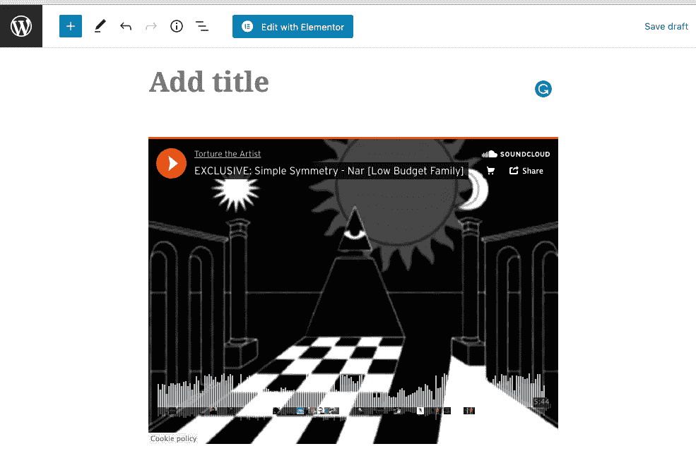
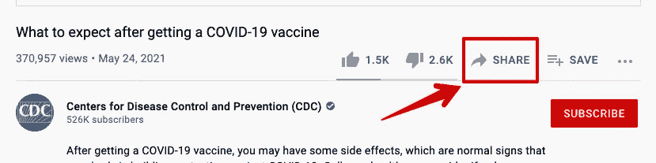
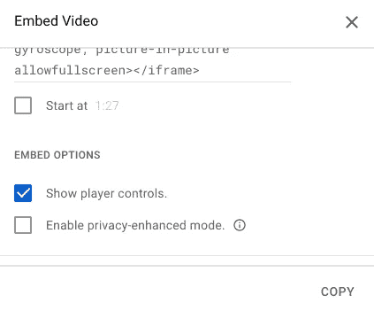

# 如何在 WordPress 中嵌入视频？

> 原文：<https://medium.com/javarevisited/how-to-embed-video-in-wordpress-2ca8117fe608?source=collection_archive---------3----------------------->

视频内容是丰富你的网站、增加网站价值、提高网站排名的有效方式。WordPress 允许轻松嵌入视频文件，因此没有理由不使用这个工具。这篇文章将介绍如何在 WordPress 网站上添加视频的所有方法。

# 如何在页面和帖子中嵌入视频

诚实， [**WordPress**](/javarevisited/5-best-wordpress-courses-for-beginners-and-experienced-website-developers-b45f7976ee40) 成功地让从任何视频服务如 YouTube、Vimeo 等插入视频变得超级容易。顺便说一下，这里有一个支持自动嵌入 WordPress 特性的平台列表:

*   油管（国外视频网站）
*   Vimeo
*   Spotify
*   声音云
*   照片墙
*   Reddit
*   Tumblr
*   闪烁（光）
*   翻晒
*   日常运动
*   葫芦
*   照相桶
*   Scribd
*   幻灯片共享
*   [WordPress.tv](http://WordPress.tv)
*   WordPress 插件目录

现在，让我们弄清楚**如何将媒体文件嵌入到 WordPress 网站**。

# o 嵌入

oEmbed 方法是插入图像、音乐、视频、文本等等的标准 WordPress 方式。

你所需要做的就是粘贴你想要嵌入的文件的源 URL。步骤如下:

*   转到 YouTube、Vimeo、SoundCloud 或其他您想要嵌入媒体的地方
*   从地址栏复制它的链接
*   转到 WordPress 编辑器，创建一篇新文章(或编辑现有文章)
*   把链接放在你想放的任何地方。它将在几秒钟内转换成嵌入视频

# 内联框架

此协议允许自定义视频在帖子或网页上的显示方式。我将以 YouTube 为例向您展示这是如何做到的，但请记住，任何其他服务都将具有相同的动作机制。所以，你需要的是:

*   单击共享按钮。它被放在任何 YouTube 视频的下面

*   在将出现的窗口中单击嵌入按钮
*   您将看到 iframe 代码和嵌入框。设置视频开始时间的最简单方法是播放视频到那个时刻，然后在执行上述步骤之前暂停

*   复制 iframe 代码，并把它放到 [WordPress 编辑器](https://javarevisited.blogspot.com/2020/08/top-5-courses-to-learn-wordpress-in.html)中
*   改变文本的视觉模式，并粘贴嵌入代码

# 我如何在侧边栏中嵌入视频？

如果你需要插入视频，不是在帖子上，而是在边栏上，你必须做以下事情:

1.  转到管理仪表板，并传递到外观->自定义。
2.  然后，单击小部件按钮
3.  选取您想要插入视频的边栏区域，然后点按
4.  在搜索栏中添加一个小部件类型“视频”
5.  视频小部件现在添加到了界面的左侧。
6.  现在点击添加视频→从 URL 插入
7.  将视频的 YouTube 链接复制并粘贴到栏中
8.  当视频预览显示关闭时，按添加到小工具进行确认
9.  在 WordPress 小工具中嵌入 Youtube 视频
10.  保存，发布按钮，并投入使用！😊

# 我应该把媒体文件直接上传到网站吗？

总之，**没有**。

也许只有在极端的情况下，当由于某种原因你不能在任何可用的平台上发表你的材料。这就是为什么你不必做它。

## 这给服务器带来了沉重的负担

视频文件通常很重，上传会让服务器紧张。此外，你很可能需要额外的插件来做到这一点，他们会加载服务器更多。最终，所有这些都会对整个网站的速度产生负面影响。

## 从宣传片的角度来看没用

当你直接上传一个视频的时候，无论你的网站上有多少访问者观看，都不会影响任何事情。但是如果你从 YouTube 上插入一个视频到网站上，你网站上的浏览量也会被计算在内。这对推广和盈利都很重要。

# 视频嵌入 WordPress 插件

# Youtube 的供稿

F[**eeds for YouTube**](https://wordpress.org/plugins/feeds-for-youtube/)是一个免费插件，允许你在可定制的提要中显示来自 YouTube 的内容。您可以在多个页面或小部件上安排来自不同频道的多个提要。在列表、网格或图库之间选择布局。还可以通过定制 CSS 或 JavaScript 进行更深入的定制。该插件很简单，工作速度非常快。

# 视频播放列表小工具

Elementor YouTube 播放列表是由 **Crocoblock** 开发的 [**JetBlog 插件**](https://crocoblock.com/widgets/video-playlist/?ref=2817) 的一部分。这是一个小工具，可以帮助你从 YouTube 和 Vimeo 上创建视频播放列表，并将它们放在你网站的任何地方。用这些小部件制作的播放列表是高度可定制的，允许你选择背景、图标、排版风格等等。

你不能单独获得 Elementor 或 YouTube 播放列表，但花 13 美元就可以获得整个 JetBlog 包。它包括 9 个小部件，涵盖了博客的所有主要需求。

# 视频包

Videopack 是一个视频插件，允许给直接上传到 WordPress 的视频添加额外的字段，并生成视频缩略图。它允许你调整它们的大小，这样视频就可以根据需要适合你的网站设计。此外，在 Videopack 的帮助下，您可以访问 Adobe Strobe 媒体播放 Flash Player、Video.js、Mediaelement.js 和 JW Player 6。

# 总结

你如何在你的 WordPress 网站上嵌入视频？欢迎在评论中分享 below⚡