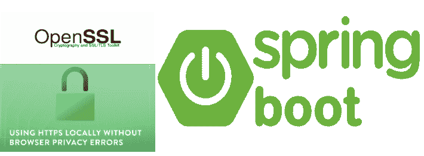
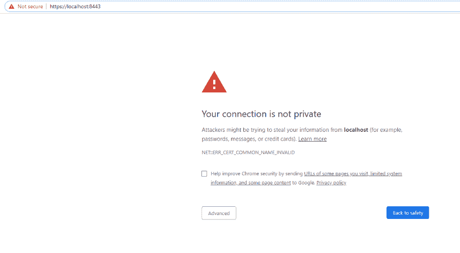
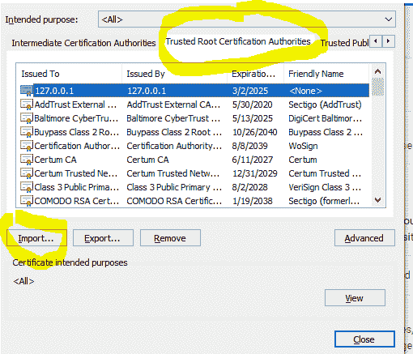
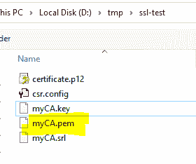
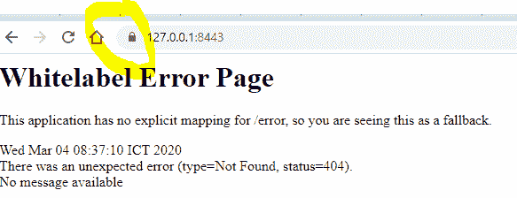
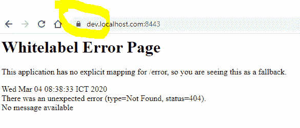

# 如何在本地启用 HTTPS，而不会在 Spring Boot 应用程序中出现恼人的浏览器隐私错误

> 原文：<https://medium.com/javarevisited/how-to-enable-https-locally-without-getting-annoying-browser-privacyerrors-in-a-spring-boot-a6137dacbc0a?source=collection_archive---------0----------------------->



当您将自己的证书作为自签名证书进行管理时，在本地设置 HTTPS 可能是一种棘手的方式，您可能仍然会遇到浏览器隐私错误。在本地主机环境中的大多数 SSL 配置中，您经常会得到浏览器抱怨您的连接不是私有的，如下所示。



错误 SSL 不安全

我们如何在本地域中使浏览器可信？

在本文中，我将带您了解如何设置自签名证书，并向您展示一个技巧来消除浏览器隐私错误，并将自签名证书集成到 spring-boot 应用程序中。

# 自签名证书和 HTTPs 弹簧启动应用程序

为 Spring Boot 配置 HTTPS 需要两步:获得 SSL 证书和在 Spring Boot 配置 SSL。无论您是要生成自签名证书，还是已经通过**根证书** **权威机构** (CA)获得了一个证书，我都将向您展示如何使用 CA 根证书创建自签名证书，以及如何在 Spring Boot 应用程序中启用 HTTPS。

1.  生成 SSL 证书
2.  在 Spring Boot 配置 SSL。

# 先决条件

*   Java 1.8
*   弹簧靴 2.x.x
*   OpenSSL 工具

我们可以自己生成一个 SSL 证书(自签名证书)。它仅用于开发和测试目的。在生产中，我们应该使用官方可信证书颁发机构(CA)颁发的证书。

在本教程中，我们将探索以下项目:

*   创建 CA 根证书
*   用 CA-Root 创建自签名证书
*   将公共证书转换成 springboot 使用的 **PKCS12 密钥库**
*   在 springboot 应用程序属性中附加 PKCS12 文件

# CA 根证书

**1#创建 CA 根**

```
openssl genrsa -des3 -out myCARoot.key 2048
```

你会被提示输入密码，我建议**不要跳过**以确保安全。密码短语将阻止任何获得您的私钥的人生成他们自己的根证书。输出应该是这样的。在这个例子中:我使用**密码**进行测试。

```
Generating RSA private key, 2048 bit long modulus
.................................................................+++
.....................................+++
e is 65537 (0x10001)
Enter pass phrase for myCARoot.key: password
Verifying - Enter pass phrase for myCARoot.key:password
```

**2#创建 CA 根证书**

```
openssl req -x509 -new -nodes -key myCARoot.key -sha256 -days 3650 -out myCARoot.pem
```

您将被提示输入您的私钥密码和一系列问题。这些问题的答案并不重要。他们在查看证书时出现，而你几乎永远不会这样做。我建议将通用名称作为您在其他证书列表中可以识别的根证书。这是唯一重要的事情。

```
Enter pass phrase for myCARoot.key:
You are about to be asked to enter information that will be incorporated
into your certificate request.
What you are about to enter is what is called a Distinguished Name or a DN.
There are quite a few fields but you can leave some blank
For some fields there will be a default value,
If you enter '.', the field will be left blank.
-----
Country Name (2 letter code) [AU]:KH
State or Province Name (full name) [Some-State]:Phnom Penh
Locality Name (eg, city) []:Phnom Penh
Organization Name (eg, company) [Internet Widgits Pty Ltd]:Test Inc
Organizational Unit Name (eg, section) []:
Common Name (e.g. server FQDN or YOUR name) []:127.0.0.1
Email Address []:noreply@gmail.com
```

您现在应该有两个文件: **myCARoot.key** (私钥)和 **myCARoot.pem** (根证书)。

**安装您的根证书**

我们需要将根证书添加到将访问您的 HTTPS 站点的任何笔记本电脑、台式机、平板电脑和手机。这可能有点痛苦，但好消息是我们只需要做一次。一旦我们的根证书(myCARoot.pem)在每台设备上，它将一直有效，直到过期。


将 myCARoot.pem 导入 Chrome



# 使用 CA-Root 的自签名证书

现在，我们所有的设备上都有了一个 CA，我们可以为任何需要 HTTPS 的新开发站点签署证书。首先，我们创建一个私钥:

```
openssl genrsa -out dev.localhost.com.key 2048
```

然后是一个 CSR 文件:

```
openssl req -new -key dev.localhost.com.key -out dev.localhost.com.csr
```

你会得到和上面一样的问题，同样，你的答案并不重要。事实上，它们甚至更不重要，因为你不会在其他人旁边的列表中看到这个证书。

您将被要求输入将被合并到您的证书申请中的信息。您将要输入的是所谓的可分辨名称或 DN。有相当多的字段，但你可以留一些空白。对于某些字段，如果您输入“.”，将会有一个默认值，该字段将留空。

```
Country Name (2 letter code) [AU]:KH
State or Province Name (full name) [Some-State]:Phnom Penh
Locality Name (eg, city) []:Phnom Penh
Organization Name (eg, company) [Internet Widgits Pty Ltd]:Test Inc
Organizational Unit Name (eg, section) []:
Common Name (e.g. server FQDN or YOUR name) []:127.0.0.1
Email Address []:noreply@gmail.com

Please enter the following 'extra' attributes
to be sent with your certificate request
A challenge password []:
An optional company name []:
```

**使用 csr 文件**创建公共证书文件

我们需要创建配置 csr 文件(csr.config):需要配置文件来定义主题可选名称(SAN)扩展。新文件命名为 **csr.config** ，增加了以下内容:

```
[req]days                   = 3650
serial                 = 1
distinguished_name     = req_distinguished_name
x509_extensions        = v3_ca[req_distinguished_name]countryName            = Country
stateOrProvinceName    = State
localityName           = Locality
organizationName       = Organizational Name
organizationalUnitName = Organizational Unit Name
commonName             = Common Name (Domain Name)
emailAddress           = Email Address[ v3_ca ]# The extentions to add to a self-signed cert
subjectKeyIdentifier   = hash
authorityKeyIdentifier = keyid:always,issuer:always# THIS IS VERY IMPORTANT IF YOU WANT TO USE THIS CERTIFICATION AS AN AUTHORITY!!!basicConstraints       = CA:TRUE
keyUsage               = digitalSignature, nonRepudiation, keyEncipherment, dataEncipherment, keyAgreement, keyCertSignsubjectAltName         = @alt_names
issuerAltName          = issuer:copy[alt_names]DNS.1 = dev.localhost.com
DNS.2 = dev.localhost.com.127.0.0.1.io
IP.1= 127.0.0.1
```

现在我们运行命令来创建公共证书:

```
openssl x509 -req -in dev.localhost.com.csr -CA myCARoot.pem -CAkey myCARoot.key -CAcreateserial -out dev.localhost.com.crt -days 3650 -sha256 -extfile **csr.config  -extensions v3_ca**
```

应该会提示您输入 CA 私钥密码。

完成上述步骤后，您应该有三个文件:

*   【dev.localhost.com.key】(私钥)、
*   **dev.localhost.com.csr**(证书签名请求)，以及
*   **dev.localhost.com.crt**(签名证书)

# **转换 PKCS#12 或 PFX 格式**

```
openssl pkcs12 -export -out dev.localhost.com.p12 -inkey dev.localhost.com.key -in dev.localhost.com.crt
```

分解命令:

*   openssl —用于执行 openssl 的命令
*   pkcs12—OpenSSL 中 PKCS#12 文件的文件实用程序
*   -export-out dev.localhost.com.p12—将 PFX 文件导出并保存为 dev . localhost . com . p12
*   -因基 dev.localhost.com.key—使用私钥文件 dev.localhost.com.key 作为私钥来与证书结合。
*   -在 dev.localhost.com.crt-使用 dev.localhost.com.crt 作为私钥将与之结合的证书。

# **在 Springboot java 应用程序中启用 SSL HTTPS**

要为 Spring Boot 2 应用程序启用 HTTPS，请将 dev.localhost.com.p12 复制到 Spring Boot 资源文件夹，然后在应用程序属性上进行配置。

# 应用程序属性

```
spring:
  application:
    name: application
---
server:
  ssl:
    key-store: classpath:**dev.localhost.com.p12**
    key-store-password: password
    key-store-type: **pkcs12**
    key-password: **password**
  port: 8443
```

# 测试 API

https://127.0.0.1:8443



[https://127.0.0.1:8443](https://127.0.0.1:8443)

访问域:[https://dev.localhost.com:8443](https://dev.localhost.com:8443/)

您需要在/etc/hosts 中添加这一行 127 . 0 . 0 . 1 dev.localhost.com

```
echo '127.0.0.1 dev.localhost.com'>> /etc/hosts'
```



[https://dev.localhost.com:8443](https://dev.localhost.com:8443/)

其他 API:[https://127 . 0 . 0 . 1:8443/API/test/data](https://127.0.0.1:8443/api/test/data)

现在错误问题消失了，浏览器认为服务器是安全和可信的。

# 结论

我希望这篇文章能够让您了解如何在 springboot 应用程序中生成自签名证书和启用 HTTPs 的基本概念

如果这篇文章有帮助，请支持按下**按钮**👏按钮，并帮助与其他读者分享这个故事。

完整的示例源代码可以在 [GitHub](https://github.com/sophea/ssl-spring-boot) 上获得。

[](/javarevisited/10-advanced-spring-boot-courses-for-experienced-java-developers-5e57606816bd) [## 面向有经验的 Java 开发人员的 10 门高级 Spring Boot 课程

### 高级 Spring Boot 课程为有经验的 Java 开发人员学习 Spring Boot 测试，云和容器…

medium.com](/javarevisited/10-advanced-spring-boot-courses-for-experienced-java-developers-5e57606816bd) [](https://javarevisited.blogspot.com/2019/10/the-java-developer-roadmap.html#123) [## 2020 年 Java 开发者路线图

### 大家好，首先祝大家 2020 新年快乐。我已经分享了很多成为网络的路线图…

javarevisited.blogspot.com](https://javarevisited.blogspot.com/2019/10/the-java-developer-roadmap.html#123)