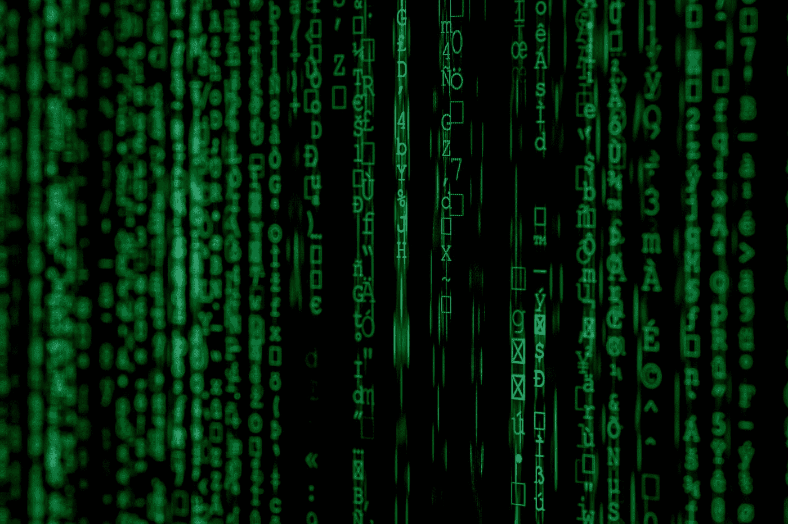

# 如何在 Java 中加密和解密数据

> 原文：<https://medium.com/javarevisited/how-to-encrypt-and-decrypt-data-in-java-de41be237422?source=collection_archive---------2----------------------->

## 使用 AES 加密来加密机密数据

马库斯·斯皮斯克在 [Unsplash](https://unsplash.com?utm_source=medium&utm_medium=referral) 上的照片

> 原载于【asyncq.com】<https://asyncq.com/how-to-encrypt-and-decrypt-data-in-java>

## **介绍**

*   **在构建任何类型的应用程序时，加密和解密机密数据都是非常常见的过程。**
*   **我们经常需要加密某种秘密数据/配置值，如 db-password、hashing…**