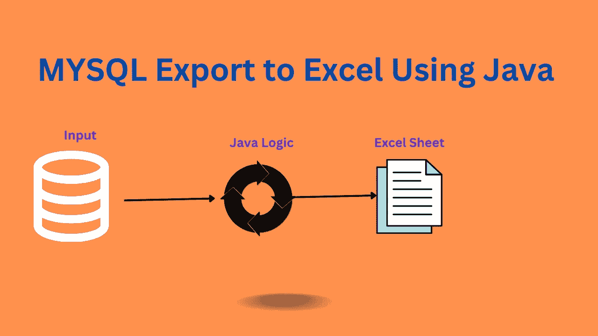

# 如何用 Java 将 Mysql 数据导出到 Excel

> 原文：<https://medium.com/javarevisited/how-to-export-mysql-data-to-excel-in-java-1292c224ae3c?source=collection_archive---------4----------------------->

## 用 Java 实现 MySQL 表到 Excel 的全表转储

> 原载于**[**【https://asyncq.com/】**](https://asyncq.com/how-to-export-mysql-database-to-excel-in-java)**

****

## **介绍**

*   **在公司中，将数据从一个系统导出到另一个系统是非常常见的用例。**
*   **在本文中，我们将构建一个逻辑来从一个 [SQL 数据库](https://click.linksynergy.com/link?id=FAaRt1BJn8w&offerid=1060092.1187016&type=2&murl=https%3A%2F%2Fwww.udemy.com%2Fcourse%2Fthe-ultimate-mysql-bootcamp-go-from-sql-beginner-to-expert%2F)中导出数据，并将其写入…**