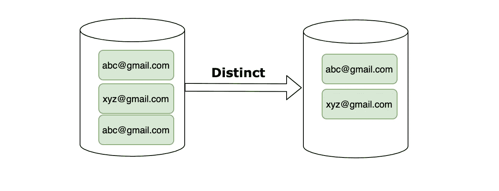

# 如何在 Java 中过滤不同的元素

> 原文：<https://medium.com/javarevisited/how-to-filter-distinct-elements-in-java-477ed0e3d27b?source=collection_archive---------3----------------------->

## 仅筛选集合中的唯一元素

> 最初发表于<https://asyncq.com/how-to-filter-distinct-elements-in-java>

****

## **介绍**

*   **当我们从一台机器向另一台机器交换数据时，重复条目是非常常见的问题。**
*   **作为客户，在使用这些记录时，我们必须实现一个逻辑来处理…**