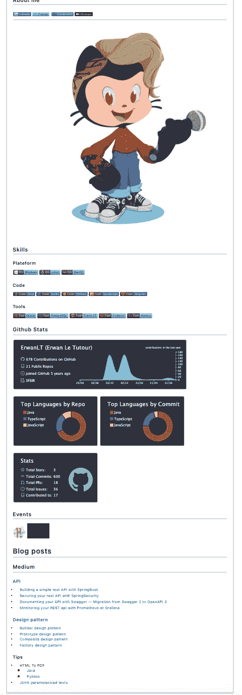
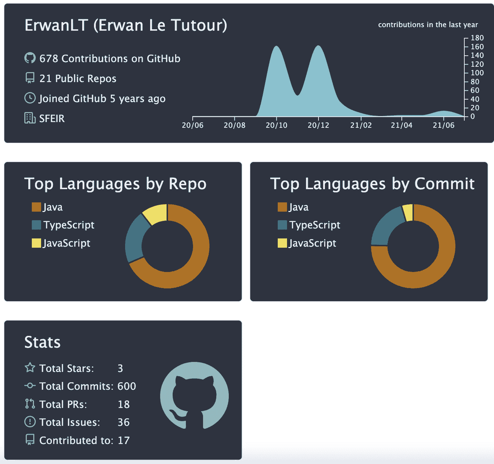
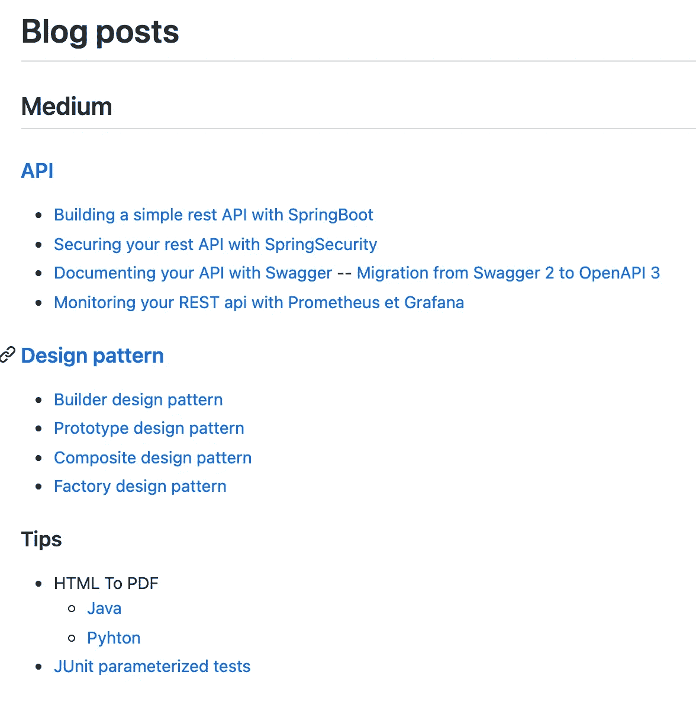

# 如何拥有个性化的 Github 个人资料

> 原文：<https://medium.com/javarevisited/how-to-have-a-personalized-github-profile-7f0a6b252235?source=collection_archive---------1----------------------->

## Github 自述文件的奇迹——震撼您的个人资料

# 先决条件

要显示个性化 github 个人资料页面，您需要遵循一些步骤

*   创建一个以你的用户名命名的**新的 Github 库**，例如，如果你的 Github 用户名是 GithubRockstar，你的库应该被命名为 GithubRockstar。
*   将这个库**公开**。
*   在该存储库的根目录下添加一个 Readme.md 文件。
*   自述文件不应为空，否则将不会显示任何内容。

# 可定制内容

在这一点上，我假设你知道如何写 markdown，如果没有，我建议你阅读这本[手册](https://www.markdownguide.org/basic-syntax/)，否则我们可以在这个自述文件页面中添加什么？几乎是我们已经可以添加到不同项目库的自述文件中的内容。

*   标记
*   夸张地表现情感
*   格式化文本
*   图像和 gif
*   环

## 添加徽章

徽章在 Github 库中很常见，那么我们该如何添加呢，简单我们就用[**shield . io**](https://shields.io/)**it permit 来构建徽章，然后复制代码添加到你的 readme 中。
使用该工具，您可以个性化:**

*   **标志和它的颜色**
*   **标签**
*   **邮件及其背景颜色**

## **Github 统计**

****

**要将 stats card 添加到您的自述文件，您可以:**

*   **使用 [github-readme-stats](https://github.com/anuraghazra/github-readme-stats) 让你把链接变成卡片，就像徽章一样**
*   **使用 [github 动作](https://github.com/marketplace/actions/github-profile-summary-cards)来生成它们。**

## **博客帖子**

****

**如果你正在撰写博客文章，也许你会想把它们添加到你的自述文件页面。我的不是使用一些动作生成的，因为我已经将它们链接到相关的存储库，但是你可以使用[博客-文章-工作流](https://github.com/gautamkrishnar/blog-post-workflow) ( *如何使用它的描述在自述文件*中)。**

## **章鱼**

**想展示自己定制的 octocat 吗？很简单，您只需进入 [my-octocat](https://myoctocat.com/) 进行创建、个性化，然后保存，以便稍后在您的个人资料页面中显示。**

# **给懒惰的人**

**如果您没有时间完成以上所有步骤，请知道有一些自述文件生成器可以帮您完成这项工作:**

*   **[https://rahuldkjain.github.io/gh-profile-readme-generator/](https://rahuldkjain.github.io/gh-profile-readme-generator/)**
*   **[https://artursmirnovs . github . io/github-profile-readme-generator/](https://arturssmirnovs.github.io/github-profile-readme-generator/)**
*   **[https://share . streamlit . io/rahulbanerjee 26/githubaboutmegenerator/main/_ _ init _ _。py](https://share.streamlit.io/rahulbanerjee26/githubaboutmegenerator/main/__init__.py)**

**更多的是，谷歌是你找到它们的朋友。**