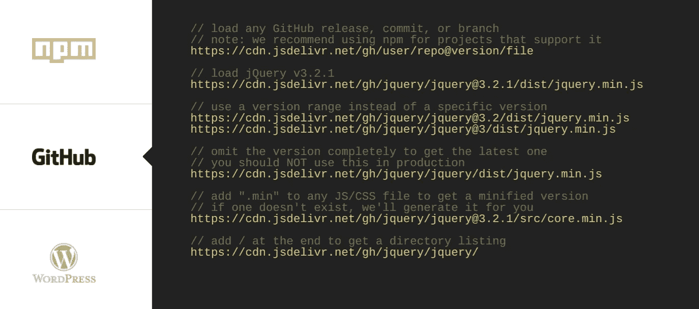

# 如何在开源 CDN“jsDelivr”上托管您的存储库 JS/CSS

> 原文：<https://medium.com/javarevisited/how-to-host-your-repository-js-css-on-open-source-cdn-jsdelivr-4de252d6fbad?source=collection_archive---------0----------------------->

几年前，我一直在寻找一个完全免费的开源 cdn 服务，但当时我找不到任何服务&我最终使用了 Netlify(另一个选择是 Hostry)。

但随后这个想法就产生了“*如果有一个 cdn 服务可以用 Github 做 CDN* 会怎么样”。大多数开发人员使用 [Github](/@javinpaul/top-10-free-courses-to-learn-git-and-github-best-of-lot-967aa314ea) 作为他们的代码库，保存他们所有的 UI 资产，如字体、js、css、图片等。快进到今天，我的探索在名为 [**jsDelivr**](https://www.jsdelivr.com/?docs=gh) **的 CDN 交付服务上结束。**



github 资产上的 jsDelivr 开源 cdn

## GitHub 资产上的 jsDelivr CDN

jsDelivr 提供了一个基于 github 资产的开源 cdn，这正是我们许多人所需要的。让我们详细研究一下。

它是这样工作的。

1.  jsDelivr CDN 服务的基本 URL 是`https://cdn.jsdelivr.net/gh/{username}/{repo}/`，其中用 GitHub 用户名替换`{username}`，用项目的存储库名称替换`{repo}`。
2.  将 URL 与您希望在项目中访问文件的路径附加在一起。例如，考虑我的示例项目 [Github-As-CDN](https://github.com/root0109/github-cdn) ，JavaScript 文件( **dummy-js-file.js** )位于`/dist`目录中。

```
<html>
...
...
<script src="https://cdn.jsdelivr.net/gh/**root0109**/**github-cdn**/dist**/dummy-js-file.js**"></script>
...
...
</html>
```

您还可以通过在存储库名称中添加`@{version-number}`来利用语义版本控制。您可以根据需要确定主要版本、次要版本和补丁版本。

## 加载最新版本

```
<script src="https://cdn.jsdelivr.net/gh/root0109/**github-cdn**/dist**/dummy-js-file.js**"></script>
```

## 仅加载主版本

```
<script src="https://cdn.jsdelivr.net/gh/root0109/github-cdn**@2**/dist**/**dummy-js-file.js"></script>
```

## 加载大调。次要版本

```
<script src="https://cdn.jsdelivr.net/gh/root0109/github-cdn@**2.1**/dist/dummy-js-file.js"></script>
```

## 加载精确版本

```
<script src="https://cdn.jsdelivr.net/gh/root0109/github-cdn@**1.0.0**/dist/dummy-js-file.js"></script>
```

## 加载缩小版本

添加”。min”到任何 JS/CSS 文件，以获得一个缩小的版本——如果不存在，它将自动为您生成。

有问题吗？建议？评论？

下一步是什么？ [**在媒体上关注我**](/@vaibhav0109) 成为第一个阅读我的故事的人。