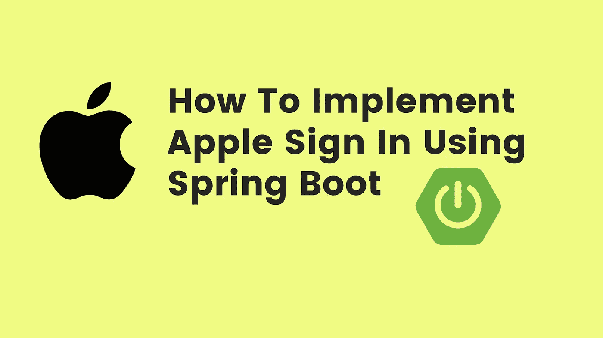

# 如何使用 Spring Boot 实现苹果登录(单点登录)

> 原文：<https://medium.com/javarevisited/how-to-implement-apple-sign-in-using-spring-boot-e4d3949b31e6?source=collection_archive---------0----------------------->

## 苹果登录

你好，我是罗汉·卡达姆😊

大家好，我希望你们都过得很好。如今，开发人员已经广泛使用第三方登录来减少对密码保护的依赖。苹果和谷歌、脸书、推特等也开始提供同样的服务。



如何用 [Spring Boot](/javarevisited/top-10-courses-to-learn-spring-boot-in-2020-best-of-lot-6ffce88a1b6e?source=---------39------------------) 实现苹果签到？

## **第一步:**创建使用服务的苹果开发者账户。

[](https://developer.apple.com/) [## 苹果开发者

### 现在是开发苹果平台的最佳时机。

developer.apple.com](https://developer.apple.com/) 

## **第二步:**成功创建后，苹果开发者。

1.  证书(. p8)
2.  团队 Id
3.  客户端 Id
4.  密钥 Id

这些都可以通过进入应用开发者账户 apple 中的 keys and identifiers 菜单来生成。

## 步骤 3:使用 Spring initializer 创建一个 Spring Boot 项目。

[](https://start.spring.io/) [## 弹簧初始化 r

### Initializr 生成的 spring boot 项目正好是你快速启动所需要的！

start.spring.io](https://start.spring.io/) 

## 依赖性:-

```
<dependency>
   <groupId>org.bouncycastle</groupId>
   <artifactId>bcpkix-jdk15on</artifactId>
   <version>1.64</version>
</dependency><!-- https://mvnrepository.com/artifact/io.jsonwebtoken/jjwt -->
<dependency>
   <groupId>io.jsonwebtoken</groupId>
   <artifactId>jjwt</artifactId>
   <version>0.9.1</version>
</dependency>
```

## 第四步:为 apple 配置创建 Application.yml。

## 步骤 5:创建带有端点的 Apple 控制器。

## 步骤 6:成功重定向后，我们会收到一个有效期仅为 5 分钟的代码。

使用收到的代码，我们会生成一个令牌请求来获取令牌响应吗

步骤 1:- 创建一个 GetTokenResponse.class

**第 2 步:**为了获取响应(令牌)，我们将使用 [rest 模板](https://javarevisited.blogspot.com/2017/02/how-to-consume-json-from-restful-web-services-Spring-RESTTemplate-Example.html)来完成同样的操作。

**步骤 3:-** 为了生成私有和公共密钥，我们将使用下面的方法来完成相同的任务。

**步骤 4:-** 如果成功，HTTP 状态码为 200 (OK)并且`[JWKSet.Keys](https://developer.apple.com/documentation/sign_in_with_apple/jwkset/keys)`对象包含苹果的公钥

**第五步:-** 如果成功，我们将收到一个由用户信息和更多信息组成的令牌。


谢谢观众们——罗汉·卡达姆