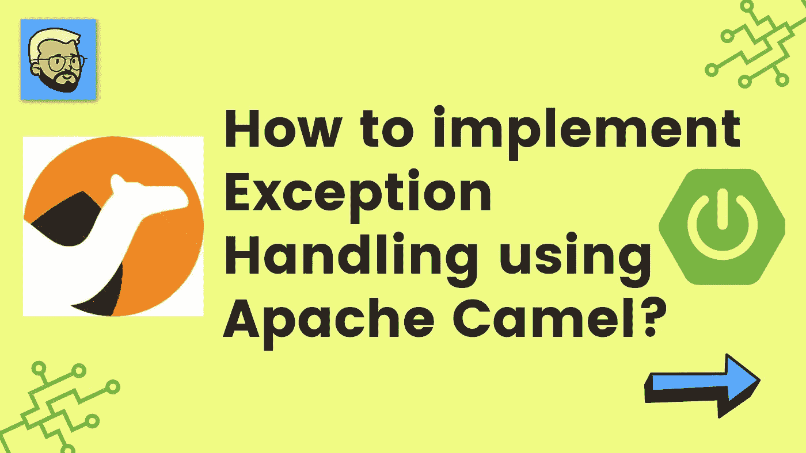
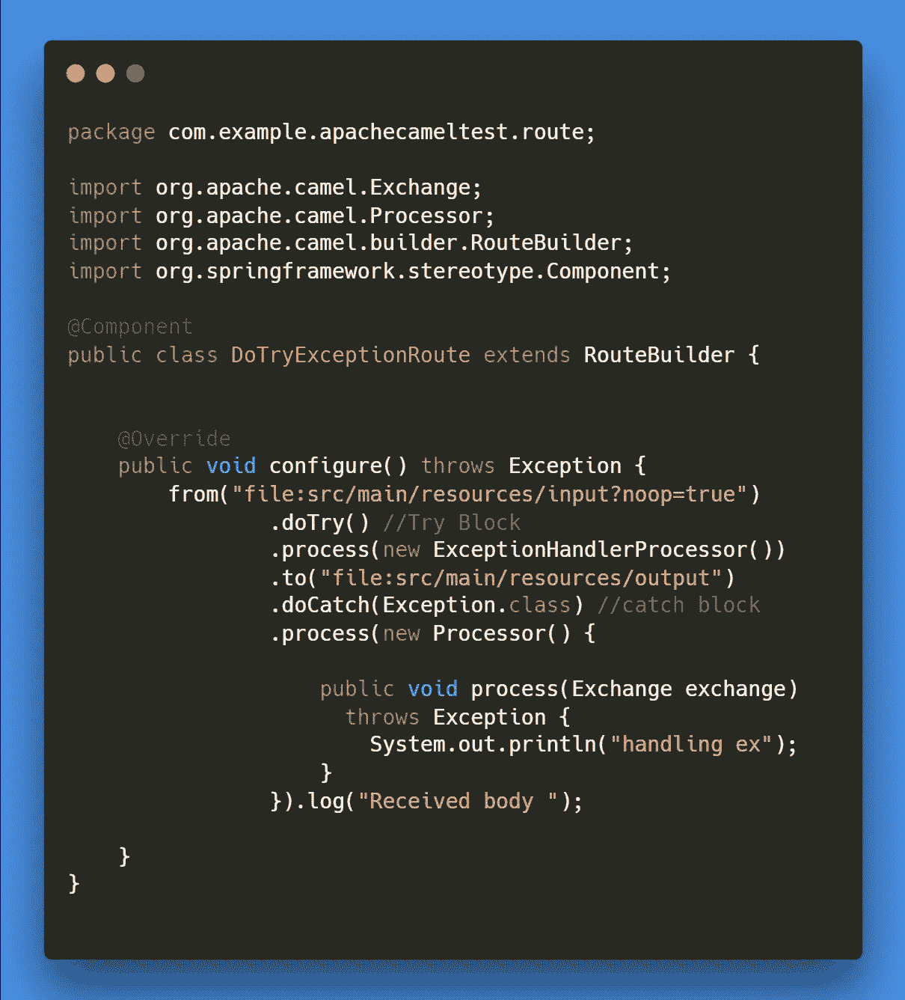
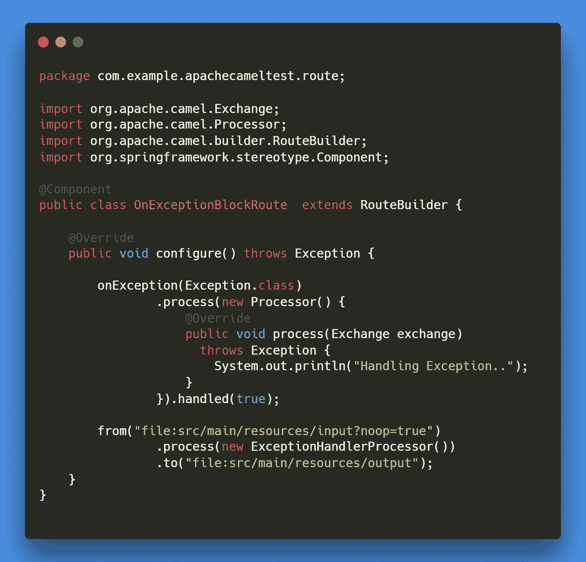

# 如何使用 Apache Camel 实现异常处理？

> 原文：<https://medium.com/javarevisited/how-to-implement-exception-handling-using-apache-camel-26faad831e8f?source=collection_archive---------1----------------------->

## 阿帕奇骆驼

你好，我的🖐[罗汉·拉温德拉·卡达姆](https://medium.com/u/a1b33b7cda75?source=post_page-----26faad831e8f--------------------------------)

欢迎，开发者社区！！在本文中，我们试图理解使用 [Apache Camel](https://javarevisited.blogspot.com/2022/02/top-5-courses-to-learn-apache-camel-in.html) 的异常处理。在直接进入文章之前，让我们试着理解与主题相关的某些问题或疑问。我们可能会问什么是阿帕奇骆驼？为什么用阿帕奇骆驼？如何使用阿帕奇骆驼？

嘿，社区，让我们深入到我们的问题中去，找到问题的答案。

致谢:- [Rohan Ravindra Kadam](https://medium.com/u/a1b33b7cda75?source=post_page-----26faad831e8f--------------------------------) 使用 Apache Camel 进行异常处理

## ⚡什么是阿帕奇骆驼？

Apache Camel 是一个基于已知的[企业集成模式](https://camel.apache.org/components/3.15.x/eips/enterprise-integration-patterns.html)的通用开源集成框架。

Camel 使您能够用各种特定于领域的语言( [DSL](https://camel.apache.org/manual/dsl.html) ，比如 [Java](/javarevisited/10-best-places-to-learn-java-online-for-free-ce5e713ab5b2) ，XML， [Groovy](/javarevisited/6-best-resources-to-learn-groovy-and-grails-for-java-developers-18c04e88fa8a) ， [Kotlin](/javarevisited/top-5-courses-to-learn-kotlin-in-2020-dfc3fa7706d8) ，以及 [YAML](https://javarevisited.blogspot.com/2021/11/top-5-courses-to-learn-yaml-in-2022.html) )来定义路由和中介规则。这意味着您可以在 IDE 中智能地完成路由规则，无论是在 Java 还是 XML 编辑器中。

Apache Camel 使用 [URIs](https://camel.apache.org/manual/uris.html) 来直接处理任何类型的传输或消息模型，如 [HTTP](https://camel.apache.org/components/3.15.x/http-component.html) 、 [ActiveMQ](https://camel.apache.org/components/3.15.x/activemq-component.html) 、 [JMS](https://camel.apache.org/components/3.15.x/jms-component.html) 、【JBI】SCA、 [MINA](https://camel.apache.org/components/3.15.x/mina-component.html) 或 [CXF](https://camel.apache.org/components/3.15.x/cxf-component.html) ，以及可插拔的[组件](https://camel.apache.org/manual/component.html)和[数据格式](https://camel.apache.org/manual/data-format.html)选项。Apache Camel 是一个很小的库，具有最少的[依赖性](https://camel.apache.org/manual/what-are-the-dependencies.html)，可以很容易地嵌入到任何 Java 应用程序中。Apache Camel 允许您使用相同的 [API](https://camel.apache.org/manual/exchange.html) 工作，不管使用哪种传输方式——所以学习一次 API，您就可以与开箱即用的所有[组件](https://camel.apache.org/components/3.15.x/index.html)进行交互。

Apache Camel 支持 Bean 绑定以及与 CDI、 [Spring](https://camel.apache.org/manual/spring.html) 等流行框架的无缝集成。Camel 也广泛支持[单元测试](https://camel.apache.org/manual/testing.html)你的路线。

 [## Apache Camel 帮助您集成 300 多个不同的系统！

### Camel 使您能够用各种特定于领域的语言(DSL，如 Java……

camel.apache.org](https://camel.apache.org/manual/faq/what-is-camel.html) 

## ⚡为什么使用阿帕奇骆驼？

让我们试着列出 Apache Camel 的一些用例

1.  为**企业集成模式(EIP)** 提供支持
2.  Apache Camel 是独立的，可以作为库嵌入到 Spring Boot、Quarkus、应用服务器和云中。Camel 子项目致力于简化您的工作。
3.  **挤满了组件**:挤满了数百个组件，用于访问数据库、消息队列、API 或天底下的任何东西。帮助你融入一切。
4.  **支持超过 50 种数据格式** :- Camel 支持大约 50 种数据格式，允许翻译多种格式的消息，并支持金融、电信、医疗保健等行业标准格式。

 [## 主页

### Camel 支持 Gregor Hohpe 和 Bobby Woolf 的优秀著作中的大多数企业集成模式，并且…

camel.apache.org](https://camel.apache.org/) 

## ⚡如何使用阿帕奇骆驼？

然后使用异常直接在 Apache Camel 上实现。

查看如何使用 Apache Camel 编写第一条路线

 [## 阿帕奇骆驼🦒:如何写第一条路线？

### 你好，我是罗汉·卡达姆😊,

rohankadam965.medium.com](https://rohankadam965.medium.com/apache-camel-how-to-write-first-route-7f7767c86c2a) 

## 步骤 1:如何使用 Spring Initializr 创建项目？

 [## 弹簧初始化 r

### Initializr 生成一个 spring boot 项目，其中包含您快速启动所需的内容！

start.spring.io](https://start.spring.io/) 

## 步骤 2:项目中包括哪些依赖项？

信用:[洛汗拉温德拉卡达姆](https://medium.com/u/a1b33b7cda75?source=post_page-----26faad831e8f--------------------------------)属地

在 Apache Camel 中有两种处理异常的方法

1.  请尝试阻止
2.  一个例外块

## 步骤 3:如何在 Apache Camel 中实现使用 Do try 块处理异常？

这种方法类似于我们在其他流行语言中使用的 [Java](/javarevisited/7000-free-pluralsight-courses-to-build-in-demand-tech-skills-without-leaving-your-house-40edb50a8cf2) ， [JavaScript](/javarevisited/5-free-books-to-learn-javascript-for-beginners-4cca79834262) try-catch 块。在这种情况下，将立即抛出异常。

## 让我们为 Do Try 块编写路由

演职员表:[洛汗·拉温德拉·卡达姆](https://medium.com/u/a1b33b7cda75?source=post_page-----26faad831e8f--------------------------------)尽试例外路线

## 步骤 4:如何在 Apache Camel 中实现使用 OnExcepttion 块处理异常？

例如，如果我们想在 apache camel 中使用 onException()方法处理某些异常。

 [## Apache Camel 帮助您集成 300 多个不同的系统！

### 您可以在 Java DSL 中使用 Exception 子句来指定您需要的每个异常类型的错误处理…

camel.apache.org](https://camel.apache.org/manual/exception-clause.html) 

演职员表:[洛汗·拉温德拉·卡达姆](https://medium.com/u/a1b33b7cda75?source=post_page-----26faad831e8f--------------------------------)一条例外街区路线

## 步骤 5:处理器将如何处理路由？

我们创建了一个名为 ExceptionHandlerProcessor 的处理器，作为处理处理器的两个路由的异常处理器。

信贷 [Rohan Ravindra Kadam](https://medium.com/u/a1b33b7cda75?source=post_page-----26faad831e8f--------------------------------) 异常处理程序

## 结论:-

在本文中，处理异常是任何软件开发中最重要的部分。我们尝试使用 Apache Camel 实现异常处理。

请分享和喜欢💕如果你觉得文章有用。在媒体[上关注我，在推特](https://medium.com/u/a1b33b7cda75?source=post_page-----26faad831e8f--------------------------------)[**上关注我**](https://twitter.com/rohankadam25)

## **⚡Bibliography**

 [## Apache Camel 帮助您集成 300 多个不同的系统！

### Camel 使您能够用各种特定于领域的语言(DSL，如 Java……

camel.apache.org](https://camel.apache.org/manual/faq/what-is-camel.html)  [## 阿帕奇骆驼🦒:如何写第一条路线？

### 你好，我是罗汉·卡达姆😊,

rohankadam965.medium.com](https://rohankadam965.medium.com/apache-camel-how-to-write-first-route-7f7767c86c2a) 

谢谢观众们——罗汉·卡达姆