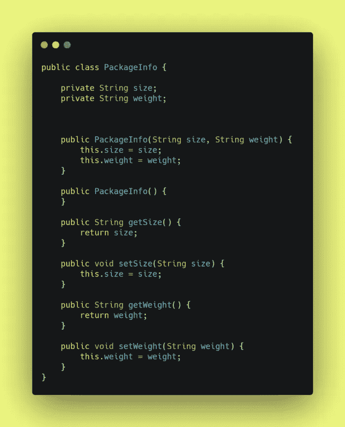
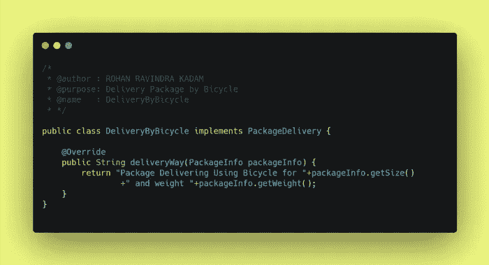
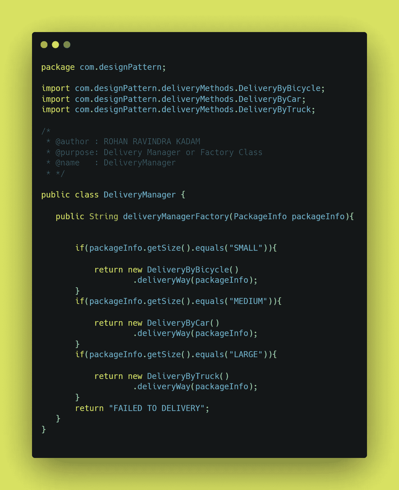
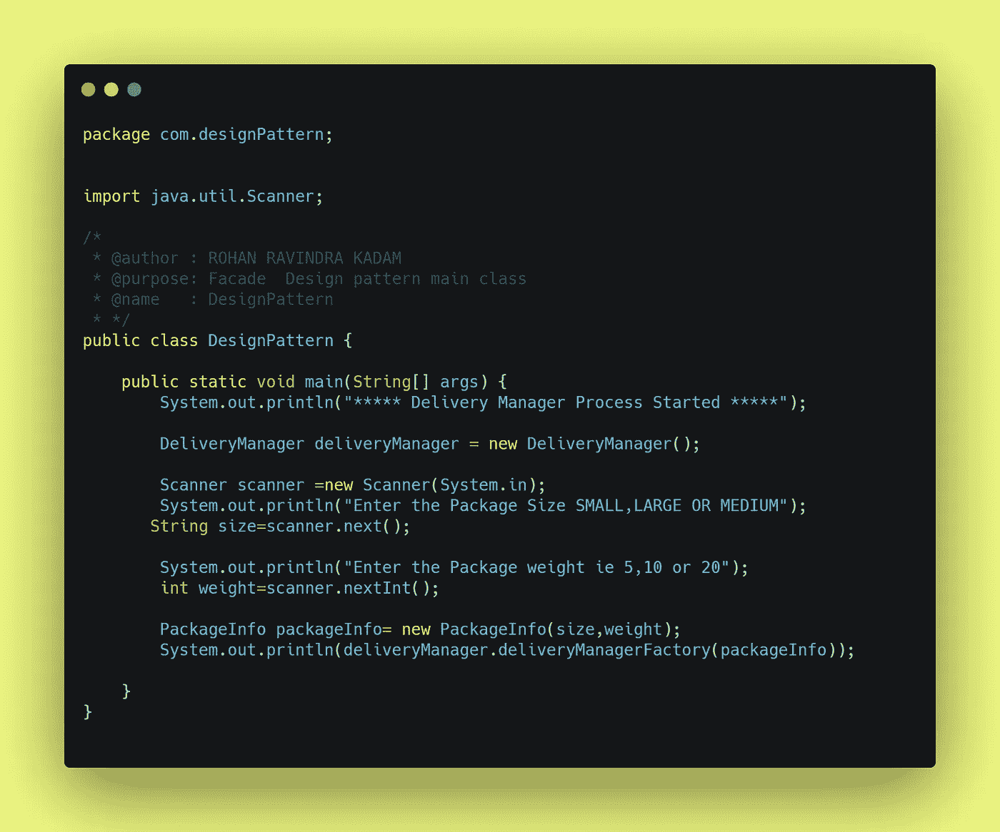

# 如何用 Java 实现 Facade 设计模式？

> 原文：<https://medium.com/javarevisited/how-to-implement-facade-design-pattern-using-java-3901e21219a4?source=collection_archive---------0----------------------->

## 设计模式

你好👋是洛汗·卡达姆😊

也许你是编码新手👩‍💻或者编程，也许有经验👴或者，你们所有的前端或后端开发人员可能都曾遇到过作为原则或概念的设计模式这个词。设计模式是编写代码或开发应用程序的一种方式或方法。在本文中，我们试图回答一些问题什么是设计模式？为什么要实现设计模式？如何实现一个设计模式( **Facade** )？

如何实现门面设计模式？

## ⚡What 是设计模式吗？

**设计模式**是软件设计中常见问题的解决方案。它们就像预制的蓝图，我们可以定制它们来解决代码中反复出现的设计问题。

它们不是可以导入并用于软件开发或解决特定问题的代码或库。我们可以遵循模式细节，并实现一个适合您程序实际情况的解决方案。

我们经常混淆设计模式和算法。虽然算法总是定义一组可以实现某个目标的清晰的动作，但是模式是解决方案的更高层次的描述。

将算法比作一道烹饪菜肴:两者都有实现目标的清晰步骤。它们不是库或模块；它们是您集成到设计核心中的指导原则，在创建灵活且可维护的面向对象系统时为您助一臂之力。

## ⚡Why 实现了一个设计模式？

我们只是简单地遇到了设计模式，它们是通用的面向对象的解决方案，你可以在你的设计中使用。由有经验的人制作👴面向对象的实践者，设计模式可以让你的设计更灵活，更能适应变化，更容易维护。所以，如果设计模式仍然不是你开发工具带的一部分，这里有五个你应该加入它们的理由。

1 →不要重复发明轮子，让我们的生活更轻松

2 →提高我们的面向对象技能

3 →识别库和语言中的模式

4 →利用共享词汇的力量

5 →发现真善美

## ⚡How 实施立面设计模式？

在直接进入设计模式的实现之前，我们需要回答一些问题，比如什么是外观设计模式？为什么要合并设计模式？最后，如何实现门面设计模式？

**1→什么是立面设计模式？**

Facade 设计模式是结构化设计模式家族的一部分，它为库、框架或任何其他复杂的类集提供了一个简化的接口。现实生活中的一个例子是，**假设你经营一家大型快递公司，作为经理，你只需输入包裹信息，即包裹尺寸和重量，让代码决定最佳运输方式。例如，输入屏幕充当其后面处理的表面或正面**。这就是门面设计模式在现实生活中的工作方式。

**定义:**
外观设计模式是一种结构设计模式**，它为一个库、一个框架或者任何其他复杂的类集合*提供了一个简化的接口。***

**2 →为什么要实施 Facade 设计模式？**

1.  立面允许我们遵循设计原则(**立体**)。
2.  它促进了将代码从子系统的复杂性中分离出来。
3.  它允许我们在不影响现有代码结构的情况下引入新代码，如**即插即用模式**

**3 →如何实现立面设计模式？**

在第节中，我们尝试使用 Java 实现工厂设计模式。例如，我们使用交付经理的例子来选择运输方式。

**步骤 1 →交付经理应该给出什么输入？**

作为送货经理，他/她应该提供关于包裹的信息，如**尺寸**和**重量**，在我们的例子中，我们使用 **PackageInfo** 来完成这项工作。

PackageInfo.class

**第二步→有哪些不同的发货方式？**

递送包裹的各种方式有汽车🚗，自行车🏍和卡车🚚。我们创建了三个定义交付模式的类。

包裹递送

我们已经创建了由 PackageDelivery 接口实现的子类。

**1→自行车送货🏍**

DeliveryByBicycle.class

**2→汽车交货**🚗

DeliveryByCar.class

**3→卡车运输**🚚

DeliveryByTruck.class

交付管理器类来管理运输模式。

交付经理类

**第三步→如何测试立面设计图案？**

为了测试我们的门面设计模式，我们给输入包的大小和重量。

基于输入的代码决定最佳的运输方式

**步骤 4→门面模式的输出是什么？**

下面的控制台输出有助于理解管理器(Facade 类)是如何根据包裹信息选择运输方式的

## ⚡Where 寻找门面设计模式的代码库？

[Github 上的****](https://github.com/Rohan2596)

** [## GitHub-rohan 2596/设计模式-模式/外观示例

### 此时您不能执行该操作。您已使用另一个标签页或窗口登录。您已在另一个选项卡中注销，或者…

github.com](https://github.com/Rohan2596/Design-pattern-examples/tree/pattern/facade) 

## ⚡Conclusion:-

在本文中，我们试图回答一些与设计模式相关的问题，特别是 **Facade 设计模式**如何帮助世界各地的开发人员编写更好的代码和构建更快的应用程序。门面设计模式允许我们有效地实现**实体**原则。门面设计模式的最佳例子将是 **Maven 依赖或 NPM 模块，库**等。

请分享和喜欢💖如果你觉得文章有用。在 medium 上关注我 [Rohan Ravindra Kadam](https://medium.com/u/a1b33b7cda75?source=post_page-----3901e21219a4--------------------------------) ，在 Twitter 上关注我 [**rohankadam25**](https://twitter.com/rohankadam25)

## 📚参考书目:-

 [## 外表

### facade 是一种结构设计模式，它提供了一个简化的库、框架或任何其他……

重构。领袖](https://refactoring.guru/design-patterns/facade) 

谢谢观众们——罗汉·卡达姆**