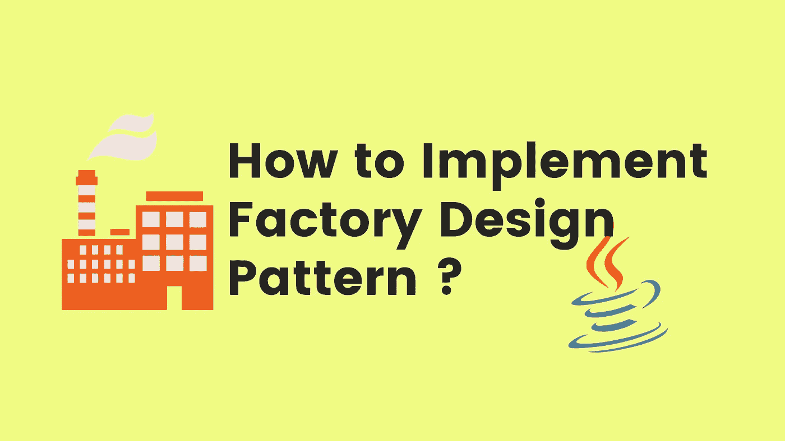
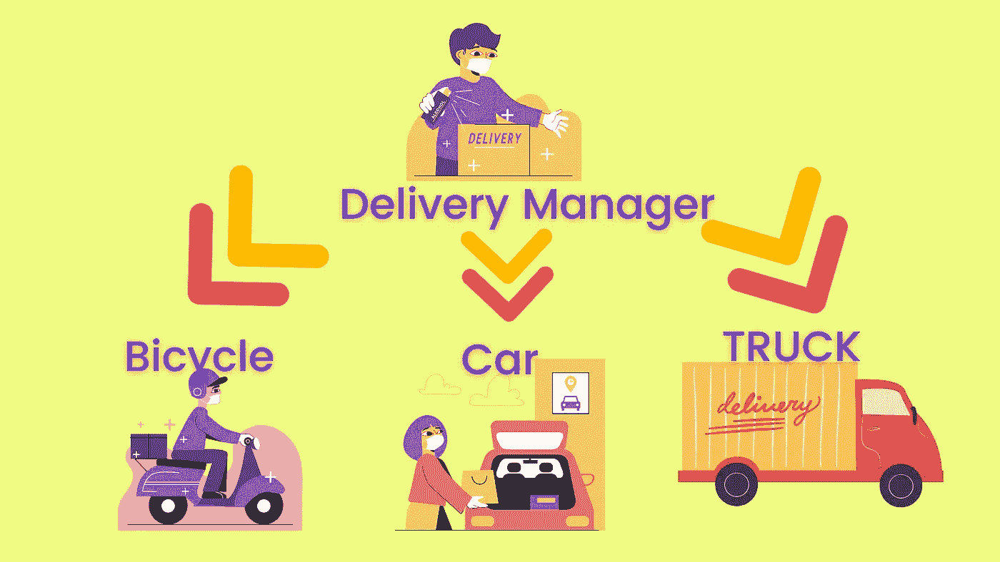
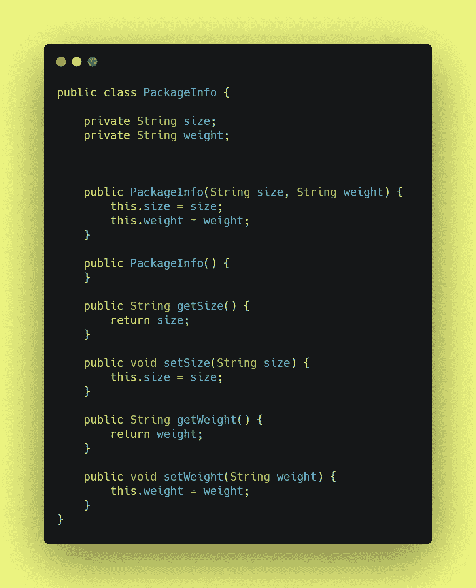
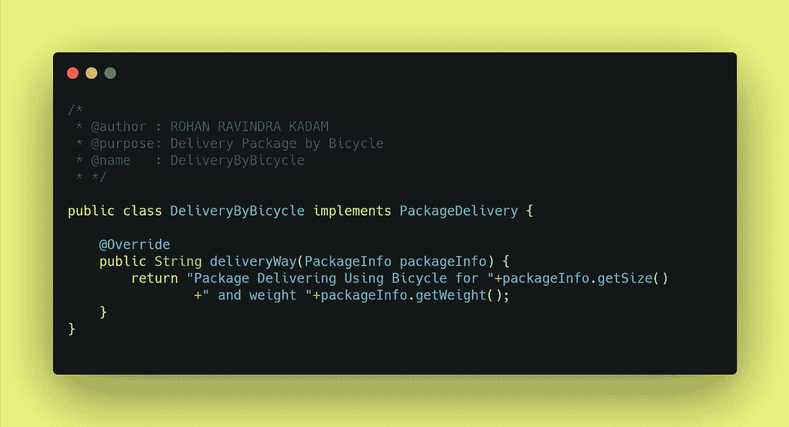
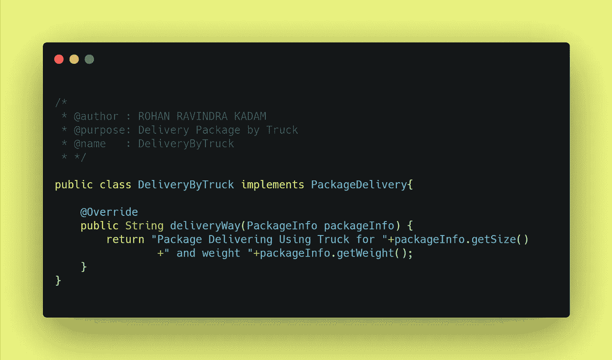
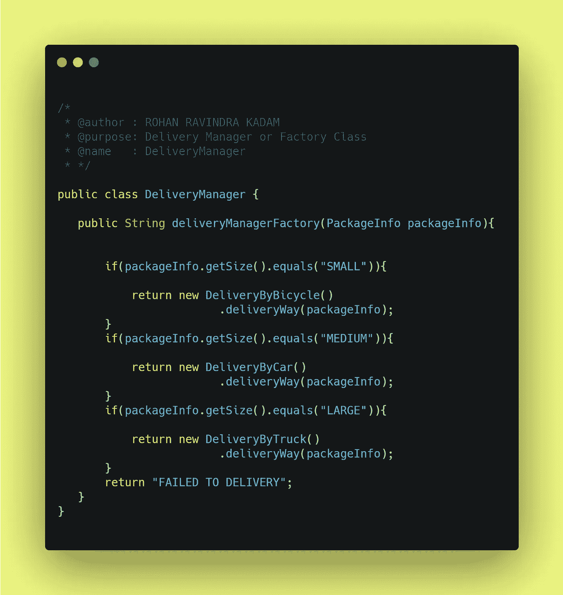
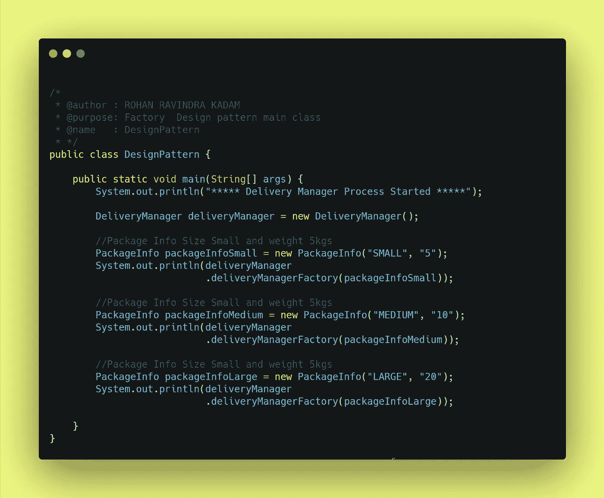

# 如何用 Java 实现工厂设计模式？

> 原文：<https://medium.com/javarevisited/how-to-implement-factory-design-pattern-using-java-478b58cb2ff3?source=collection_archive---------1----------------------->

## 设计模式

你好👋是洛汗·卡达姆😊

也许你是编码新手👩‍💻或者编程，也许有经验👴或者，你们所有的前端或后端开发人员可能都曾遇到过作为原则或概念的设计模式这个词。设计模式是编写代码或开发应用程序的一种方式或方法。在本文中，我们试图回答一些问题什么是设计模式？为什么要实现设计模式？如何实现一个设计模式(**工厂**)？

如何实现工厂设计模式？

## 🏭什么是设计模式？

**设计模式**是软件设计中常见问题的解决方案。它们就像预制的蓝图，我们可以定制它们来解决代码中反复出现的设计问题。

它们不是可以导入并用于软件开发或解决特定问题的代码或库。我们可以遵循模式细节，并实现一个适合您自己程序实际情况的解决方案。

我们经常混淆设计模式和算法。虽然算法总是定义一组可以实现某个目标的清晰的动作，但是模式是解决方案的更高层次的描述。

将算法比作一道烹饪菜肴:两者都有实现目标的清晰步骤。它们不是库或模块；它们是您集成到设计核心中的指导原则，在创建灵活且可维护的面向对象系统时为您助一臂之力。

## 🏭为什么要实现设计模式？

我们只是简单地遇到了设计模式，它们是通用的面向对象的解决方案，您可以在自己的设计中使用。由有经验的人制作👴面向对象的实践者，设计模式可以让你的设计更灵活，更能适应变化，更容易维护。所以，如果设计模式仍然不是你开发工具带的一部分，这里有五个你应该加入它们的理由。

1 →不要重复发明轮子，让我们的生活更轻松

2 →提高我们的面向对象技能

3 →识别库和语言中的模式

4 →利用共享词汇的力量

5 →发现真善美

## 🏭如何实现工厂设计模式？

在直接进入设计模式的实现之前，我们需要回答一些问题，比如什么是工厂设计模式？为什么要合并设计模式？最后，如何实现工厂设计模式？

**1→什么是工厂设计模式？**

工厂设计模式是创造性设计模式家族的一部分，它让我们在子类上创建一个接口，让子类完成业务逻辑工作。现实生活中的一个例子是，**假设你在 business🛒进行了一次大型送货，你必须将包裹交付给消费者，现在问题来了，你应该使用什么来交付特定的汽车🚗，卡车🚚或者 bicycle🛵** 。**因此，解决方案可以是我们输入一个包裹的尺寸和重量，在此基础上我们决定哪种运输方式可能是最好的**。这就是工厂模式在现实生活中的工作方式。

**定义:**
*工厂模式是* **定义一个接口或抽象类来创建一个对象，但让子类决定实例化哪个类** *的设计模式。*

**2 →为什么要实现工厂设计模式？**

1.  工厂允许我们遵循设计原则(**坚实**)。
2.  它消除了将特定于应用程序的类绑定到代码中的需要，从而促进了松散耦合。
3.  它允许我们在不影响现有代码结构的情况下引入新代码，如**即插即用模式**

**3 →如何实现工厂设计模式？**

在第节中，我们尝试使用 Java 实现工厂设计模式。例如，我们使用交付经理的例子来选择运输方式。

交付经理示例

**第 1 步→交付经理应该提供什么信息？**

作为送货经理，他/她应该提供关于包裹的信息，如**尺寸**和**重量**，在我们的示例中，我们使用 **PackageInfo** 来完成这项工作。

**第二步→发货有哪些不同的方式？**

递送包裹的各种方式有汽车🚗，自行车🏍和卡车🚚。我们创建了三个定义交付模式的类。根据工厂模式的定义，我们需要**定义一个接口或抽象类在**我们的例子中我们已经创建了一个**接口**，命名为 **PackageDelivery。**

包裹交付界面

我们已经创建了由 PackageDelivery 接口实现的子类。

**1→骑自行车送货🏍**

骑自行车送货

**2→汽车交货**🚗

汽车送货

**3→卡车运输**🚚

卡车运输

**第三步→我的工厂班或者经理班会是什么？**

例如，交付管理器将是一个工厂类或管理器类，负责根据包的大小选择交付方法。根据定义，我们让子类决定实例化哪个类。

**第四步→如何测试工厂设计模式？**

为了测试我们的工厂设计模式，我们给出了 3 种不同的包装，有 3 种不同的包装尺寸，如**小型、大型和中型**

**步骤 5→工厂模式的输出是什么？**

下面的控制台输出有助于理解管理器(工厂类)是如何根据包装信息选择运输方式的

## 🏭在哪里可以找到工厂设计模式的代码库？

[Github 上的](https://github.com/Rohan2596)

**<https://github.com/Rohan2596/Design-pattern-examples/tree/pattern/factory>  

## 结论:-

在本文中，我们试图回答一些与设计模式相关的问题，特别是**工厂设计模式**如何帮助世界各地的开发人员编写更好的代码和构建更快的应用程序。工厂设计模式允许我们有效地实现**坚实的**原则，无论是**松耦合还是单责任。**

请分享和喜欢💖如果你觉得文章有用。在 medium[Rohan Ravindra Kadam](https://medium.com/u/a1b33b7cda75?source=post_page-----478b58cb2ff3--------------------------------)和 Twitter[**rohankadam 25**](https://twitter.com/rohankadam25)上关注我

## 📚参考书目:-

<https://www.oreilly.com/content/5-reasons-to-finally-learn-design-patterns/>  <https://refactoring.guru/design-patterns/factory-method>  

谢谢观众们——罗汉·卡达姆**