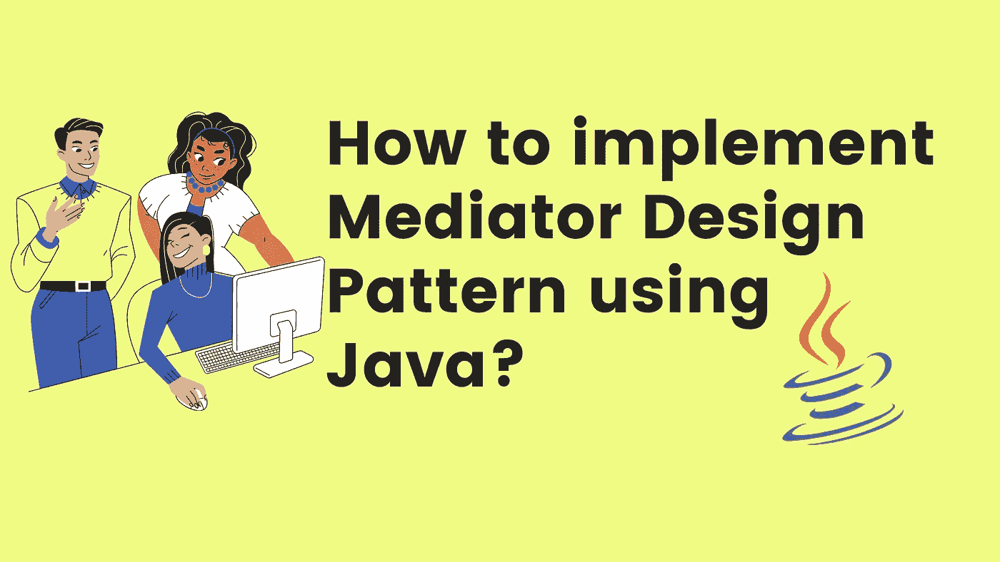
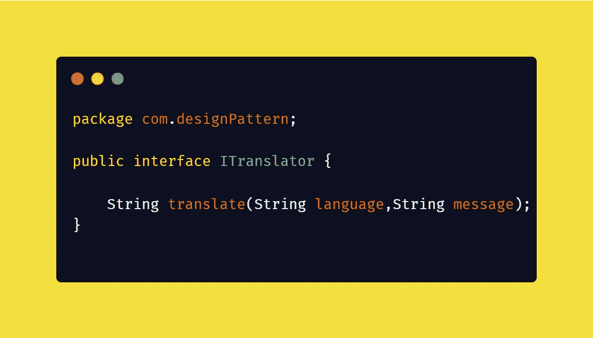
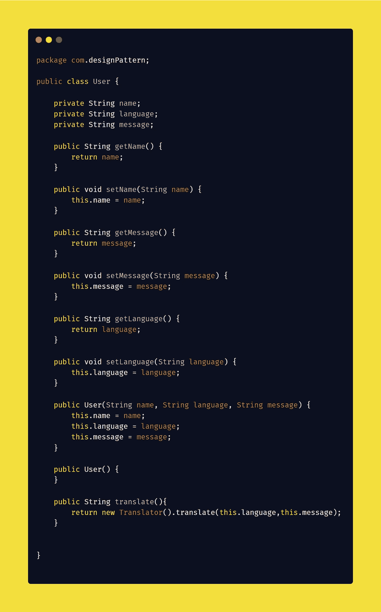
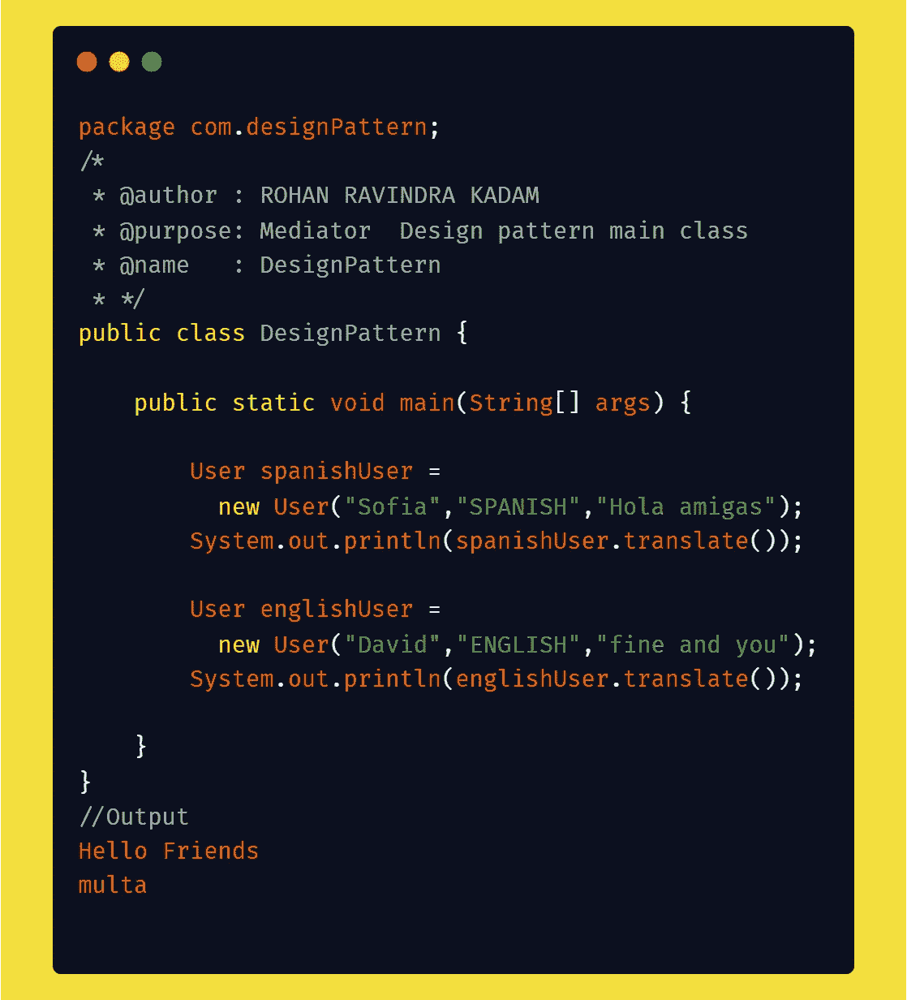

# 如何用 Java 实现 Mediator 设计模式？

> 原文：<https://medium.com/javarevisited/how-to-implement-mediator-design-pattern-using-java-2ab2c901291?source=collection_archive---------2----------------------->

## 设计模式

你好👋是洛汗·卡达姆😊

也许你是编码新手👩‍💻或者编程，也许有经验👴或者，也许你们所有的前端或后端开发人员都可能遇到过作为原则或概念的单词[设计模式](/javarevisited/7-best-online-courses-to-learn-object-oriented-design-pattern-in-java-749b6399af59)。设计模式是编写代码或开发应用程序的一种方式或方法。在本文中，我们试图回答一些问题什么是设计模式？为什么要实现设计模式？如何实现一个设计模式(中介)？

使用 Java 的中介设计模式

## ⚡What 是设计模式吗？

[设计模式](/javarevisited/7-best-books-to-learn-design-patterns-for-java-programmers-5627b93eefdb)是软件设计中常见问题的解决方案。它们就像预制的蓝图，我们可以定制它们来解决代码中反复出现的设计问题。

它们不是可以导入并用于软件开发或解决特定问题的代码或库。我们可以遵循模式细节，并实现一个适合您自己程序实际情况的解决方案。

> **我们经常在** [**设计模式**](/javarevisited/7-best-online-courses-to-learn-object-oriented-design-pattern-in-java-749b6399af59) **和算法之间困惑。虽然算法总是定义一组可以实现某个目标的清晰的动作，但是模式是解决方案的更高层次的描述。**

将算法比作一道烹饪菜肴:两者都有实现目标的清晰步骤。它们不是库或模块；它们是您集成到设计核心中的指导原则，在创建灵活且可维护的面向对象系统时为您助一臂之力。

## ⚡Why 实现了一个设计模式？

我们只是简单地遇到了设计模式，它们是通用的[面向对象的解决方案](https://www.java67.com/2016/07/top-5-object-oriented-design-interview-questions.html)，你可以在自己的设计中使用。由有经验的人制作👴面向对象的实践者，设计模式可以让你的设计更灵活，更能适应变化，更容易维护。所以，如果设计模式仍然不是你开发工具带的一部分，这里有五个你应该加入它们的理由。

1 →不要重复发明轮子，让我们的生活更轻松

2 →提高我们的面向对象技能

3 →识别库和语言中的模式

4 →利用共享词汇的力量

5 →发现真善美

## ⚡How 实现了一个中介设计模式？

在直接进入设计模式的实现之前，我们需要回答一些问题，比如什么是中介设计模式？为什么要合并设计模式？最后，如何实现中介设计模式？

**1→什么是 Mediator 设计模式？**

中介设计模式是行为设计模式家族的一部分，**它有助于减少对象之间的紧密耦合或对象之间的混乱依赖**。一个真实的例子是，假设我们是一名翻译。在我们的场景中，我们去了一个地方，那里的居民不懂你说的语言。在这种情况下，我们需要一个懂两种语言的翻译。在这些情况下，译者充当了中介者的角色，这就是中介者模式在现实生活中的工作方式。

> **定义:**
> *中介模式是一种设计模式，它让我们能够* ***减少对象之间混乱的依赖关系。该模式限制了对象之间的直接通信，并迫使它们通过中介对象进行协作。***

**2 →为什么要实现 Mediator 设计模式？**

1.  中介体**设计模式允许我们遵循[设计原则](/javarevisited/10-oop-design-principles-you-can-learn-in-2020-f7370cccdd31)**
2.  它可以减少程序中不同组件之间的耦合。
3.  其支持 [**开/关**原理](https://javarevisited.blogspot.com/2015/07/strategy-design-pattern-and-open-closed-principle-java-example.html)
4.  它还支持 [**单责**原则](https://javarevisited.blogspot.com/2017/04/single-responsibility-principle-example.html#axzz7Byp3govG)

**3 →如何实现 Mediator 设计模式？**

在本文中，我们试图通过一些现实生活中的译者例子来理解中介模式。在我们的案例研究中，译者充当两个用户之间的中介。

**步骤 1→对象或用户将如何交流？**

翻译器接口可以促进对象(用户)之间的通信。

翻译界面

**第二步→如何调解人(翻译)会沟通？**

Translator(具体类)正在实现 ITranslator 接口。在我们的例子中，Translator 将文本从英语转换成西班牙语，反之亦然

Translator.class

**步骤 3→在我们的案例中，翻译(中介)将如何发生？**

在用户对象下面，我们有一个 translate 方法，它将文本转换成另一种用户语言。

User.class

**步骤 4→如何测试 MediatorDesign 模式？**

为了测试我们的中介，我们两个说西班牙语和英语的用户试图相互交流。

设计模式主

## ⚡Where 为**中介**设计模式寻找代码库？

 [## GitHub-rohan 2596/设计-模式-模式/中介的示例

### 此时您不能执行该操作。您已使用另一个标签页或窗口登录。您已在另一个选项卡中注销，或者…

github.com](https://github.com/Rohan2596/Design-pattern-examples/tree/pattern/mediator) 

## ⚡Conclusion:-

在文章中，我们试图回答一些与设计模式相关的问题，特别是**中介** **设计模式**如何帮助世界各地的开发人员编写更好的代码和构建更快的应用程序。中介设计模式允许我们有效地实现 [**坚实的**原则](https://javarevisited.blogspot.com/2018/07/10-object-oriented-design-principles.html)。中介设计模式的最好例子是流量控制器、翻译器、聊天应用程序等。请分享和喜欢💖如果你觉得文章有用。在 medium 上关注我 [Rohan Ravindra Kadam](https://medium.com/u/a1b33b7cda75?source=post_page-----2ab2c901291--------------------------------) ，在 Twitter 上关注我 [**rohankadam25**](https://twitter.com/rohankadam25)

不要忘记看看我的网站，以了解更多关于我的信息

 [## 罗汉·拉温德拉·卡达姆

### 来自印度孟买的全栈开发人员，拥有大约 3 年的软件开发经验。

kadamrohan.com](https://kadamrohan.com/) 

## 📚参考书目:-

 [## 调解人

### 也被称为中介，控制器调解人是一个行为设计模式，让您减少混乱…

重构大师](https://refactoring.guru/design-patterns/mediator) 

谢谢观众们——罗汉·卡达姆