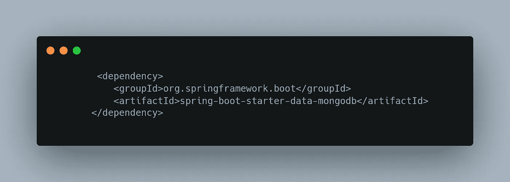
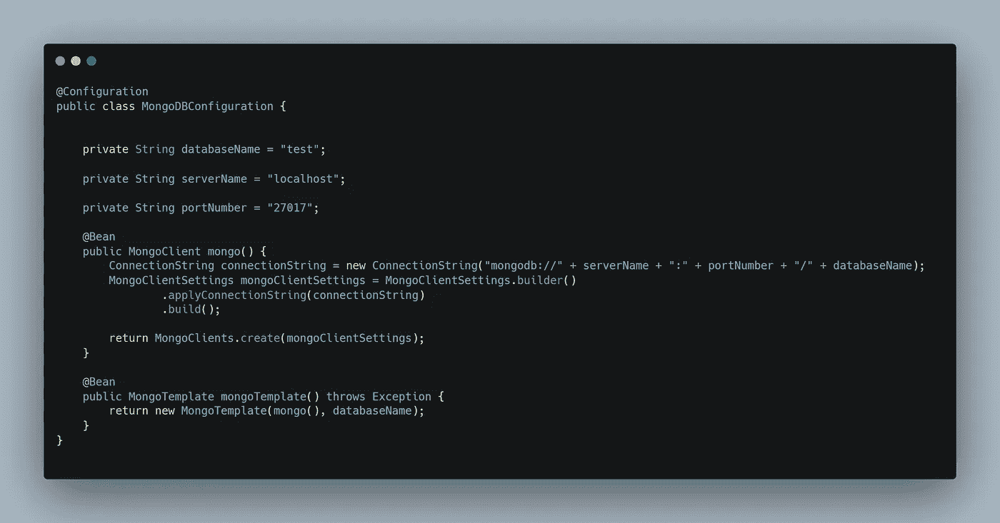
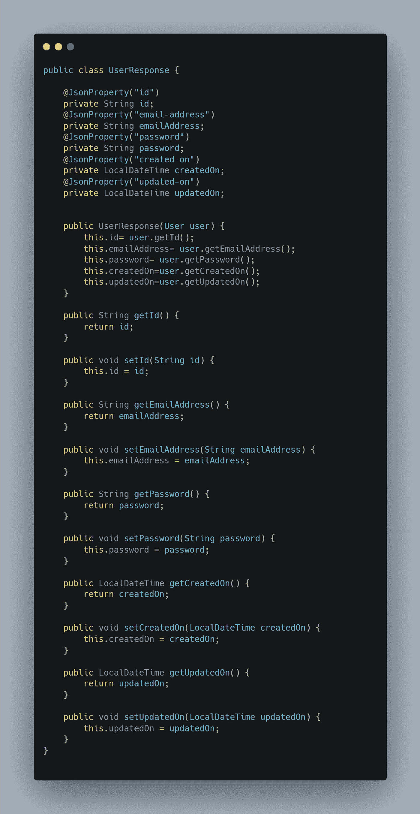
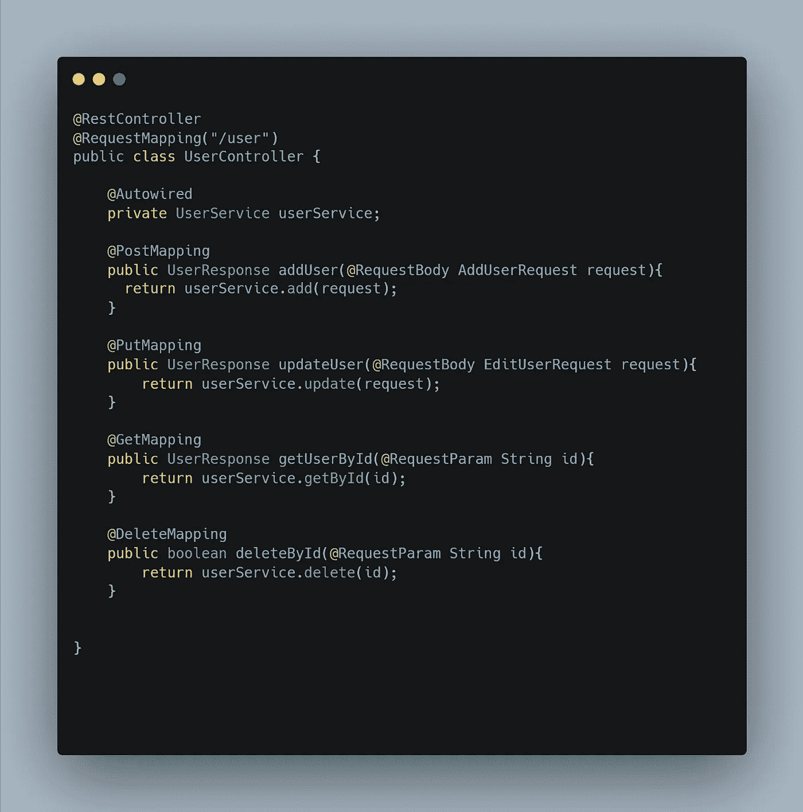
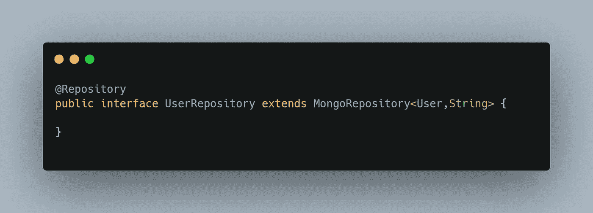

# 如何使用 Spring Boot 实现 MongoDB？

> 原文：<https://medium.com/javarevisited/how-to-implement-mongodb-using-spring-boot-d27e4502a987?source=collection_archive---------1----------------------->

## MongoDB

你好👋我是罗汉·卡达姆😊。

在本文中，我们将尝试理解 MongoDB 以及如何使用 spring boot 来使用它。在直接进入代码之前，我们应该首先理解某些子主题什么是 MongoDB？为什么要用 MongoDB？以及更多的问题。

如何使用 Spring Boot 实现 MongoDB？

# ⚡What 是 MongoDB？

[MongoDB](/javarevisited/10-free-online-courses-to-learn-mongodb-and-nosql-942609611664) 是一个文档数据库，具有您想要的可伸缩性和灵活性，可以进行您需要的查询和索引。它将数据存储在灵活的、类似 JSON 的文档中，这意味着不同文档的字段可能不同，并且数据结构可以随着时间的推移而改变。

文档模型映射到应用程序代码中的对象，使数据易于处理。即席查询、索引和实时聚合提供了访问和分析数据的强大方法。它的核心是一个分布式数据库，因此高可用性、水平扩展和地理分布是内置的，并且易于使用。

## ⚡Why 用 MongoDB？

MongoDB 构建在一个[横向扩展架构](https://www.mongodb.com/basics/scaling)之上，这种架构已经受到了各种开发人员的欢迎，他们通过不断发展的数据模式来开发可伸缩的应用程序。

作为一个文档数据库，MongoDB 使开发人员可以轻松存储结构化或非结构化数据。它使用类似于 [JSON 的](https://www.mongodb.com/json-and-bson)格式来存储文档。

这种格式直接映射到大多数现代编程语言中的本机对象，使其成为开发人员的自然选择，因为他们不需要考虑[规范化数据](https://www.mongodb.com/basics/data-models)。MongoDB 还可以处理大容量数据，并且可以垂直或水平伸缩以适应大数据负载。

## ⚡How 将使用 Spring Boot 实现 MongoDB？

今天，MongoDB 被业界广泛用于开发快速而强大的应用程序。它最出名的是它的高性能搜索和查询。今天我们将使用 spring boot 和编程语言 Java 来实现 MongoDB。这一部分我们将讨论相同的 CRUD 操作。

## 第一步:如何生成 Spring Boot 项目？

<https://start.spring.io/>  

## 步骤 2:我应该包括哪些依赖项？

Spring Data MongoDB 项目提供了与 MongoDB 文档数据库的集成。Spring Data MongoDB 的关键功能领域是一个以 POJO 为中心的模型，用于与 MongoDB DBCollection 进行交互，并轻松编写存储库风格的数据访问层。

MongoDB 依赖性

## 步骤 Mongo DB 的配置是什么？

[连接字符串](https://docs.mongodb.com/manual/reference/connection-string/) :-它有助于设置我们的应用程序和数据库之间的连接。

[MongoTemplate](https://docs.spring.io/spring-data/mongodb/docs/current/api/org/springframework/data/mongodb/core/MongoTemplate.html):-MongoTemplate 类是 MongoOperations 接口的主要实现，它指定了 MongoDB 操作的基本集合。我们还可以使用 MongoRepository 接口来执行 MongoDB 操作。MongoRepository 的实现类在运行时使用 MongoTemplate bean

MongoDB 配置

## 步骤 MongoDB 的文档/实体是什么？

用户实体

## 步骤 MongoDB 的控制器是什么？

1.  **请求添加和更新请求**

添加请求和编辑请求

**2。用户反应**

用户响应

**3。用户控制器**

用户控制器-端点

## 步骤 MongoDB 的存储库/DAO 是什么？

用户存储库— MongoDB

## 步骤 MongoDB 的业务逻辑 CRUD 操作是什么？

用户服务-逻辑

## 步骤 MongoDb 的最终输出是什么？

Mongo 数据库

## 步骤 8:在哪里可以找到完整的代码库？

<https://github.com/Rohan2596/spring-boot-mongoDB>  

## ⚡Conclusion:-

在本文中，我们试图回答一些与 MongoDB 相关的问题，以及如何使用 Spring boot 实现相同的功能。MongoDB 是一个快速而强大的非 SQL 数据库，被许多财富 500 强公司用来为其他公司提供服务。

如果你觉得这篇文章有用，请分享和喜欢。请在 medium[Rohan Ravindra Kadam](https://medium.com/u/a1b33b7cda75?source=post_page-----d27e4502a987--------------------------------)和 Twitter[rohankadam 25上关注我](https://twitter.com/rohankadam25)

## ⚡Bibliography:-

<https://www.mongodb.com/what-is-mongodb>  <https://www.mongodb.com/why-use-mongodb>  

谢谢观众们-罗汉·卡达姆