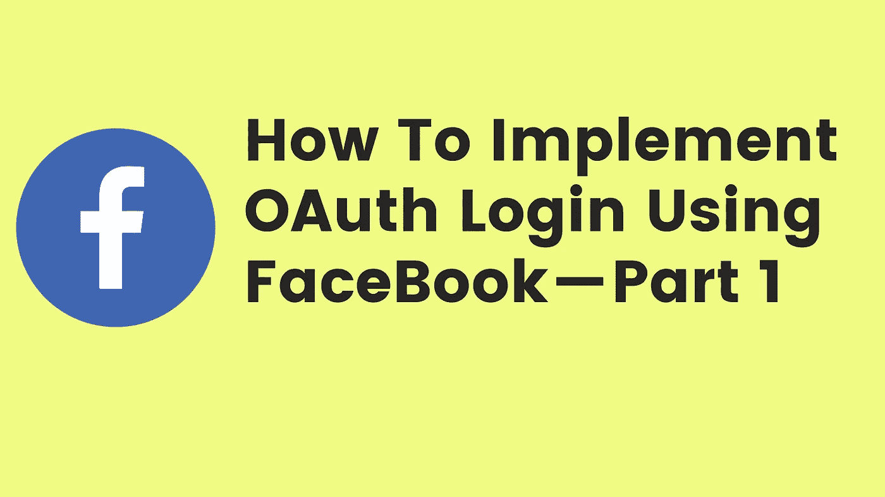
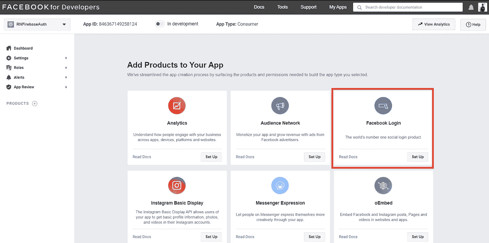
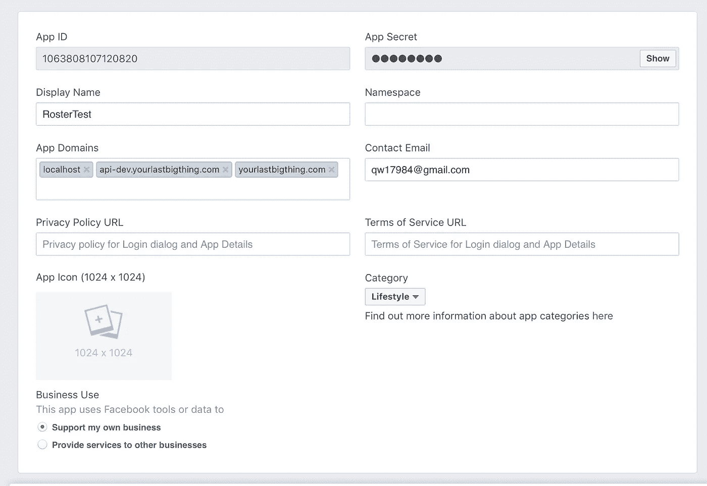

# 如何使用脸书实现 OAuth2 社交登录(单点登录)——第 1 部分

> 原文：<https://medium.com/javarevisited/how-to-implement-oauth2-social-login-using-facebook-part-1-e7995f30774e?source=collection_archive---------2----------------------->

## OAuth2 FaceBook

你好👋我是罗汉·卡达姆😊

欢迎来到使用**脸书**的 OAuth2 社交登录的第 1 部分。在这一部分，我们试图理解如何使用开发者门户创建**脸书**配置。

如何使用脸书实现 Oauth/SSO 登录——第 1 部分

<https://developers.facebook.com/>  

## ⚡Step 1: 如果你还没有一个 Facebook 账户，那就创建一个。

  

## ⚡Step 2: 注册成为 FaceBook 开发者

<https://developers.facebook.com/docs/development/register/>  

## ⚡Step 3: 创建一个应用程序(Facebook 应用程序)

<https://developers.facebook.com/docs/development/create-an-app>  

## **⚡Step 4:** 填写 App 详情。

***根据您的要求选择。**

I)选择应用类型为消费者 *****

ii)输入应用程序名称、联系电子邮件

iii)最后点击创建应用程序

## **第五步:**成功创建后，您将进入仪表板&选择脸书登录。

脸书开发者仪表板

## **⚡Step 6:** 填写基本细节，如重定向 URI 和应用程序域。

脸书登录设置第 1 页

## **第七步:**保存密钥，以备将来在系统中使用。

1.  应用程序 Id(也称为客户端 Id)
2.  应用程序秘密(也称为客户端秘密密钥)

## **⚡Step 8:** 可根据需要添加附加信息。

## **⚡Step 9:** Facebook Oauth(社交登录)使用 [Spring boot。](/javarevisited/top-10-courses-to-learn-spring-boot-in-2020-best-of-lot-6ffce88a1b6e?source=---------39------------------)

</@rohankadam965/how-to-implement-oauth2-social-login-using-facebook-spring-boot-part-2-8582a8943144>  

## ⚡Conclusion:-

在本文中，我们试图回答尽可能多的问题，这些问题与我们如何使用第三方服务(主要是脸书、谷歌和 Twitter 等)为我们的应用程序使用 Oauth / SSO 登录有关。SSO /Oauth 正在成为许多在线服务的用户登录和注册的标准。

请分享和喜欢💖如果你觉得文章有用。在媒体上关注我，在推特上关注我，在 T2 关注我

谢谢你