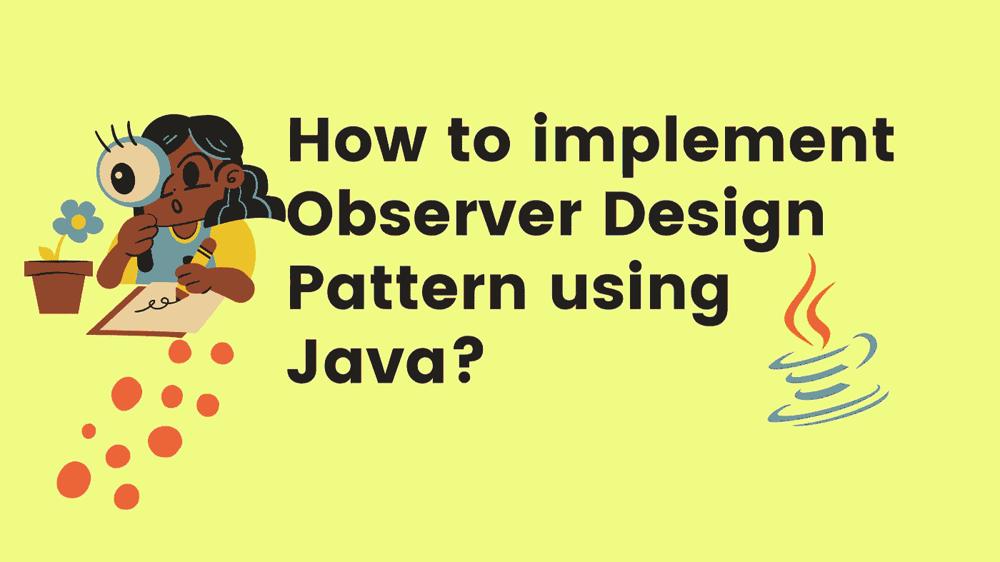
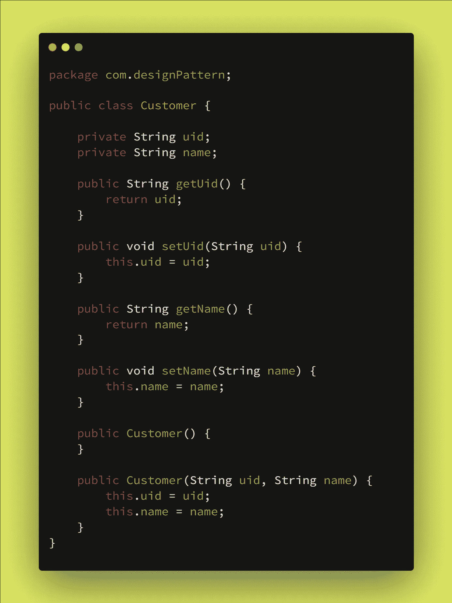
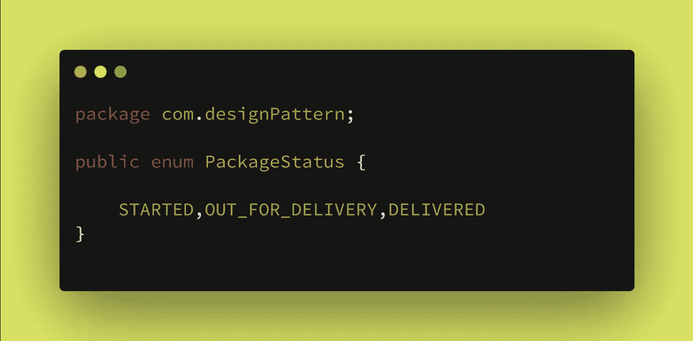
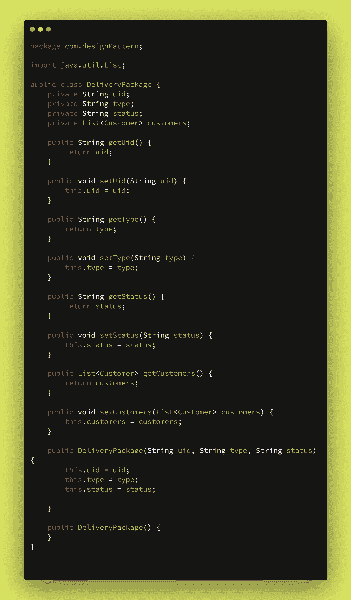
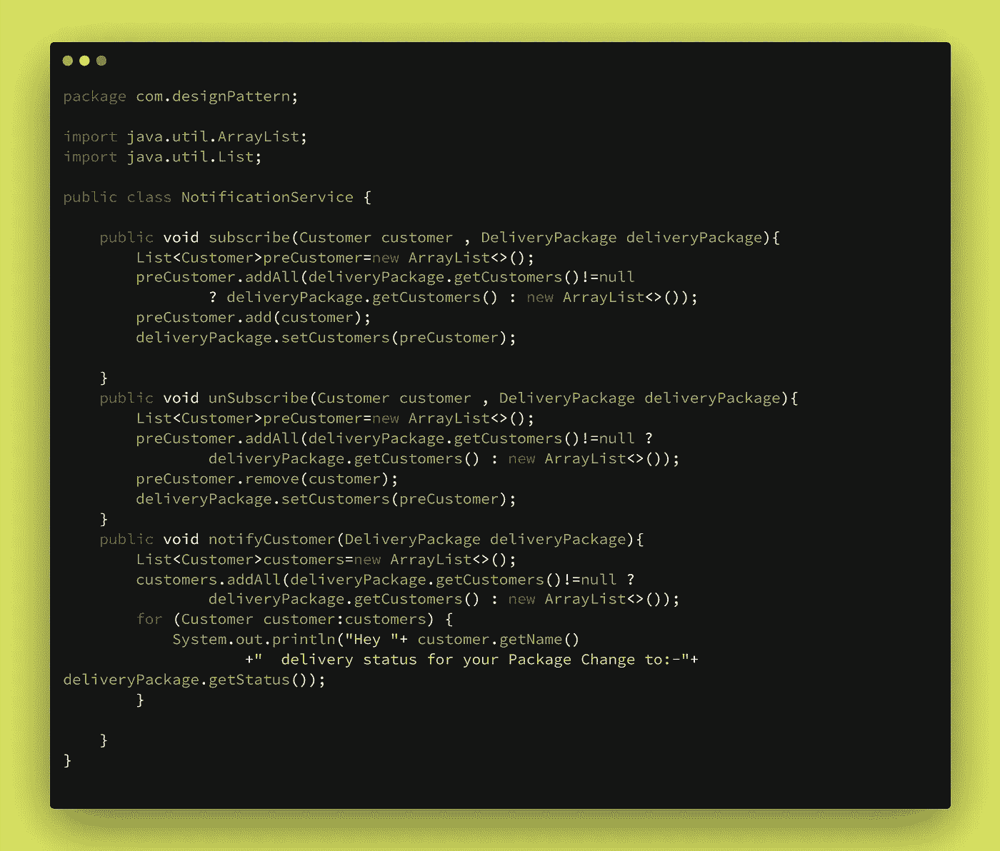
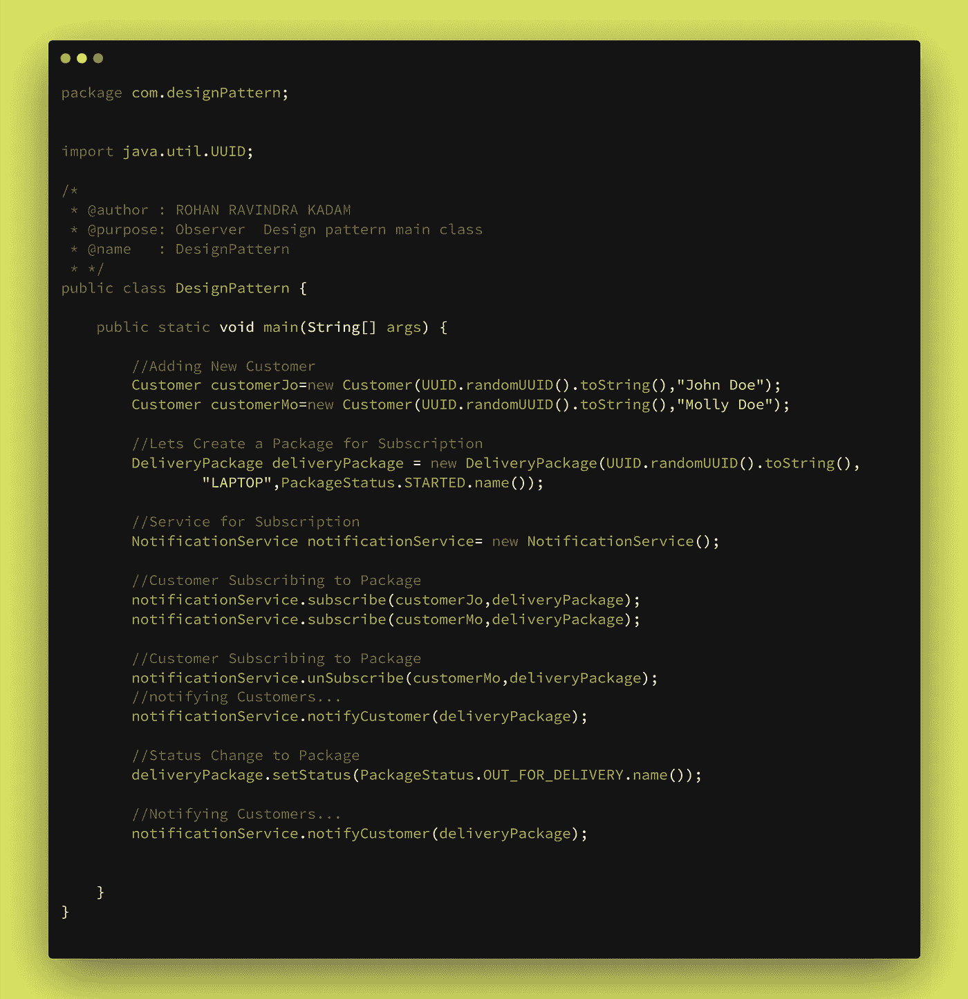
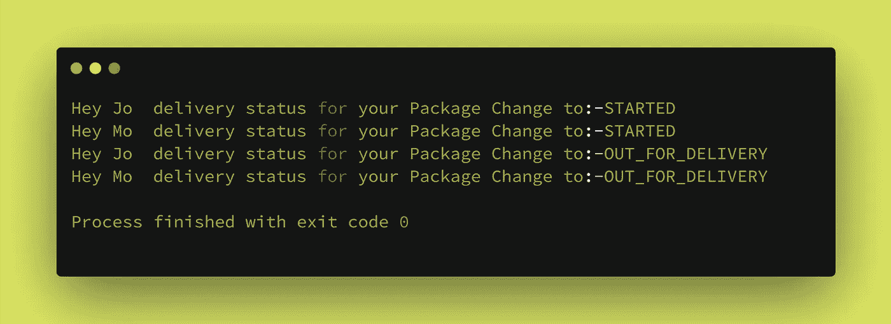

# 如何用 Java 实现观察者设计模式？

> 原文：<https://medium.com/javarevisited/how-to-implement-observer-design-pattern-using-java-fda89ff76b2c?source=collection_archive---------3----------------------->

## 设计模式

你好👋是洛汗·卡达姆😊

也许你是编码新手👩‍💻或者编程，也许有经验👴或者，也许你们所有的前端或后端开发人员都可能遇到过作为原则或概念的单词[设计模式](/javarevisited/7-best-books-to-learn-design-patterns-for-java-programmers-5627b93eefdb?source=---------15------------------)。设计模式是编写代码或开发应用程序的一种方式或方法。在本文中，我们试图回答一些问题什么是设计模式？为什么要实现设计模式？如何实现一个设计模式(观察者)？

如何用 Java 实现观察者设计模式？

## ⚡What 是设计模式吗？

设计模式是对[软件设计](https://www.java67.com/2019/09/top-5-courses-to-learn-system-design.html)中常见问题的解决方案。它们就像预制的蓝图，我们可以定制它们来解决代码中反复出现的设计问题。

它们不是可以导入并用于软件开发或解决特定问题的代码或库。我们可以遵循模式细节，并实现一个适合您自己程序实际情况的解决方案。

> **我们经常在** [**设计模式**](/javarevisited/7-best-online-courses-to-learn-object-oriented-design-pattern-in-java-749b6399af59) **和算法之间困惑。虽然算法总是定义一组可以实现某个目标的清晰的动作，但是模式是解决方案的更高层次的描述。**

将算法比作一道烹饪菜肴:两者都有实现目标的清晰步骤。它们不是库或模块；它们是你集成到设计核心的指导方针，帮助你创建灵活和可维护的面向对象系统。

## ⚡Why 实现了一个设计模式？

我们只是简单地遇到了设计模式，它们是通用的面向对象的解决方案，您可以在自己的设计中使用。由有经验的人制作👴面向对象的实践者，设计模式可以让你的设计更灵活，更能适应变化，更容易维护。所以，如果设计模式仍然不是你开发工具带的一部分，这里有五个你应该加入它们的理由。

1 →不要重复发明轮子，让我们的生活更轻松

2 →提高我们的面向对象技能

3 →识别库和语言中的模式

4 →利用共享词汇的力量

5 →发现真善美

## ⚡How 实现了一个观察者设计模式？

在直接进入设计模式的实现之前，我们需要回答一些问题，比如什么是观察者设计模式？为什么要加入设计模式？最后，如何实现观察者设计模式？

**1→什么是观察者设计模式？**

观察者设计模式是行为设计模式家族的一部分，**它让我们在我们观察的对象上定义订阅机制，每当对象改变时订阅者都会得到通知**。现实生活中的一个例子是，假设我们正在经营一家大型快递公司。在我们的场景中，包是这样一个对象，每当包的状态发生变化时，客户或订户都会观察到这个对象。这就是观察者模式在现实生活中的工作方式。

> **定义:**

**2 →为什么要实现观察者设计模式？**

1.  观察者设计模式允许我们遵循设计原则(**)。**
2.  **它在运行时培养对象之间的关系。**
3.  **其支持 [**开/关**原理](https://javarevisited.blogspot.com/2015/07/strategy-design-pattern-and-open-closed-principle-java-example.html)**

****3 →如何实现观察者设计模式？****

**在第节中，我们尝试使用 Java 实现观察者设计模式。例如，我们使用包订阅来通知订阅的客户**

## ****第一步:如何创建订阅客户？****

**为了通知客户，我们需要为其创建一个自定义对象。在图像下方结账👇**

**

Customer.java** 

## ****第二步:交付有哪些不同的状态？****

**为了便于通知，我们使用了 status。像电子商务平台，用于他们的交货系统。**

****

## **第三步:-我们的递送包裹是什么？**

**包是一个包含各种相关信息的对象，例如客户列表、类型和状态。客户列表将存储关于订阅客户的客户信息。“状态”字段对应于包裹状态，例如“已开始”、“外出交付”、“已交付”。**

****

## ****第四步:如何通知认购客户？****

**为了通知客户，它需要首先订阅该包。下面的通知服务用于表示订阅和通知。**

****

## **第五步:如何测试我们的设计模式？**

**在下面结帐👇**

****

## **第六步:输出**

****

## **⚡Where 找到观察者设计模式的代码库？**

 **[## GitHub-rohan 2596/设计-模式-模式/观察者中的示例

### 此时您不能执行该操作。您已使用另一个标签页或窗口登录。您已在另一个选项卡中注销，或者…

github.com](https://github.com/Rohan2596/Design-pattern-examples/tree/pattern/observer)** 

## **⚡Conclusion:-**

**在文章中，我们试图回答一些与设计模式相关的问题，特别是**观察者** **设计模式**如何帮助世界各地的开发者编写更好的代码和构建更快的应用程序。观察者设计模式允许我们有效地实现 [**固体**原理](https://javarevisited.blogspot.com/2018/07/10-object-oriented-design-principles.html)。观察者设计模式的最好例子是电子商务、送货业务等。请分享和喜欢💖如果你觉得文章有用。在 medium 上关注我 [Rohan Ravindra Kadam](https://medium.com/u/a1b33b7cda75?source=post_page-----fda89ff76b2c--------------------------------) ，在 Twitter 上关注我 [**rohankadam25**](https://twitter.com/rohankadam25)**

**不要忘记看看我的网站，以了解更多关于我的信息**

 **[## 罗汉·拉温德拉·卡达姆

### 来自印度孟买的全栈开发人员，拥有大约 3 年的软件开发经验。

kadamrohan.com](https://kadamrohan.com/)** 

## **📚参考书目:-**

** [## 观察者

### 也称为事件订阅者，监听器观察器是一种行为设计模式，让您定义订阅…

重构。领袖](https://refactoring.guru/design-patterns/observer) 

谢谢观众们——罗汉·卡达姆**