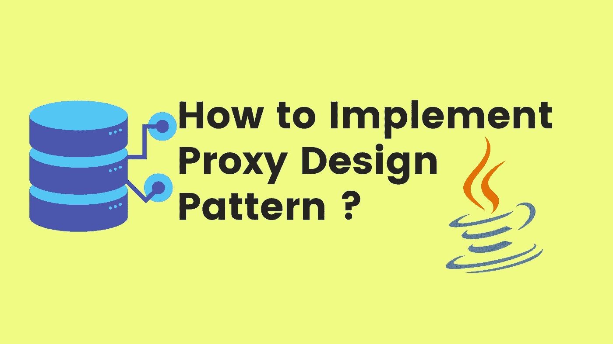
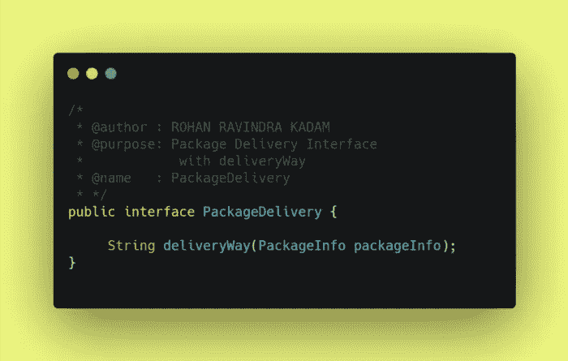
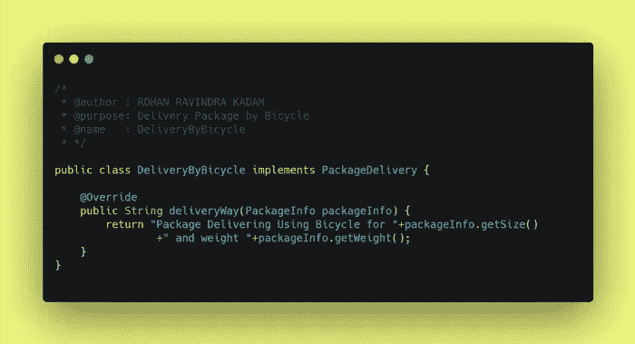
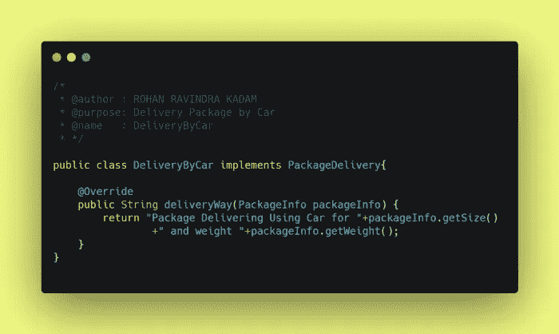
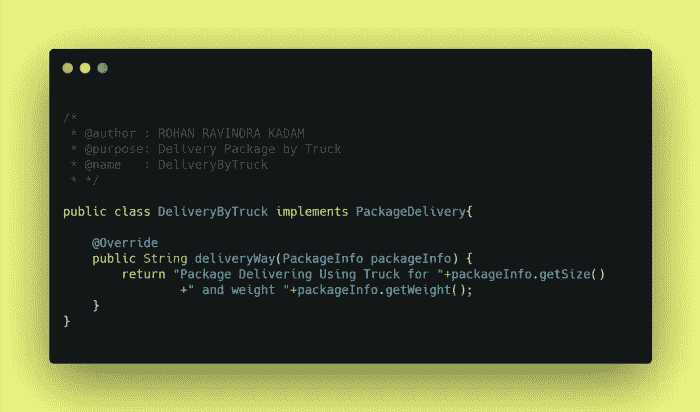
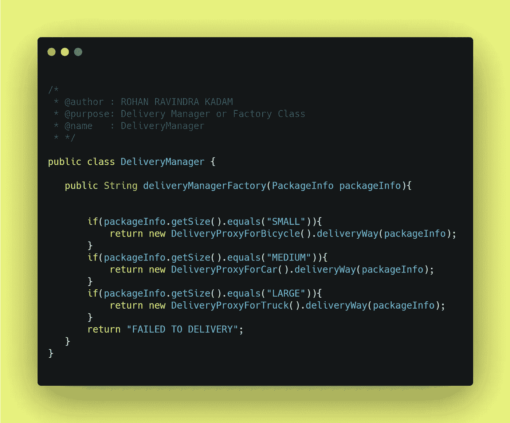
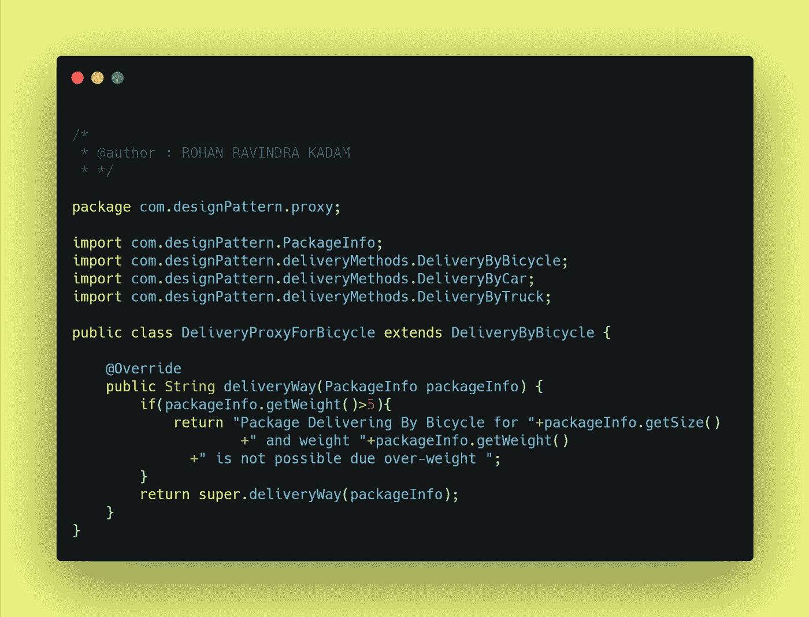
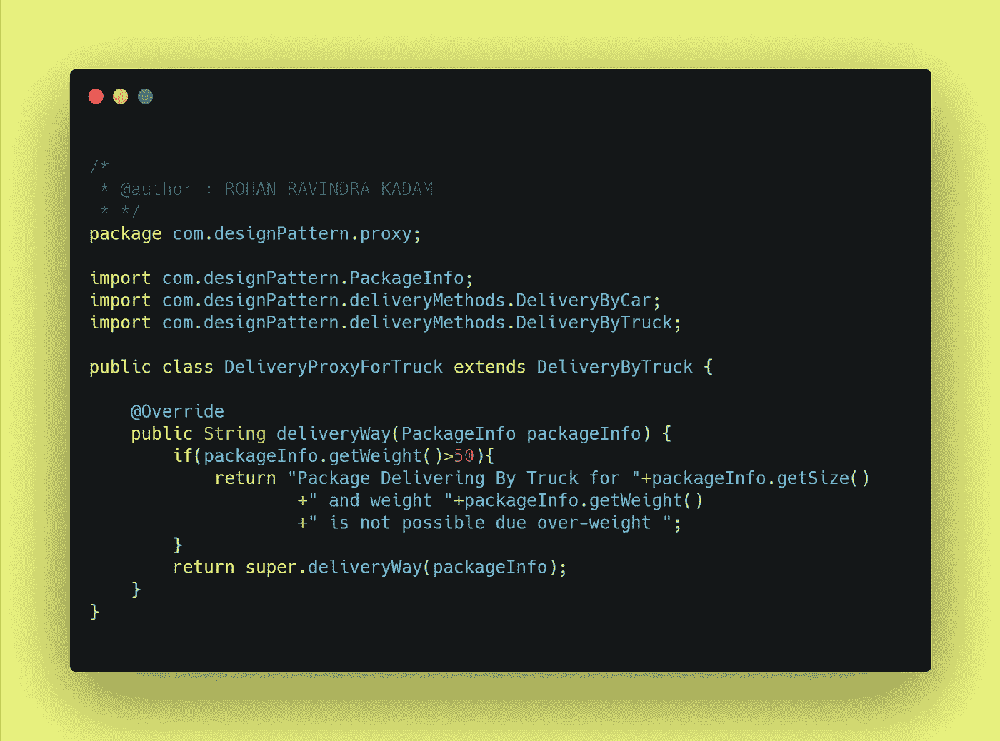

# 如何用 Java 实现代理设计模式？

> 原文：<https://medium.com/javarevisited/how-to-implement-proxy-design-pattern-using-java-719c06a0ae34?source=collection_archive---------0----------------------->

## 设计模式

你好👋是洛汗·卡达姆😊

也许你是编码新手👩‍💻或者编程，也许有经验👴或者，你们所有的前端或后端开发人员可能都曾遇到过作为原则或概念的设计模式这个词。设计模式是编写代码或开发应用程序的一种方式或方法。在本文中，我们试图回答一些问题什么是设计模式？为什么要实现设计模式？如何实现一个设计模式(**代理**)？

如何实现代理设计模式？

## ⚡What 是设计模式吗？

**设计模式**是软件设计中常见问题的解决方案。它们就像预制的蓝图，我们可以定制它们来解决代码中反复出现的设计问题。

它们不是可以导入并用于软件开发或解决特定问题的代码或库。我们可以遵循模式细节，并实现一个适合您自己程序实际情况的解决方案。

> **我们经常混淆设计模式和算法。虽然算法总是定义一组可以实现某个目标的清晰的动作，但是模式是解决方案的更高层次的描述。**

将算法比作一道烹饪菜肴:两者都有实现目标的清晰步骤。它们不是库或模块；它们是您集成到设计核心中的指导原则，在创建灵活且可维护的面向对象系统时为您助一臂之力。

## ⚡Why 实现了一个设计模式？

我们只是简单地遇到了设计模式，它们是通用的面向对象的解决方案，您可以在自己的设计中使用。由有经验的人制作👴面向对象的实践者，设计模式可以让你的设计更灵活，更能适应变化，更容易维护。所以，如果设计模式仍然不是你开发工具带的一部分，这里有五个你应该加入它们的理由。

1 →不要重复发明轮子，让我们的生活更轻松

2 →提高我们的面向对象技能

3 →识别库和语言中的模式

4 →利用共享词汇的力量

5 →发现真善美

## ⚡How 要实现代理设计模式？

在直接进入设计模式的实现之前，我们需要回答一些问题，比如什么是代理设计模式？为什么要合并设计模式？最后，如何实现代理设计模式？

**1→什么是代理设计模式？**

代理设计模式是结构设计模式家族的一部分，它让我们创建一个占位符或真实对象的替代品。现实生活中的一个例子是，**假设你在 business🛒进行了一次大型送货，你必须将包裹交付给消费者，现在问题来了，你应该使用什么来交付特定的汽车🚗，卡车🚚或者 bicycle🛵** 。**因此，解决方案可以是，我们输入包裹的大小，基于此我们决定哪种运输方式可能是最好的，但如果包裹信息与条件不匹配，我们会通过默认消息发送给它**。这就是代理模式在现实生活中的工作方式。

> **定义:**
> *代理模式是一种设计模式，*让我们**为另一个对象提供替代品或占位符。代理控制对原始对象的访问，允许您在请求到达原始对象之前或之后执行某些操作。**

**2 →为什么要实现代理设计模式？**

1.  代理设计模式允许我们遵循设计原则(**实体**)。
2.  它允许我们在客户机不知道的情况下控制服务对象。
3.  它允许我们在不影响现有代码结构的情况下引入新代码，如支持我们的开放-封闭原则的**即插即用模型。**

**3 →如何实现代理设计模式？**

## 在第节中，我们尝试使用 Java 实现代理设计模式。例如，我们使用交付经理的例子来选择运输方式。

**步骤 1 →交付经理应该给出什么输入？**

作为送货经理，他/她应该提供关于包裹的信息，如**尺寸**和**重量**，在我们的例子中，我们使用 **PackageInfo** 来完成这项工作。

包装信息

**第二步→有哪些不同的发货方式？**

递送包裹的各种方式有汽车🚗，自行车🏍和卡车🚚。我们创建了三个定义交付模式的类。

包裹交付界面

我们已经创建了由 PackageDelivery 接口实现的子类。

**1→自行车送货🏍**

骑自行车送货

**2→汽车交货**🚗

汽车送货

**3→卡车运输**🚚

卡车运输

**步骤 3→如何管理代理？**

例如，代理将由交付管理器类管理，我们也可以称为工厂管理器类。再往下，代理类根据将要递送或拒绝递送的包裹的重量来决定。

交付经理

**第四步→如何为另一个对象提供一个替代品或占位符？**

根据代理模式的定义，我们需要**为另一个对象提供一个替代或占位符，所以在我们的例子**中，我们为各种模式使用交付代理类。在我们的例子中，我们检查包裹的重量限制，如果它没有通过超重信息。深入理解示例，**代理控制对原始对象的访问，允许您在请求到达原始对象之前或之后执行某些操作。在我们的示例中，代理类在包对象进入交付方法之前基于重量检查包对象。**

## 自行车的🛵Delivery 代理

自行车送货代理

## 🚗汽车运输代理

汽车送货

## 🚚卡车运输代理

卡车运输代理

**第五步→如何测试工厂设计模式？**

为了测试我们的工厂设计模式，我们给出了 3 种不同的包装，具有 3 种不同的包装尺寸，如**小型、大型和中型&以及包装信息的重量。**

设计模式

**步骤 6→工厂模式的输出是什么？**

下面的控制台输出有助于理解管理器(工厂类)是如何根据包装信息选择运输方式的

工厂模式的输出

## ⚡Where 找到工厂设计模式的代码库？

Github 上的<https://github.com/Rohan2596>

**<https://github.com/Rohan2596/Design-pattern-examples/tree/pattern/proxy>  

## 📑结论:-

在本文中，我们试图回答一些与设计模式相关的问题，特别是**代理设计模式**如何帮助世界各地的开发人员编写更好的代码和构建更快的应用程序。**代理设计模式**允许我们有效地实现**稳固的**原则，无论是**松耦合还是单责任。**

请分享和喜欢💖如果你觉得文章有用。在媒体上关注我，在推特上关注我

## 📚参考书目:-

<https://refactoring.guru/design-patterns/proxy>  <https://en.wikipedia.org/wiki/Proxy_pattern>  **