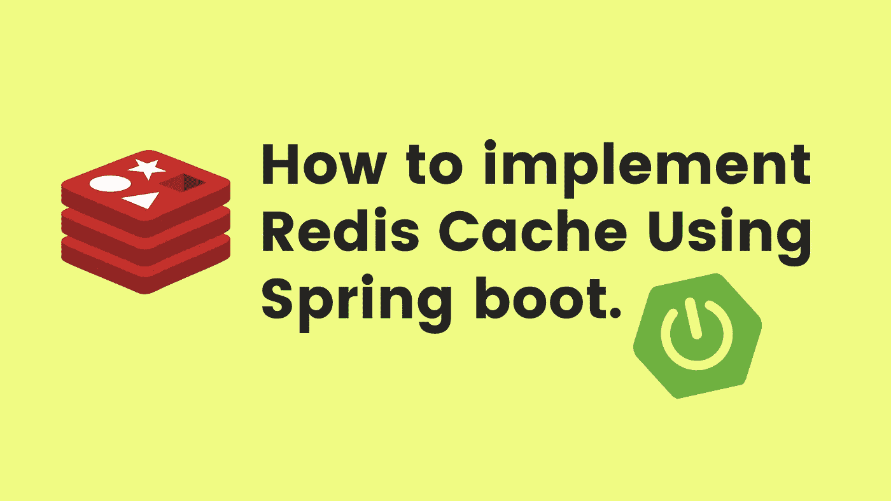
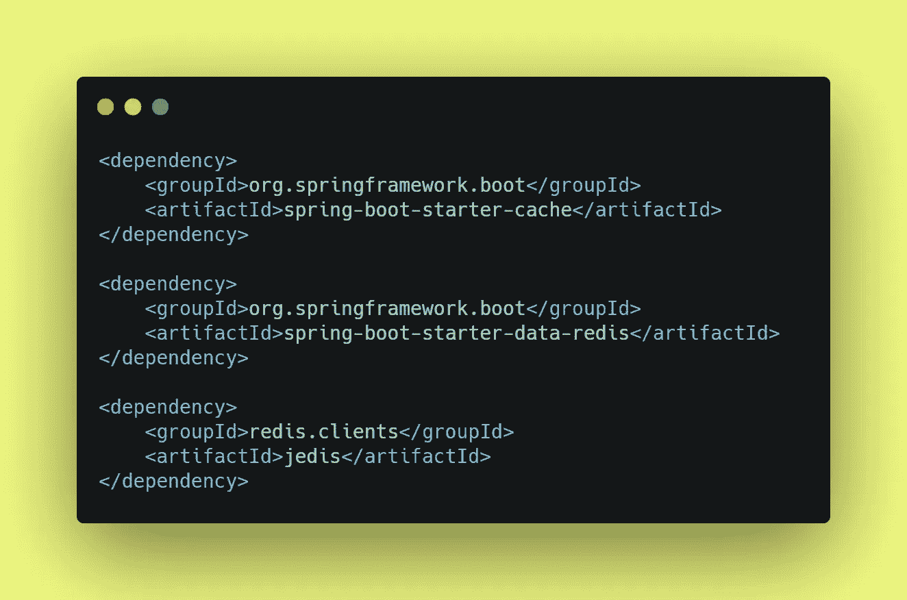
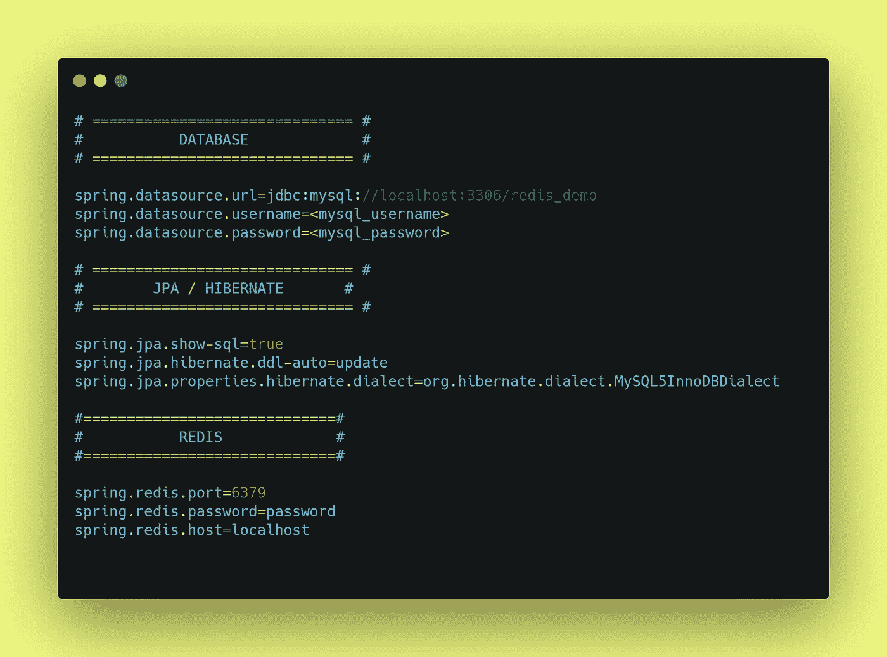
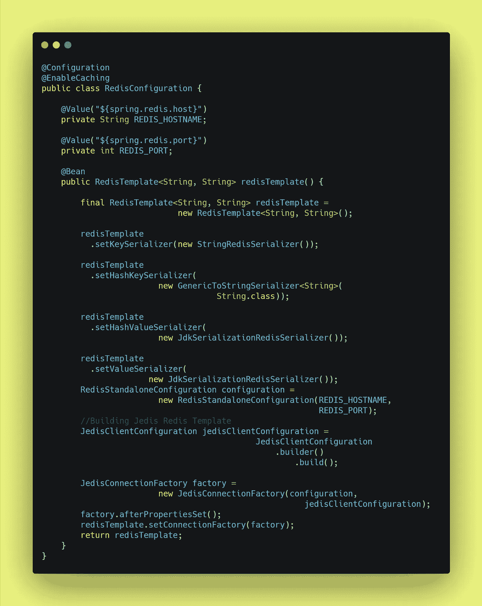
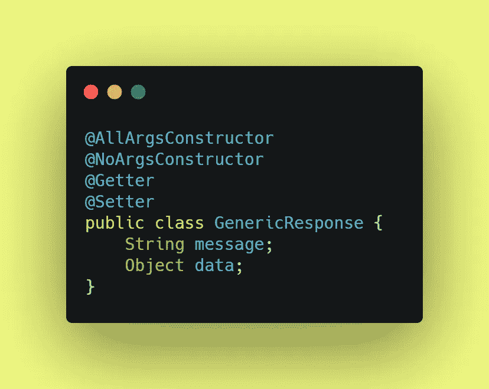
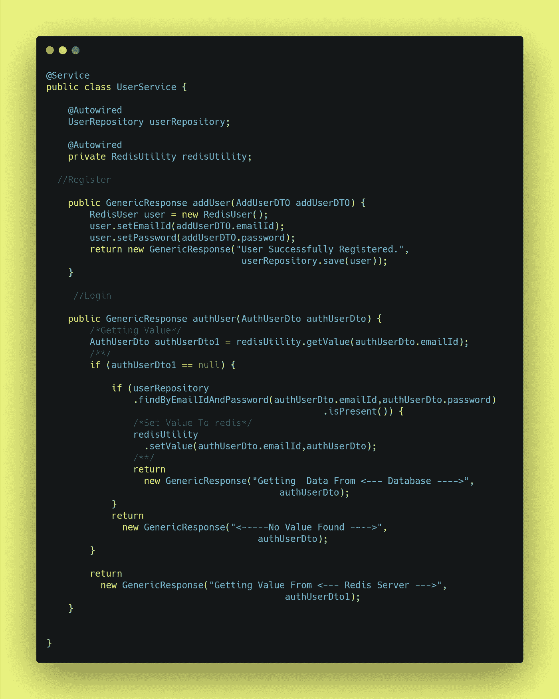
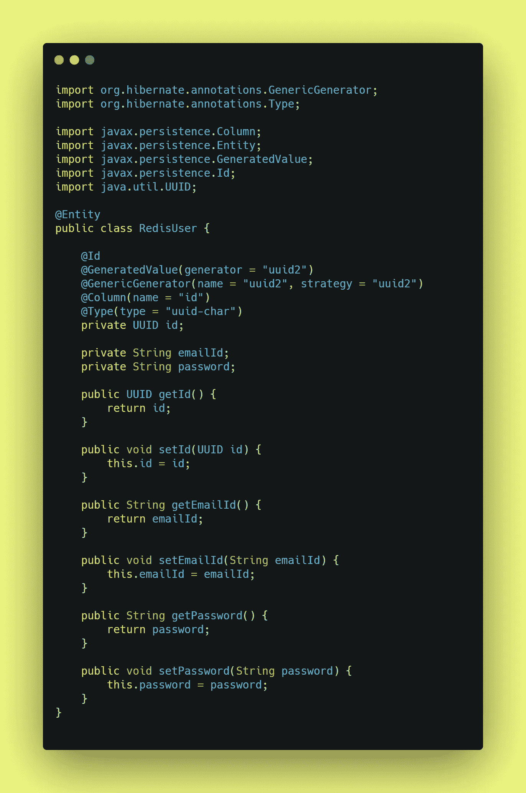
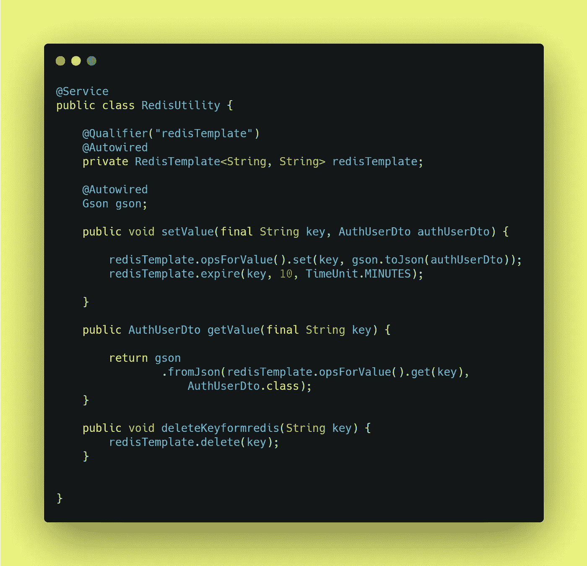

# 如何用 Spring boot 实现 Redis 缓存？

> 原文：<https://medium.com/javarevisited/how-to-implement-redis-cache-using-spring-boot-c707fcf151a9?source=collection_archive---------0----------------------->

## Redis 缓存

你好👋，其[罗汉拉温德拉卡达姆](https://medium.com/u/a1b33b7cda75?source=post_page-----c707fcf151a9--------------------------------) ↗ [️](https://znap.link/rohankadam)

大家好👋，大家可能都有很多疑问，比如**什么是 Redis 缓存？为什么使用 Redis 缓存？如何使用 Redis 缓存？**在这篇博客中，我们将回答上面提出的所有问题，但主要是关于【Redis 缓存是如何使用 Spring Boot 实现的。

如何使用 Spring、Boot 实现 Redis 缓存

> 嘿 DevCommunity 别忘了在 Instagram 上查看更多内容，地址:[**@ rohankadam _ codes**](https://www.instagram.com/rohankadam_codes/)

## 什么是 Redis 缓存？

Redis 代表远程字典服务器，是一个快速、开源、内存中的键值数据存储。当 Redis 的最初开发者 Salvatore Sanfilippo 希望提高他的意大利初创公司的可扩展性时，该项目开始了。在那里，他开发了 Redis，现在被用作数据库、缓存、消息代理和队列。Redis 是一个开源的(BSD 许可的)、内存中的数据结构存储，用作数据库、缓存和消息代理。Redis 提供了数据结构，如字符串、散列、列表、集合和带有范围查询、位图、超级日志、地理空间索引和流的排序集合。Redis 具有内置的复制、Lua 脚本、LRU 驱逐、事务和不同级别的磁盘持久性，并通过 Redis Sentinel 和 Redis Cluster 的自动分区提供高可用性。

## 为什么使用 Redis 缓存？

Redis 是实现高可用性内存缓存的绝佳选择，可以减少数据访问延迟、增加吞吐量，并减轻关系或 NoSQL 数据库和应用程序的负担。Redis 可以以亚毫秒级的响应时间提供频繁请求的项目，并使您能够轻松扩展以适应更高的负载，而不会增加更昂贵的后端。数据库查询结果缓存、持久会话缓存、网页缓存和常用对象(如图像、文件和元数据)的缓存都是 Redis 缓存的常见示例。Redis 可以与 Apache Kafka 和 Amazon Kinesis 等流解决方案一起使用，作为内存中的数据存储，以亚毫秒级延迟接收、处理和分析实时数据。Redis 是社交媒体分析、广告定位、个性化和物联网等[实时分析](https://aws.amazon.com/elasticache/redis/#Real-time_Analytics)用例的理想选择。

## **如何使用 Redis 缓存？**

Redis 缓存的用途很多，可以用作数据库或缓存，但在这些部分，我们将讨论如何使用 **Redis 作为缓存。**

## 第一步:如何生成 Spring Boot 项目？

 [## 弹簧初始化 r

### Initializr 生成的 spring boot 项目正好是你快速启动所需要的！

start.spring.io](https://start.spring.io/) 

## 步骤 2:我应该包括哪些依赖项？

Redis 缓存依赖项

## 步骤 3:我们需要在应用程序中添加哪些属性。属性？

应用程序.属性

## 步骤 Redis 缓存的配置是什么？

注意:我们正在使用构建一个 spring boot 应用程序，因此我们将进入配置中的 Jedis 配置。

应用程序的 Redis 配置

## 步骤 5:什么是控制器端点或 API 端点？

Redis 应用程序的用户控制器

## 第五步:什么是 GenericResponse？AddUserDto？& AuthUserDto？

通用响应

AddUserDTO

AuthUserDTO

## 第六步:业务逻辑或者所谓的 UserService 在哪里？

登录和注册的用户服务

## 步骤 7:我的实体类在哪里？

再扩散器

## 第八步:如何对 Redis 缓存进行 CRUD 操作？

Redis 服务的 Redis 实用程序

## 步骤 9:如何测试项目？

如果你问我是否会使用**[**Postman**](https://www.postman.com/)，可以使用许多不同的方法来测试 API 端点**

****API 终点是:-****

****用户注册端点****

**[http://localhost:8080/redis/demo/add](http://localhost:8080/redis/demo/add)**

****用户登录端点****

**[http://localhost:8080/redis/demo](http://localhost:8080/redis/demo)**

## **结论:-**

**在本文中，我们试图回答许多与 Redis 缓存相关的问题，以及如何使用 Spring boot 实现同样的问题。Redis 缓存的强大功能，如缓存和快速查询，被许多财富 500 强公司用来为其他公司提供服务。**

**请分享和喜欢💕如果你觉得文章有用。在媒体上关注我，在推特上关注我**

****

**谢谢观众**