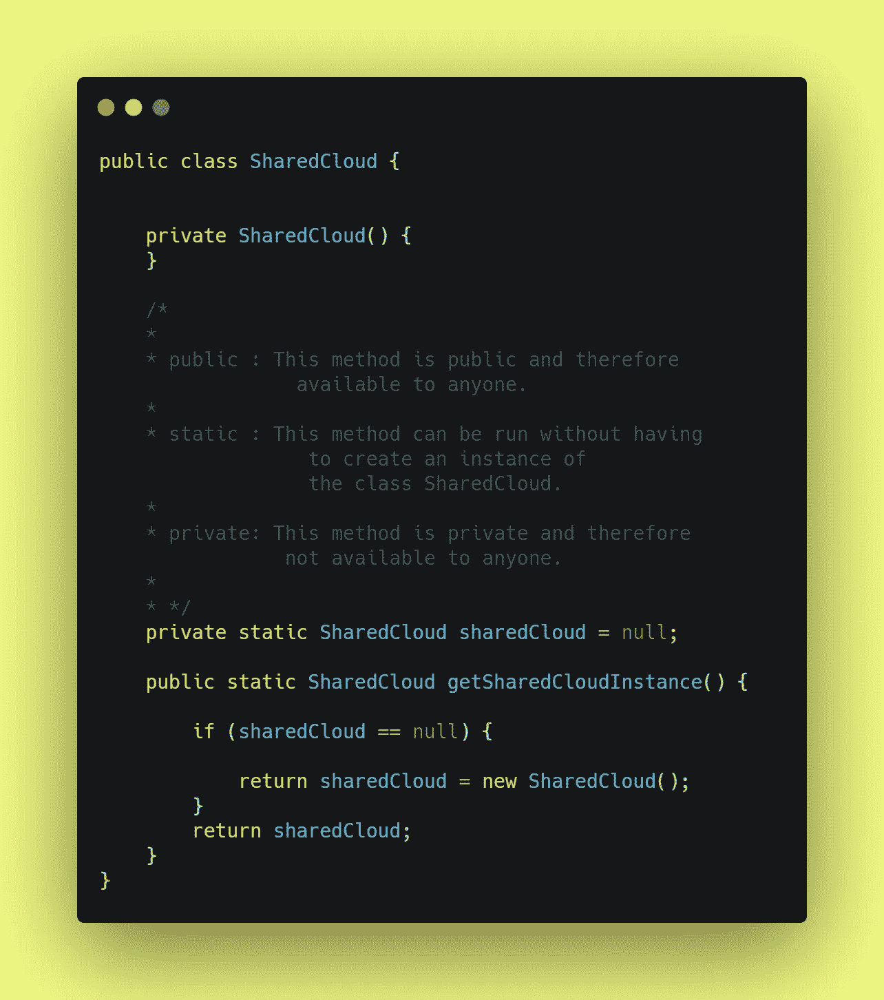
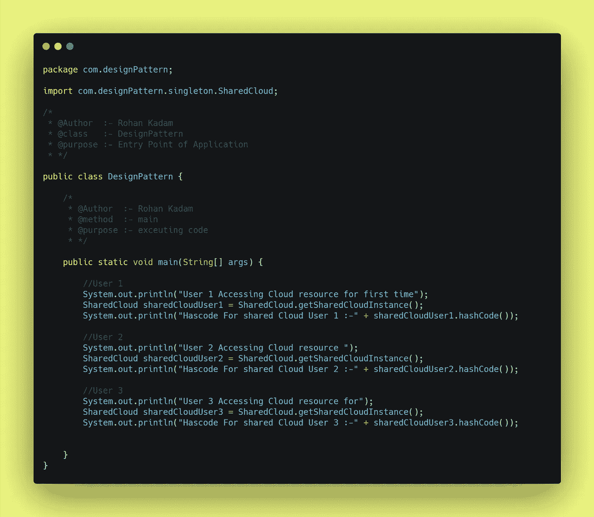
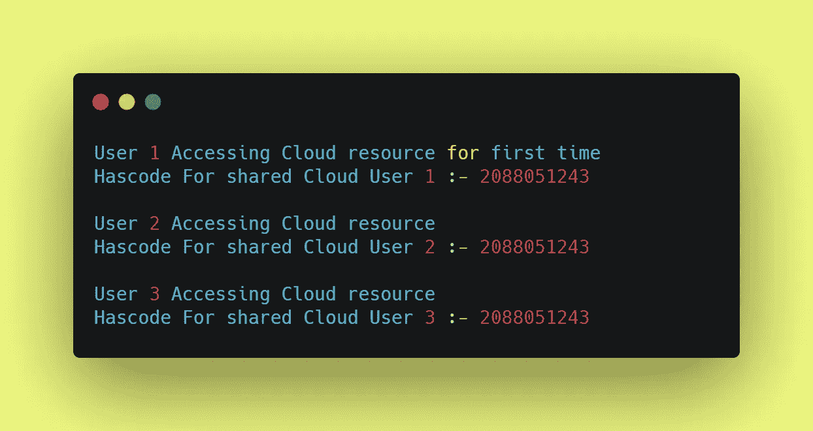

# 如何用 Java 实现 Singleton 设计模式？

> 原文：<https://medium.com/javarevisited/how-to-implement-singleton-design-pattern-using-java-410197d97af0?source=collection_archive---------2----------------------->

## 设计模式

你好👋是洛汗·卡达姆😊

也许你是编码新手👩‍💻或者编程，也许有经验👴或者，你们所有的前端或后端开发人员可能都曾遇到过作为原则或概念的设计模式这个词。设计模式是编写代码或开发应用程序的一种方式或方法。在本文中，我们试图回答一些问题什么是设计模式？为什么要实现设计模式？如何实现一个设计模式准确的说 **Singleton 设计模式**？

如何实现单例模式？

## 什么是设计模式？

**设计模式**是软件设计中常见问题的解决方案。它们就像预制的蓝图，我们可以定制它们来解决代码中反复出现的设计问题。

它们不是可以导入并用于软件开发或解决特定问题的代码或库。我们可以遵循模式细节，并实现一个适合您自己程序实际情况的解决方案。

我们经常混淆设计模式和算法。虽然算法总是定义一组可以实现某个目标的清晰的动作，但是模式是解决方案的更高层次的描述。

将算法比作一道烹饪菜肴:两者都有实现目标的清晰步骤。它们不是库或模块；它们是您集成到设计核心中的指导原则，在创建灵活且可维护的面向对象系统时为您助一臂之力。

## 为什么要实现设计模式？

我们只是简单地遇到了设计模式🌰，它们是通用的面向对象的解决方案，您可以在自己的设计中使用。由有经验的人制作👴面向对象的实践者，设计模式可以让你的设计更灵活，更能适应变化，更容易维护。所以，如果设计模式仍然不是你开发工具带的一部分，这里有五个你应该加入它们的理由。

1 →不要重复发明轮子，让我们的生活更轻松

2 →提高我们的面向对象技能

3 →识别库和语言中的模式

4 →利用共享词汇的力量

5 →发现真善美

## 如何实现单例设计模式？

在直接进入设计模式的实现之前，我们需要回答一些问题，比如什么是单体设计模式？为什么要合并设计模式？最后，如何实现单例设计模式？

**1→什么是单例设计模式？**

Singleton 是创造性设计模式家族的一部分，它让我们确保一个类或对象只有一个实例。一个真实的例子是，**假设你在一家拥有云存储的大公司工作💾用于存储文件、图像和文档共享资源的系统我们创建共享存储就像创建单独的云存储一样💾对于每个用户👩‍💻可能成本很高**。

**定义:**
*singleton 模式是一种将类的实例化限制在一个对象上的设计模式。*

**2 →为什么要实现单体设计模式？**

1.  我们可以确定一个类只有一个实例。
2.  我们获得了该实例的全局访问点。
3.  Singleton 对象只有在第一次被请求时才会被初始化。

**3 →如何实现单体设计模式？**

在第节中，我们尝试使用 Java 实现单例设计模式。例如，我们将使用共享资源云来理解单例设计模式。

在这个例子中，共享云类充当了一个**单例**。这个类没有公共构造函数，所以获取它的对象的唯一方法是调用`getSharedCloudInstance`方法。此方法缓存第一个创建的对象，并在所有后续调用中返回它。

共享云的单例类

在这个例子中，设计模式类充当了一个 **Main** 。

设计模式的主要类别

在本例中，下面是**输出**。如果我们注意到所有访问共享云资源的用户都有相同的 hashcode。

输出

## 基本代码:-

在下面的例子中，代码可以在 Github 上找到。相同的链接下面的结帐

<https://github.com/Rohan2596/Design-pattern-examples/tree/pattern/singleton>  

## 结论:-

在这篇文章中，我们试图回答许多与设计模式相关的问题，特别是**单例设计模式**如何帮助全世界的开发者写出更好的代码和构建更快的应用程序。

请分享和喜欢💖如果你觉得文章有用。在媒体上关注我，在推特上关注我

## 参考书目:-

<https://www.oreilly.com/content/5-reasons-to-finally-learn-design-patterns/>  <https://refactoring.guru/design-patterns/singleton>  

谢谢观众们——罗汉·卡达姆