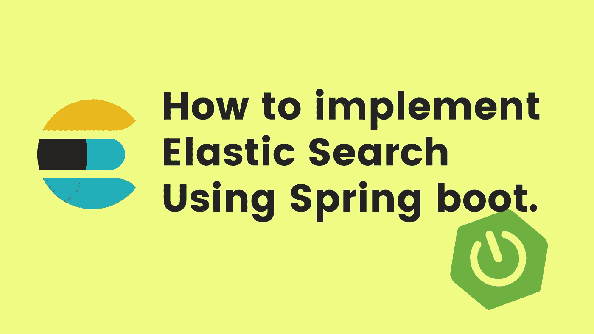
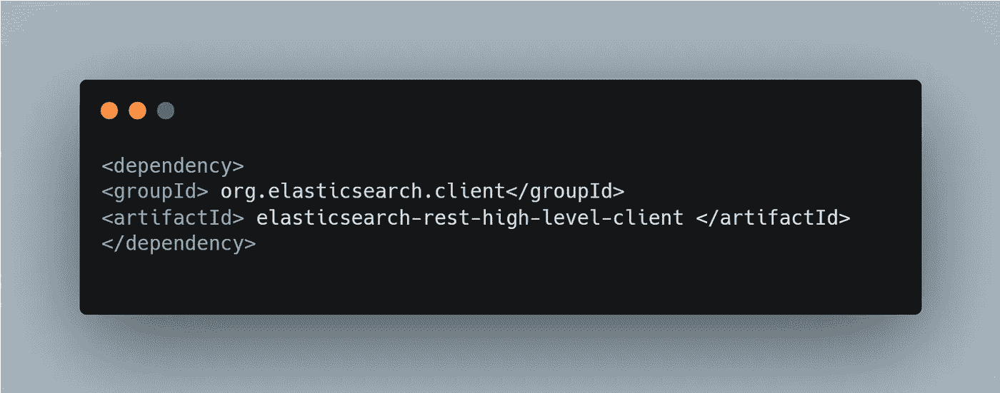
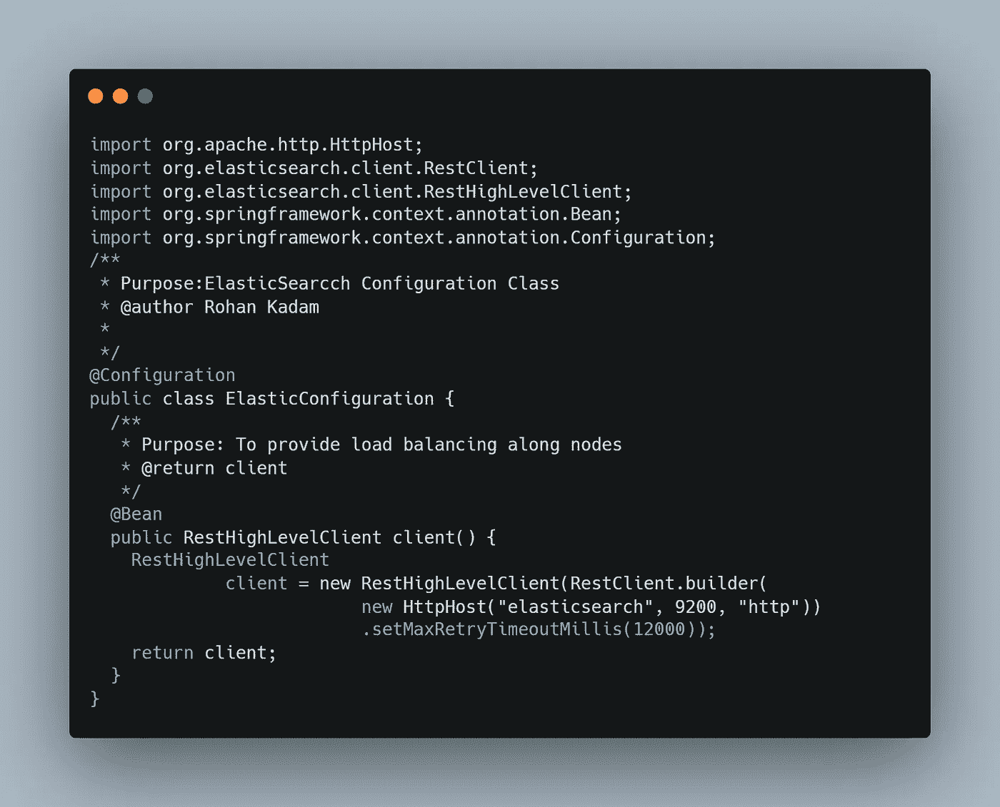
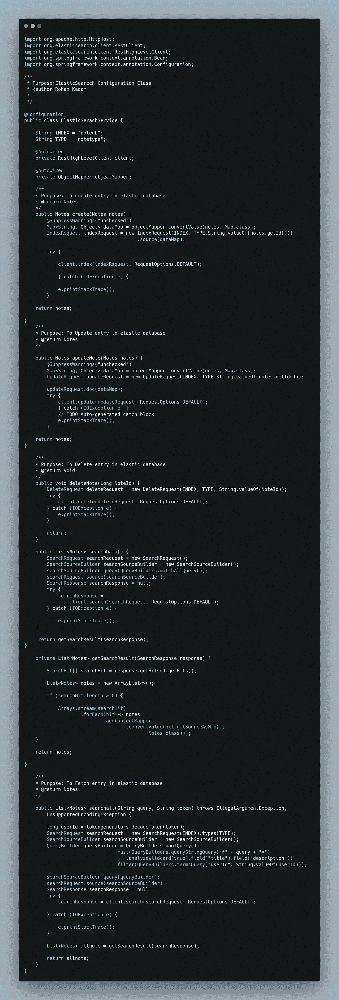

# 如何使用 Spring Boot 实现弹性搜索？

> 原文：<https://medium.com/javarevisited/how-to-implement-using-elastic-search-using-spring-boot-31a4f800b41f?source=collection_archive---------2----------------------->

## 弹性搜索

你好🖐，我是[罗汉·拉温德拉·卡达姆](https://medium.com/u/a1b33b7cda75?source=post_page-----31a4f800b41f--------------------------------) ↗ [️](https://znap.link/rohankadam)

弹性搜索！！什么是弹性搜索？为什么要弹性搜索？如何使用 Spring boot 使用弹性搜索？

使用 Spring Boot 的弹性搜索

> 嘿 DevCommunity 别忘了在 Instagram 上查看更多内容，请点击[**@ rohankadam _ codes**](https://www.instagram.com/rohankadam_codes/)

## [什么是弹性搜索？](https://www.elastic.co/what-is/elasticsearch)

Elasticsearch 是一个分布式、免费和开放的搜索和分析引擎，适用于所有类型的数据，包括文本、数字、地理空间、结构化和非结构化数据。Elasticsearch 基于 Apache Lucene 构建，由 Elasticsearch N.V .(现名为 Elastic)于 2010 年首次发布。

Elasticsearch 以其简单的 REST APIs、分布式特性、速度和可伸缩性而闻名，是 Elastic Stack 的核心组件，是一套用于数据摄取、丰富、存储、分析和可视化的免费开放工具。通常被称为 ELK Stack(在 Elasticsearch、Logstash 和 Kibana 之后)，Elastic Stack 现在包括一个丰富的轻量级运输代理集合，称为 Beats，用于向 Elasticsearch 发送数据。

## [为什么要用弹性搜索？](https://www.elastic.co/what-is/elasticsearch)

**Elasticsearch 很快。**因为 Elasticsearch 是建立在 Lucene 之上的，所以它擅长全文搜索。Elasticsearch 也是一个接近实时的搜索平台，这意味着从文档被索引到它变得可搜索的等待时间非常短——通常是一秒钟。因此，Elasticsearch 非常适合时间敏感的用例，如安全分析和基础架构监控。

**Elasticsearch 是自然分布的。**存储在 Elasticsearch 中的文档分布在称为*碎片*的不同容器中，这些碎片被复制以在硬件故障时提供数据的冗余副本。Elasticsearch 的分布式特性允许它扩展到数百(甚至数千)台服务器，处理数 Pb 的数据。

**Elasticsearch 具有广泛的功能。**除了速度、可伸缩性和弹性之外，Elasticsearch 还有许多强大的内置功能，使存储和搜索数据更加高效，例如数据汇总和索引生命周期管理。

**弹性堆栈简化了数据接收、可视化和报告。**与 Beats 和 Logstash 的集成使得在索引到 Elasticsearch 之前处理数据变得容易。Kibana 提供了 Elasticsearch 数据的实时可视化，以及用于快速访问应用性能监控(APM)、日志和基础设施指标数据的 ui。

## 如何在 Spring Boot 实施弹性搜索？

如今，弹性搜索被业界广泛用于开发搜索引擎。它最出名的是它的高性能搜索和查询。今天我们将使用 spring boot 和编程语言 Java 来实现弹性搜索。这一部分我们将讨论相同的 CRUD 操作。

## 第一步:如何生成 Spring Boot 项目？

<https://start.spring.io/>  

## 步骤 2:我应该包括哪些依赖项？

Rest 高级客户端弹性搜索

## 第三步:弹性搜索的配置是什么？

Java 高级 REST 客户端工作在 Java 低级 REST 客户端之上。它的主要目标是公开特定于 API 的方法，这些方法接受请求对象作为参数并返回响应对象，以便由客户端自己处理请求编组和响应取消编组。

每个 API 都可以同步或异步调用。同步方法返回一个响应对象，而名称以`async`后缀结尾的异步方法需要一个侦听器参数，一旦接收到响应或错误，就会通知该参数(在由低级客户端管理的线程池上)。

Java 高级 REST 客户端依赖于 Elasticsearch 核心项目。它接受与`TransportClient`相同的请求参数，并返回相同的响应对象。

构型弹性搜索

为了执行 CRUD 操作，我们需要为存储我们的数据对象定义存储。在弹性搜索的情况下，`type`就像 SQL 数据库中的一个表，其中`index`是 SQL 数据库。然而，这不是接近`type`的好方法。在下面的示例中，使用注释文档/实体/模型，它可以有多个字段，如标题、描述等。RestClient 依赖项为我们提供了如下方法

1.  [**IndexRequest**](https://www.elastic.co/guide/en/elasticsearch/client/java-rest/master/java-rest-high-document-index.html) :-为对象创建新的索引。
2.  [**update request**](https://www.elastic.co/guide/en/elasticsearch/client/java-rest/master/java-rest-high-document-update.html):-更新一个已有的索引。
3.  [**DeleteRequest**](https://www.elastic.co/guide/en/elasticsearch/client/java-rest/master/java-rest-high-document-delete.html) :-从弹性表中删除一个指标。
4.  [**搜索请求**](https://www.elastic.co/guide/en/elasticsearch/client/java-rest/current/java-rest-high-search.html) :-从数据库中执行搜索。

CRUD 操作的业务逻辑

## 结论:-

在本文中，我们试图回答许多与弹性搜索相关的问题，以及如何使用 Spring boot 实现弹性搜索。许多财富 500 强公司使用弹性搜索的强大功能(如索引和快速查询)为他人提供服务。

请分享和喜欢💖如果你觉得文章有用。请在 medium [上关注我，rohan ravindra kadam](https://medium.com/u/a1b33b7cda75?source=post_page-----31a4f800b41f--------------------------------)↗️上关注我，并在 Twitter 上关注 rohan kadam 25t15】

## 参考书目:-

<https://www.elastic.co/guide/en/elasticsearch/client/java-rest/master/java-rest-high.html>  <https://www.elastic.co/>  

谢谢观众们——罗汉·卡达姆