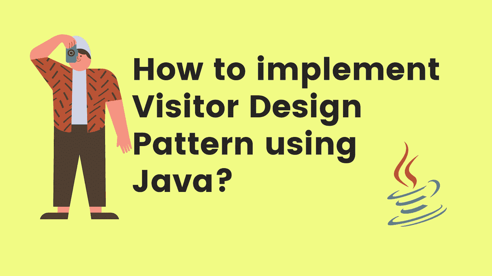
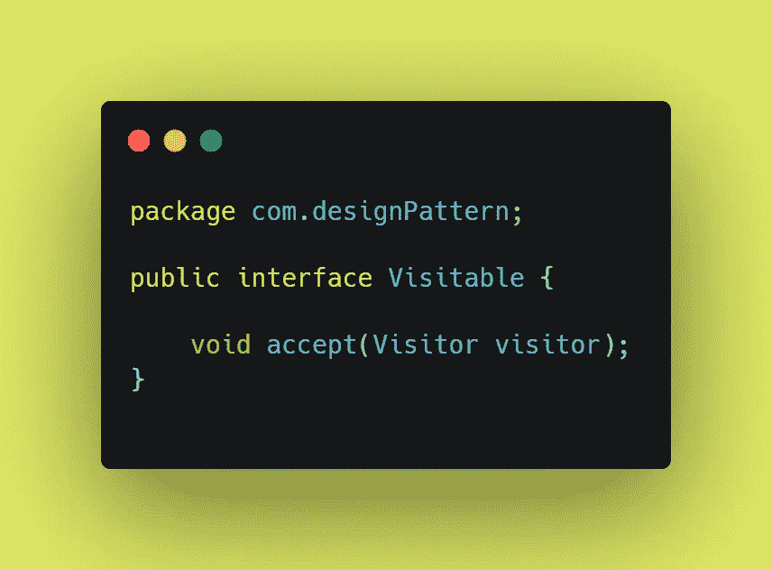
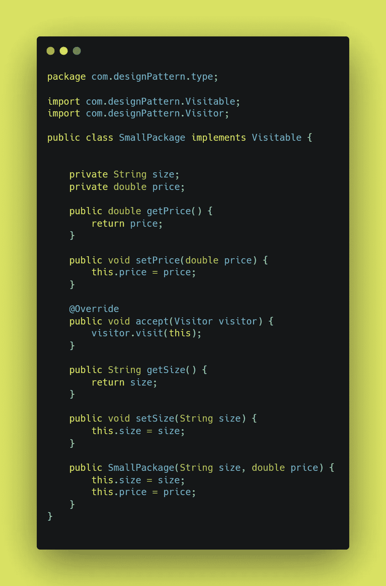
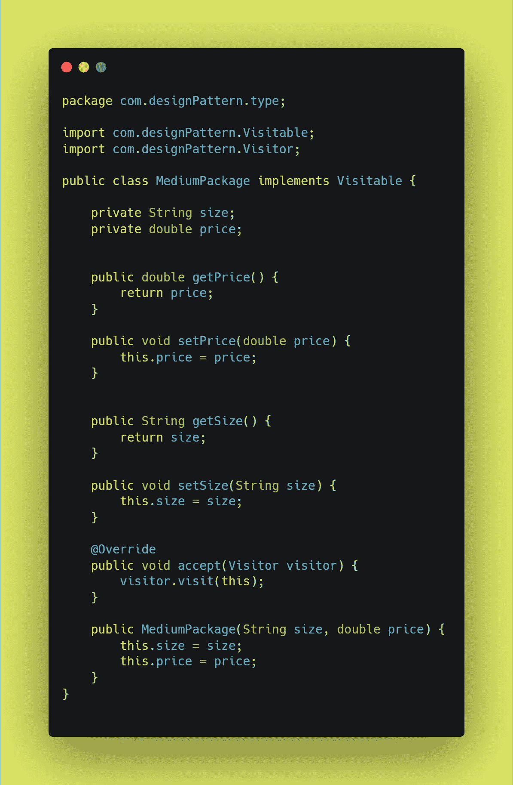
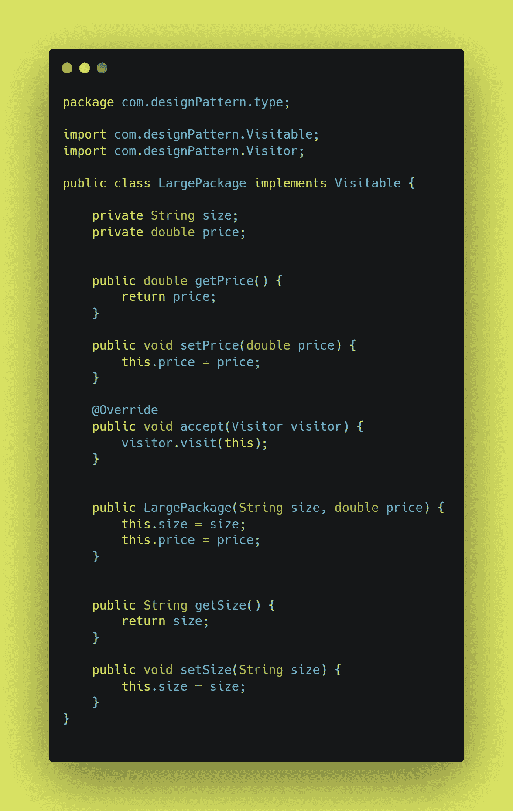
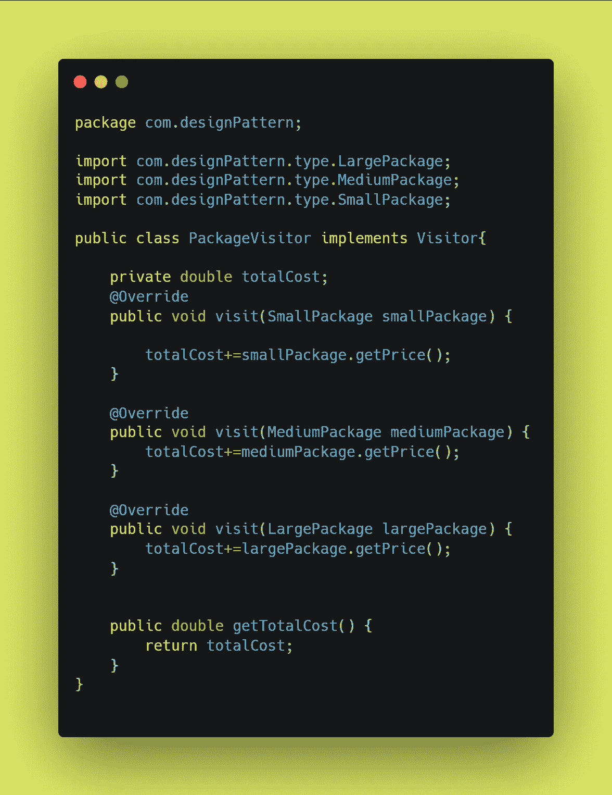
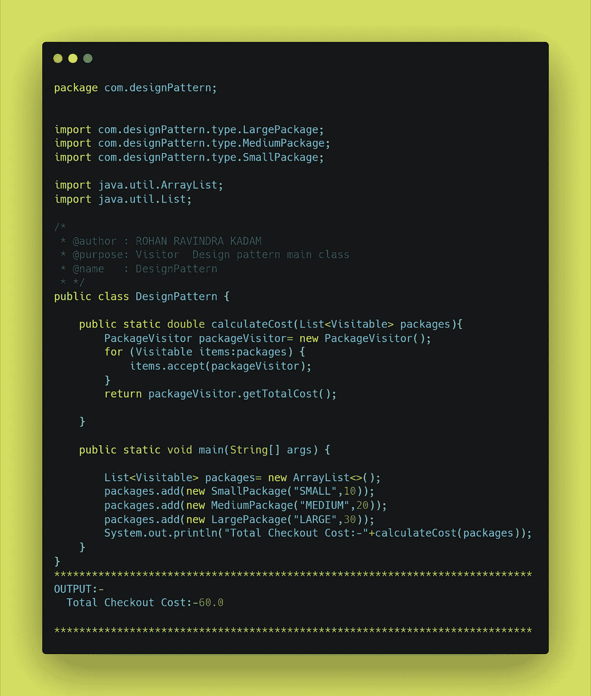

# 如何用 Java 实现访问者设计模式？

> 原文：<https://medium.com/javarevisited/how-to-implement-visitor-design-pattern-using-java-99b6fcdd48ef?source=collection_archive---------1----------------------->

## 设计模式

你好👋是洛汗·卡达姆😊

也许你是编码新手👩‍💻或者编程，也许有经验👴或者，也许你们所有的前端或后端开发人员都可能遇到过作为原则或概念的单词[设计模式](/javarevisited/7-best-online-courses-to-learn-object-oriented-design-pattern-in-java-749b6399af59)。设计模式是编写代码或开发应用程序的一种方式或方法。在本文中，我们试图回答一些问题什么是设计模式？为什么要实现设计模式？如何实现一个设计模式(**访问者**)？

如何用 Java 实现访问者设计模式？

## 🏭什么是设计模式？

[**设计模式**](/javarevisited/7-best-books-to-learn-design-patterns-for-java-programmers-5627b93eefdb) 是软件设计中常见问题的解决方案。它们就像预制的蓝图，我们可以定制它们来解决代码中反复出现的设计问题。

它们不是可以导入并用于软件开发或解决特定问题的代码或库。我们可以遵循模式细节，并实现一个适合您自己程序实际情况的解决方案。

> 我们经常混淆设计模式和算法。虽然算法总是定义一组可以实现某个目标的清晰的动作，但是模式是解决方案的更高层次的描述。

将算法比作一道烹饪菜肴:两者都有实现目标的清晰步骤。它们不是库或模块；它们是您集成到设计核心中的指导原则，在创建灵活且可维护的面向对象系统时为您助一臂之力。

## ⚡Why 实现了一个设计模式？

我们只是简单地遇到了设计模式，它们是通用的面向对象的解决方案，您可以在自己的设计中使用。由有经验的人制作👴面向对象的实践者， [*设计模式*](https://www.java67.com/2012/09/top-10-java-design-pattern-interview-question-answer.html) 可以让你的设计更灵活，更能适应变化，更容易维护。所以，如果设计模式仍然不是你开发工具带的一部分，这里有五个你应该加入它们的理由。

1 →不要重复发明轮子，让我们的生活更轻松

2 →提高我们的面向对象技能

3 →识别库和语言中的模式

4 →利用共享词汇的力量

5 →发现真善美

## ⚡How 实现访问者设计模式？

在直接进入设计模式的实现之前，我们需要回答一些问题，比如什么是访问者设计模式？为什么要合并设计模式？最后，如何实现访问者设计模式？

**1→什么是访客设计模式？**

访问者设计模式是行为设计模式家族的一部分，**它让我们从一个对象结构中分离出一个算法来运行**。现实生活中的一个例子是，假设我们经营一家快递公司，我们负责递送不同类型的包裹。由于包裹类型的不同，定价也会有所不同——我们使用访问者模式来合计包裹的总递送成本。这就是访问者模式在现实生活中的工作方式。

**定义:**
*访问者模式(Visitor pattern)是一种设计模式，它允许我们* ***将一个算法从它所操作的对象结构*** *中分离出来。e*

**2 →为什么要实现访问者设计模式？**

1.  参观者允许我们遵循设计原则(**坚实**)。
2.  它消除了将特定于应用程序的类绑定到代码中的需要，从而促进了松耦合。
3.  它允许我们在不影响现有代码结构的情况下引入新代码，如**即插即用模式**

**3 →如何实现访问者设计模式？**

在第节中，我们尝试使用 Java 实现访问者设计模式。例如，我们使用交付管理来找出根据大小交付的包裹的总成本。

## ⚡How 我们会参观元素吗？

为了允许访问者访问元素，我们创建了一个可访问的界面来接受访问者。

可视界面

## ⚡What 将会是被参观的不同元素？

在我们的例子中，我们有以下三个元素(包)。我们实现了 Visitable，使访问者可以访问元素(包)。

**小包装元件**

**中包游客元素**

中型包装(游客元素)

**大包裹(游客包裹)**

大包装(游客元素)

## 游客会知道⚡How 哪些地方值得参观吗？

我们已经创建了一个游客界面，接受不同的游客(包)它可能是小，中或大。

访问者类别

## ⚡How 将基于访问者元素计算最终结果？

我们已经创建了一个 Package visitor，它可以帮助我们计算所有不同包类型(visitor 元素)的总交付成本

总费用包游客

## ⚡How 要加入游客因素来计算总送货成本吗？

设计模式类

## ⚡Where 找到访问者设计模式的代码库？

 [## GitHub-rohan 2596/设计模式-模式示例/访问者

### 此时您不能执行该操作。您已使用另一个标签页或窗口登录。您已在另一个选项卡中注销，或者…

github.com](https://github.com/Rohan2596/Design-pattern-examples/tree/pattern/visitor) 

## ⚡Conclusion:-

在文章中，我们试图回答一些与设计模式相关的问题，特别是**访问者** **设计模式**如何帮助世界各地的开发人员编写更好的代码和构建更快的应用程序。访问者设计模式允许我们有效地实现**坚实的**原则。访问者设计模式的最好例子是购物车、送货业务等。请分享和喜欢💖如果你觉得文章有用。在 medium 上关注我 [Rohan Ravindra Kadam](https://medium.com/u/a1b33b7cda75?source=post_page-----99b6fcdd48ef--------------------------------) ，在 Twitter 上关注我 [**rohankadam25**](https://twitter.com/rohankadam25)

不要忘记看看我的网站，以了解更多关于我的信息

 [## 罗汉·拉温德拉·卡达姆

### 来自印度孟买的全栈开发人员，拥有大约 3 年的软件开发经验。

kadamrohan.com](https://kadamrohan.com/) 

## 📚参考书目:-

 [## 访问者

### Visitor 是一种行为设计模式，它让你将算法从它们所操作的对象中分离出来…

重构大师](https://refactoring.guru/design-patterns/visitor) 

谢谢你——罗汉·卡达姆