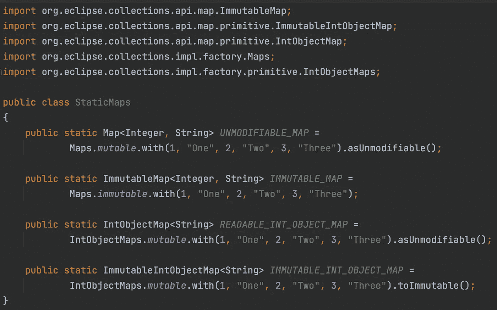
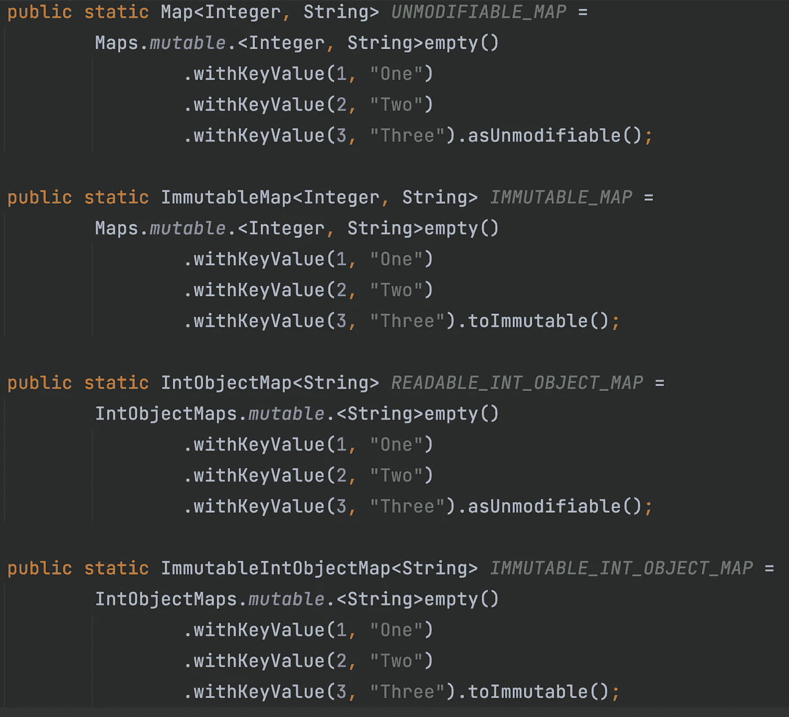

# 如何使用 Eclipse 集合初始化静态地图

> 原文：<https://medium.com/javarevisited/how-to-initialize-a-static-map-using-eclipse-collections-3ea503e1d69d?source=collection_archive---------3----------------------->

使用 [Eclipse 集合](https://github.com/eclipse/eclipse-collections)初始化地图既简单又灵活。

使用对象和图元映射工厂

差不多十年前我回答了下面这个关于栈溢出的问题。

 [## 我如何初始化一个静态地图？

### 我喜欢初始化一个静态的、不可变的 map 的 Guava 方式:static final Map MY _ Map = immutable Map . of(1，" one "，2…

stackoverflow.com](https://stackoverflow.com/questions/507602/how-can-i-initialise-a-static-map/13943037#13943037) 

如果您使用`empty`和`withKeyValue`在 Eclipse 集合中创建一个`MutableMap`，那么您可以根据需要链接任意多的键/值组合。作为最后的转换步骤，您可以使地图同步(`asSynchronized`)、不可修改(`asUnmodifiable`)或不可改变(`toImmutable`)。

使用 empty、withKeyValue、asUnmodifiable 和 toImmutable 创建地图

在下面的博客中，我展示了更多使用 Eclipse 集合流畅地创建地图、列表、集合和包的例子。

 [## 工厂问题—第 3 部分(方法链接)

### 了解如何通过利用 Eclipse 中一些不太为人所知的 API，流畅地在 Java 集合中添加或删除元素…

medium.com](/oracledevs/as-a-matter-of-factory-part-3-method-chaining-224217074d31) 

感谢阅读！尽情享受吧！

*我是由*[*Eclipse Foundation*](https://projects.eclipse.org/projects/technology.collections)*管理的*[*Eclipse Collections*](https://github.com/eclipse/eclipse-collections)*OSS 项目的创建者和提交者。Eclipse Collections 为* [*投稿*](https://github.com/eclipse/eclipse-collections/blob/master/CONTRIBUTING.md) *打开。*

 [## 2022 年 Java 开发者路线图[更新]

### 大家好，首先祝大家 2022 新年快乐。我已经分享了很多成为网络的路线图…

javarevisited.blogspot.com](https://javarevisited.blogspot.com/2019/10/the-java-developer-roadmap.html)  [## 2022 年免费在线学习 Java 的 10 个最佳地点

### 我最喜欢的免费在线学习 Java 的网站，适合初学者和想学习 Java 编码的人…

medium.com](/javarevisited/10-best-places-to-learn-java-online-for-free-ce5e713ab5b2)  [## 十大微服务设计模式和原则-示例

### 让我们看看微服务架构构建的原则。1.可扩展性 2。灵活性 3…

javarevisited.blogspot.com](https://javarevisited.blogspot.com/2021/09/microservices-design-patterns-principles.html)