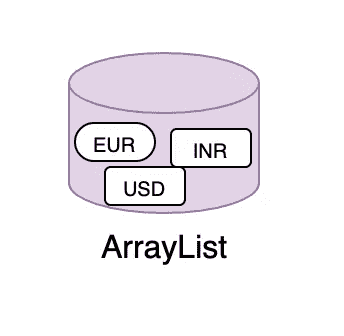

# 如何在 Java 中初始化数组列表

> 原文：<https://medium.com/javarevisited/how-to-initialize-arraylist-in-java-8bb3434e3eb8?source=collection_archive---------1----------------------->

## 分享 Java 中初始化数组列表的 8 种方法

> 最初发表@[https://asyncq.com/](https://asyncq.com/how-to-initialize-arraylist-in-java)

# 介绍

*   Java 集合框架提供了许多数据结构来存储元素，无论是[数组](https://www.java67.com/2018/02/10-examples-of-array-in-java-tutorial.html)、[集合](https://www.java67.com/2021/11/how-to-use-hashset-in-java-set-example.html)、[映射](https://www.java67.com/2017/12/java-8-compute-and-computeifpresent.html)、[堆栈](https://javarevisited.blogspot.com/2017/03/how-to-implement-stack-in-java-using-array-example.html)，还是[队列](https://javarevisited.blogspot.com/2022/02/-stack-and-queue-data-structure-interview-questions.html)。
*   初始化这些数据结构是构建时的一个常见步骤…