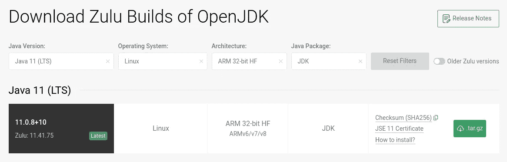
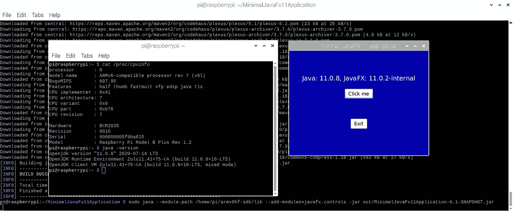

# 如何在采用 ARMv6 处理器的 Raspberry Pi 板上安装和使用 Java 11 和 JavaFX 11

> 原文：<https://medium.com/javarevisited/how-to-install-and-use-java-11-and-javafx-11-on-raspberry-pi-boards-with-armv6-processor-ca7109b76b7c?source=collection_archive---------1----------------------->

在之前的文章[“在 Raspberry Pi 上安装 Java 和 JavaFX”](/javarevisited/installing-java-and-javafx-on-the-raspberry-pi-d68d0ad7b484)中，您可以阅读如何安装 BellSoft LibericaJDK，以便能够在采用 ARMv7 或 ARMv8 处理器的 Raspberry Pi 上运行具有图形用户界面的 Java FX 应用程序。

但是这对于一些(旧的)版本的 Raspberry Pi 来说不起作用，因为这些版本使用的 ARMv6 处理器与默认的 OpenJDK 11 不兼容，open JDK 11 是 Raspbian 操作系统的一部分。

这篇文章将指导你在这些 Raspberry Pi 板版本上使用 Java JDK 和 [JavaFX 11](https://javarevisited.blogspot.com/2020/06/top-5-courses-to-learn-java-fx-in-2020.html) 的步骤。

# 准备 ARMv6 树莓 Pi 板

在这篇文章中，我使用的是旧的 Raspberry Pi B+ 1.2。要确定使用的是哪个 ARM 版本，请检查终端中“cat /proc/cpuinfo”的输出:

```
$ cat /proc/cpuinfo

processor	: 0
model name	: ARMv6-compatible processor rev 7 (v6l)
BogoMIPS	: 697.95
Features	: half thumb fastmult vfp edsp java tls 
CPU implementer	: 0x41
CPU architecture: 7
CPU variant	: 0x0
CPU part	: 0xb76
CPU revision	: 7

Hardware	: BCM2835
Revision	: 0010
Serial		: 000000005f9ba615
Model		: Raspberry Pi Model B Plus Rev 1.2
```

为了清楚地了解不同的主板和 ARM 版本，查看维基百科上的[表格。带 ARMv6 的板有:](https://en.wikipedia.org/wiki/Raspberry_Pi#Specifications)

*   树莓 Pi 1 A 和 A+
*   树莓派 1 B and B+
*   计算模块 1
*   零 1.2、1.3 和 W

# 使用 Raspbian 操作系统准备 SD 卡(完整版)

我们使用[“Imager”](https://www.raspberrypi.org/downloads/)工具在 SD 卡上安装一个全新的 Raspbian 操作系统。

现在，当我们使用 ARMv6 处理器启动 Rasberry Pi 板并检查 Java 版本时，我们会得到以下结果:

```
$ java -version 
Error occurred during initialization of VM 
Server VM is only supported on ARMv7+ VFP
```

正如所料，默认包含的 OpenJDK 是为版本 7 或更高版本构建的，因此在这个基于 ARMv6 的 Raspberry Pi B+ 1.2 上不起作用。

# 关于爪哇 JDK

Java 的源代码可以通过[开源项目 OpenJDK](http://openjdk.java.net/) 获得。所以任何人都可以构建 Java JDK 包——是的，你甚至可以[自己动手](https://hg.openjdk.java.net/jdk-updates/jdk9u/raw-file/tip/common/doc/building.html)！幸运的是，现在有很多免费的预构建版本。

# 安装 Azul 提供的用于 ARMv6 的 Java 11

似乎只有 Azul 提供了 ARMv6 版本，而且是免费的！

[](https://medium.com/javarevisited/10-free-courses-to-learn-java-in-2019-22d1f33a3915?source=collection_home---4------8-----------------------)

让我们从他们的下载页面获取并在我们的 Raspberry Pi 上提取它。

```
$ cd /usr/lib/jvm
$ sudo wget https://cdn.azul.com/zulu-embedded/bin/zulu11.41.75-ca-jdk11.0.8-linux_aarch32hf.tar.gz
$ sudo tar -xzvf zulu11.41.75-ca-jdk11.0.8-linux_aarch32hf.tar.gz
$ sudo rm zulu11.41.75-ca-jdk11.0.8-linux_aarch32hf.tar.gz
$ ls -l
total 12
lrwxrwxrwx  1 root root   21 Jul 23 15:58 java-1.11.0-openjdk-armhf -> java-11-openjdk-armhf
drwxr-xr-x  9 root root 4096 Aug 20 11:41 java-11-openjdk-armhf
drwxr-xr-x  2 root root 4096 Aug 20 11:41 openjdk-11
drwxrwxr-x 10  111  122 4096 Jul 10 16:50 zulu11.41.75-ca-jdk11.0.8-linux_aarch32hf
```

好了，在这里！一个新的 JDK 在我们的董事会上。现在让我们配置操作系统，让它知道这个新的。

```
$ sudo update-alternatives --install /usr/bin/java java /usr/lib/jvm/zulu11.41.75-ca-jdk11.0.8-linux_aarch32hf/bin/java 1
$ sudo update-alternatives --install /usr/bin/javac javac /usr/lib/jvm/zulu11.41.75-ca-jdk11.0.8-linux_aarch32hf/bin/javac 1
```

现在，我们可以选择新的 JDK，使其链接到“java”和“javac”命令。

```
$ sudo update-alternatives --config java
There are 2 choices for the alternative java (providing /usr/bin/java).

  Selection    Path                                                             Priority   Status
------------------------------------------------------------
* 0            /usr/lib/jvm/java-11-openjdk-armhf/bin/java                       1111      auto mode
  1            /usr/lib/jvm/java-11-openjdk-armhf/bin/java                       1111      manual mode
  2            /usr/lib/jvm/zulu11.41.75-ca-jdk11.0.8-linux_aarch32hf/bin/java   1         manual mode

Press <enter> to keep the current choice[*], or type selection number: 2
update-alternatives: using /usr/lib/jvm/zulu11.41.75-ca-jdk11.0.8-linux_aarch32hf/bin/java to provide /usr/bin/java (java) in manual mode

$ sudo update-alternatives --config javac
There are 2 choices for the alternative javac (providing /usr/bin/javac).

  Selection    Path                                                              Priority   Status
------------------------------------------------------------
* 0            /usr/lib/jvm/java-11-openjdk-armhf/bin/javac                       1111      auto mode
  1            /usr/lib/jvm/java-11-openjdk-armhf/bin/javac                       1111      manual mode
  2            /usr/lib/jvm/zulu11.41.75-ca-jdk11.0.8-linux_aarch32hf/bin/javac   1         manual mode

Press <enter> to keep the current choice[*], or type selection number: 2
update-alternatives: using /usr/lib/jvm/zulu11.41.75-ca-jdk11.0.8-linux_aarch32hf/bin/javac to provide /usr/bin/javac (javac) in manual mode
```

如果一切顺利，我们现在应该可以检查 Java 版本了…

```
$ java -version 
openjdk version "11.0.8" 2020-07-14 LTS 
OpenJDK Runtime Environment Zulu11.41+75-CA (build 11.0.8+10-LTS) 
OpenJDK Client VM Zulu11.41+75-CA (build 11.0.8+10-LTS, mixed mode)
```

我们有赢家了！我们现在成功地将默认的 OpenJDK 11(仅在 ARMv7+上工作)替换为在 ARMv6 上工作的 Azul Zulu JDK。

# 使用未编译的 Java 文件进行测试

让我们试试新安装的 Java JDK。从 Java 11 开始，我们可以直接运行 Java 文件而不需要编译它们。让我们用 nano 创建一个简单的文件并运行它。

```
$ cd /home/pi
$ nano HelloWorld.java

public class HelloWorld {
    public static void main (String[] args) {
        System.out.println("Hello World");
    }
}

$ java HelloWorld.java
Hello World
```

完美！Java 像预期的那样工作，但在这个 2014 年的旧板上显示“Hello World”之前需要大约 15 秒。

# JavaFX 的图形用户界面

如果您还想使用 JavaFX 用户界面，则需要额外的步骤，因为该库不包含在 JDK 11 中。它是作为一个独立的开源项目在 [openjfx.io](https://openjfx.io/) 上开发的。主要贡献者和维护者是[胶子](https://gluonhq.com/)。他们还为希望使用 JavaFX 开发桌面和移动应用的公司提供[商业支持](https://gluonhq.com/services/javafx-support/)。

在继续下一步之前，请确保您已成功更新到 Azul Zulu JDK 11。

# 安装 GluonHQ 提供的用于 ARMv6 的 JavaFX 11

我们将在他们的[下载页面](https://gluonhq.com/products/javafx/)上使用 Gluon 提供的免费公开版本。

```
$ cd /home/pi 
$ wget -O javafx.zip https://gluonhq.com/download/javafx-11-0-2-sdk-armv6hf/ 
$ unzip javafx.zip 
$ rm javafx.zip
```

我们现在可以检查在“armv6hf-sdk”中解包的 JavaFX 库:

```
pi@raspberrypi:~ $ ls -l
total 44
drwxr-xr-x 4 pi pi 4096 Mar 12  2019 armv6hf-sdk
drwxr-xr-x 2 pi pi 4096 Aug 20 11:40 Bookshelf
drwxr-xr-x 2 pi pi 4096 Aug 20 12:10 Desktop
...

$ ls -l armv6hf-sdk/
total 8
drwxr-xr-x 8 pi pi 4096 Mar 12  2019 legal
drwxr-xr-x 2 pi pi 4096 Mar 12  2019 lib

$ ls -l armv6hf-sdk/lib/
total 17124
-rw-r--r-- 1 pi pi  845637 Mar 12  2019 javafx.base.jar
-rw-r--r-- 1 pi pi 2761905 Mar 12  2019 javafx.controls.jar
-rw-r--r-- 1 pi pi  143926 Mar 12  2019 javafx.fxml.jar
-rw-r--r-- 1 pi pi 5270589 Mar 12  2019 javafx.graphics.jar
-rw-r--r-- 1 pi pi  294822 Mar 12  2019 javafx.media.jar
-rw-r--r-- 1 pi pi     992 Mar 12  2019 javafx.platform.properties
-rw-r--r-- 1 pi pi     113 Mar 12  2019 javafx.properties
-rw-r--r-- 1 pi pi   41802 Mar 12  2019 javafx-swt.jar
-rw-r--r-- 1 pi pi  786021 Mar 12  2019 javafx.web.jar
-rwxr-xr-x 1 pi pi   61200 Mar 12  2019 libdecora_sse.so
-rwxr-xr-x 1 pi pi   31428 Mar 12  2019 libglass_monocle.so
-rwxr-xr-x 1 pi pi   15946 Mar 12  2019 libglass_monocle_x11.so
-rwxr-xr-x 1 pi pi  200074 Mar 12  2019 libglass.so
-rwxr-xr-x 1 pi pi   22409 Mar 12  2019 libjavafx_font_freetype.so
-rwxr-xr-x 1 pi pi   20508 Mar 12  2019 libjavafx_font_pango.so
-rwxr-xr-x 1 pi pi   15206 Mar 12  2019 libjavafx_font.so
-rwxr-xr-x 1 pi pi  231402 Mar 12  2019 libjavafx_iio.so
-rwxr-xr-x 1 pi pi   43339 Mar 12  2019 libprism_common.so
-rwxr-xr-x 1 pi pi   54506 Mar 12  2019 libprism_es2_monocle.so
-rwxr-xr-x 1 pi pi   56505 Mar 12  2019 libprism_sw.so
-rw-r--r-- 1 pi pi 6598638 Mar 12  2019 src.zip
```

# 使用最小的 JavaFX 应用程序进行测试

我们将重用在这篇文章[“pi Java—第 4 部分—用 Maven 构建一个最小的 JavaFX 11 应用程序”](https://webtechie.be/post/2019-04-01-pijava-part-4-building-a-minimal-javafx-11-application-with-maven/)中创建的最小 JavaFX 应用程序。首先，我们需要从 GitHub 克隆源代码:

```
$ cd /home/pi 
$ git clone [https://github.com/FDelporte/MinimalJavaFx11Application.git](https://github.com/FDelporte/MinimalJavaFx11Application.git)
```

为了能够构建应用程序，我们还需要安装 Maven。

```
$ sudo apt install maven
```

现在让我们构建应用程序:

```
$ cd MinimalJavaFx11Application 
$ mvn clean package
```

这将需要一些时间，因为所有的依赖项都需要下载。

完成后，我们现在可以使用下面的 start 命令运行应用程序，该命令指向下载的 JavaFX 库和在“MinimalJavaFx11Application”的输出目录中生成的 jar-application:

```
$ sudo java --module-path /home/pi/armv6hf-sdk/lib 
      --add-modules=javafx.controls 
      -jar /home/pi/MinimalJavaFx11Application/out/MinimalJavaFx11Application-0.1-SNAPSHOT.jar
```

我们做到了！运行在 ARMv6 Raspberry Pi B+ 1.2 上的 JavaFX！！！



# 结论

与拥有更快处理器和更多内存的最新 Raspberry Pi 相比，该应用程序在我 6 年前的测试板上启动速度慢了很多。但是很管用！是的，真的，有用:-)

这个小小的超级英雄板再次证明了它能够处理任何事情，甚至是旧处理器上最现代的 Java 版本。

如果你喜欢视频，这里有来自【Java 访问 Youtube 频道关于[如何在 Raspberry PI 上安装 Java](https://www.youtube.com/watch?v=QVkSSeoW8QI)的视频

如果你喜欢这个视频并想了解更多，你也可以在这里查看完整的课程— [在树莓派上使用 Java 和 Java FX](https://bit.ly/3jrtns3)

*原载于*[*https://web techie . be*](https://webtechie.be/post/2020-08-27-azul-zulu-java-11-and-gluon-javafx-11-on-armv6-raspberry-pi/)*。*