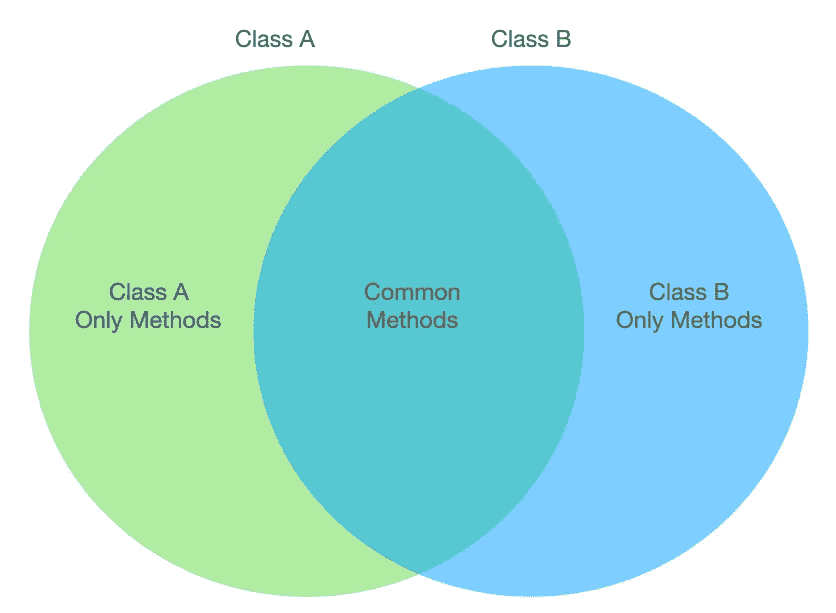
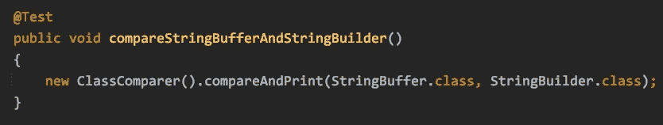
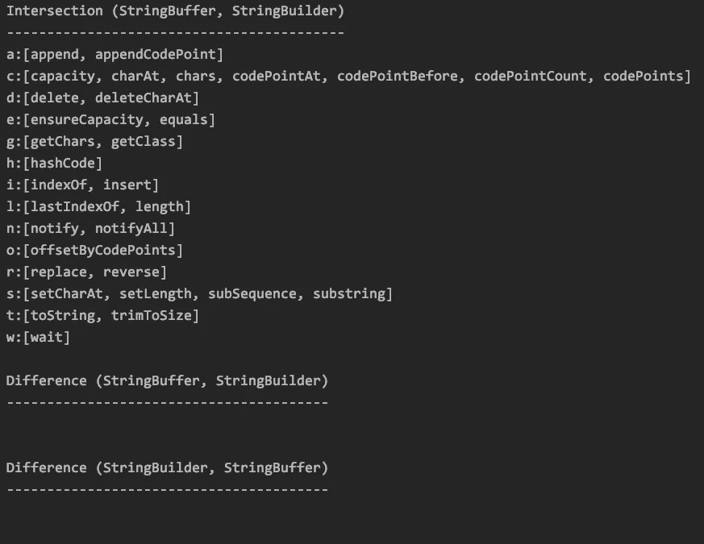
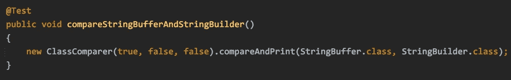
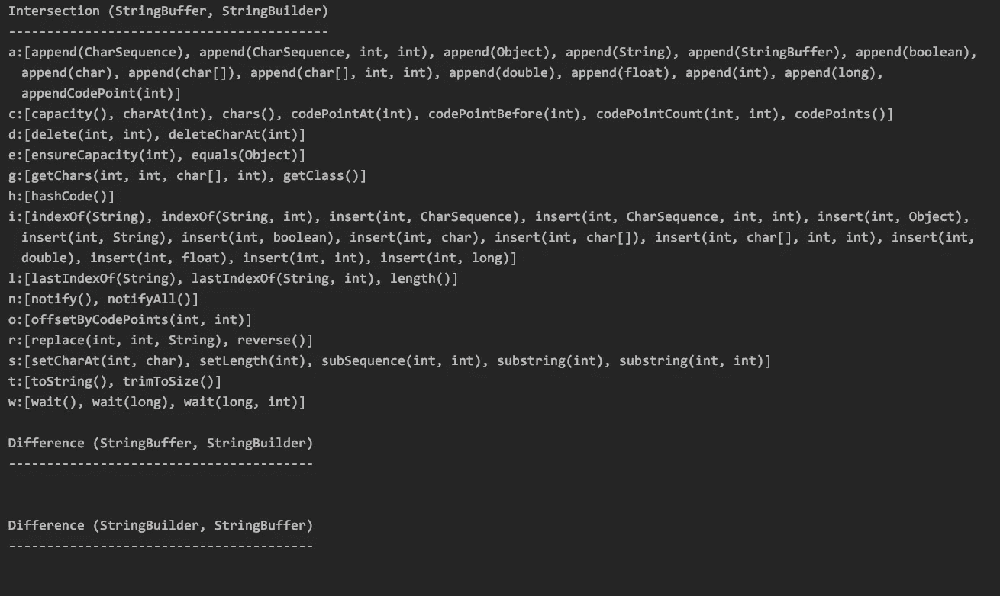
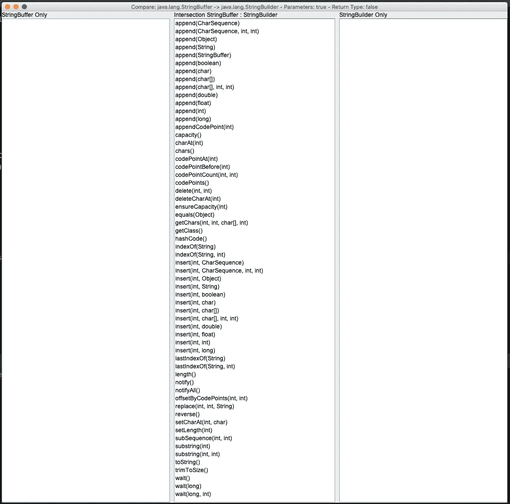
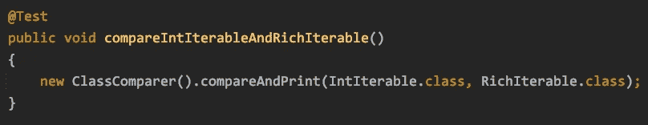
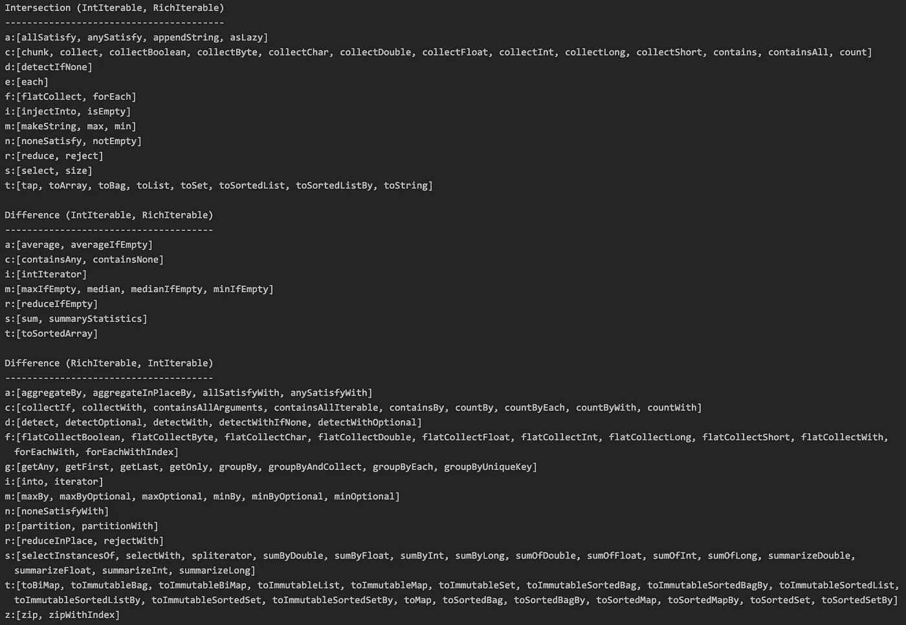
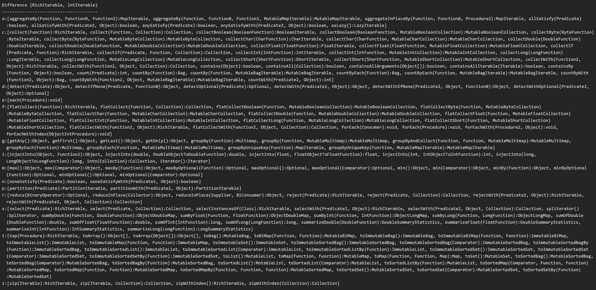
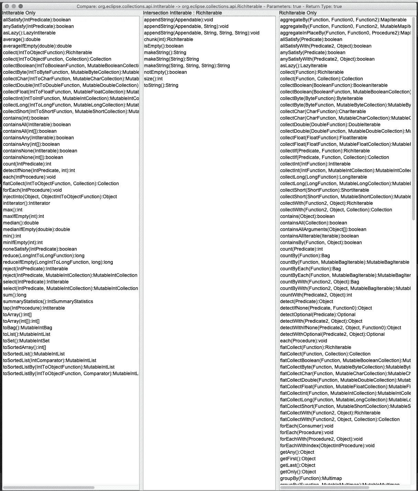

# 如何在 Java 中自省并发现类之间的概念对称性

> 原文：<https://medium.com/javarevisited/how-to-introspect-and-find-conceptual-symmetry-between-classes-in-java-696999b7eeda?source=collection_archive---------3----------------------->

演示用 Eclipse 集合构建的实用程序类`ClassComparer`。

[杰克·弗伦奇](https://unsplash.com/@throughjackseyes?utm_source=medium&utm_medium=referral)在 [Unsplash](https://unsplash.com?utm_source=medium&utm_medium=referral) 上的照片

# 富 API 的挑战

丰富的 API 可能很棒。通过提供许多有用的通用行为，它们可以显著减少代码的重复。有时，类的不同实现具有相似的丰富的方法签名集。Java 中的一些类在概念上是等价的，即使它们不共享定义该行为的公共父抽象。

问题是，作为人类，我们有时需要帮助来确定和理解概念上相同的类之间的细微差别。解析和比较 Java 源文件或 Javadoc 中长达数百行的文本既费力又容易出错。有时候我们会错过一些东西。电脑可以帮助我们，所以我们可以识别和理解模式。

[Eclipse Collections](https://github.com/eclipse/eclipse-collections) 是一个库，它的主要设计目标是在其 API 中提供良好的对称性。考虑到 Eclipse 集合 API 的规模，这个目标非常难以实现。Eclipse Collections API 在过去 18 年中发展如此之快，我需要一些帮助来完全理解它。

# 用于比较类的解决方案

几年前，我在一个实用程序类中编写了一些代码，用于比较两个类中的方法签名。该实用程序利用 Java 中可用的方法来自省类，以及 Eclipse 集合中可用的数据结构和算法来比较这些方法。

我写的比较类的实用程序没有什么特别令人惊奇的地方。我在以前的博客中分享过早期版本的源代码(链接到最后)。直到最近，当我不得不将代码复制到我当前的 Eclipse Collections 项目并修改它以便比较`IntIterable`和`RichIterable`时，我才决定将它包含在 Eclipse Collections `eclipse-collections-testutils`模块中是有用的，这样我就可以很容易地在任何需要比较丰富 API 的项目中使用它。

该实用程序执行以下操作:

*   使用`getMethods`读取每个`Class`的方法
*   可选地使用`getParameters`读取每个`Method`的参数
*   可以选择包含每个方法的返回类型
*   将每个方法的一个`String`添加到两个`MutableSortedSet`实例之一
*   计算两组方法的交集
*   计算两组方法在两个方向上的差异
*   输出按字母顺序排序的方法，并按其首字母进行分组

在名为`ClassComparer`的实用程序类中还有一些其他有用的方法，但这是它的主要目的。

## 保持简单

该实用程序在两个类的方法签名之间创建一个等效的维恩图。聪明的地方在于，如果有的话，实用程序类将允许您在方法签名比较中可选地包括参数类型和返回类型。通过排除参数类型和返回类型，我们能够通过简单地比较方法名来确定两个类是否具有良好的概念对称性。

# 简单的比较

作为比较的第一个例子，我将比较`StringBuffer`和`StringBuilder`。注意:我在本地 Eclipse Collections 项目中使用了这段代码，该项目目前使用的是 Java 8。`StringBuilder`是作为 Java 5 中`StringBuffer`的替代物引入的，所以我们希望它们有相同的方法签名。从概念上讲，它们是相同的。当我们更深入地挖掘细节时，我们会发现它们有微妙的区别。

下面是比较这两个类所需的代码，不包括参数类型或返回类型。

比较 StringBuffer.class 和 StringBuilder.class

这个特定的方法将进行比较，并输出一个文本版本的`StringBuffer`和`StringBuilder`类的交集和双向差。因为我使用了默认的构造函数，所以方法参数类型和返回类型被排除在比较之外。

StringBuffer 和 StringBuilder 的交集和差异的输出

现在，让我们比较在方法中包含参数时的输出。

将第一个标志设置为 true 可以包含方法参数类型

下面是包含方法参数的输出。

使用参数类型比较 StringBuffer 和 StringBuilder 的输出

这些类看起来还是一样的。因此，让我们通过将`ClassComparer`构造函数中的第二个标志设置为`true`来包含返回类型。

将第二个标志设置为 true 可以包含方法返回类型

现在输出看起来大不相同了。

使用参数和返回类型比较 StringBuffer 和 StringBuilder 的输出

许多方法签名要么返回`StringBuffer`要么返回`StringBuilder`。两者都有一个名为`AbstractStringBuilder`的父抽象，它定义了许多类似`append`的方法，这些方法从两个子类中调用，并被覆盖以返回特定的返回类型。这就是为什么方法的数量在双向差异中显著增长。

# 一个实验性的 Swing UI

我决定构建一个快速原型 Swing UI 来显示`ClassComparer`的交集和差异。Swing UI 在快速比较差异方面更好，因为它使用三窗格列表视图，这或多或少模拟了维恩图，只是没有重叠的圆圈。

下面是比较上面两个类的 Swing UI 的样子。

## 排除参数和返回类型

Swing UI 比较 StringBuffer 和 StringBuilder，不包括参数和返回类型

## 包括参数类型

Swing UI 比较 StringBuffer 和 StringBuilder，仅包括参数类型

## 包括参数和返回类型

Swing UI 比较 StringBuffer 和 StringBuilder，包括参数和返回类型

# 在 Eclipse 集合 API 中寻找不对称性

为了说明在 Eclipse 集合上工作的开发人员如何使用这个实用程序来发现在改善对称性方面需要完成的潜在工作，我将比较一个原始集合接口和它在对象端的对等接口。

## `IntIterable`与`RichIterable`

首先，让我们从纯概念的角度比较一下`IntIterable`和`RichIterable`的方法签名。我们可以通过在`ClassComparer`上使用不带参数的构造函数来做到这一点。

比较不可改变的和可丰富的接口

输出显示了基元集合父类型和对象集合父类型之间一些有趣的差异，甚至在概念级别。概念对称是我们在 Eclipse 集合中最关心的问题。显然，我们在这一领域有很多工作要做。

比较不可更改接口和可丰富接口的输出

在实验性的 Swing UI 中查看相同的输出，可以看到文本输出的一个优点，即按照方法的首字母对方法进行分组。在文本输出中不需要滚动，在三窗格 Swing UI 中，所有方法都不适合屏幕，所以需要滚动。

Swing UI 比较了不可改变和可丰富

看看当我们在比较中向方法添加参数类型和返回类型时，文本输出会发生什么。

输出的第 1 部分比较了不可改变和可丰富，包括参数和返回类型

输出的第 2 部分比较了不可改变和可丰富，包括参数和返回类型

正如我们所看到的，在 Eclipse 集合`RichIterable`和`IntIterable`接口中有相当多的方法被重载。使用不带方法参数和返回类型的概念视图隐藏了这些细节。这个细节很重要，所以两种观点都有价值。

这是 Swing UI 在这个更大的比较中的样子。

Swing UI 比较了不可改变和可丰富，包括参数和返回类型

Swing UI 对于这种特殊的比较可能更有用，因为在这两种情况下都需要滚动。

# 敬请期待

`ClassComparer`的代码将在即将发布的 Eclipse Collections 11.0 版本中提供。它位于`eclipse-collections-testutils`模块中。如果您想查看代码，现在可以在下面链接的 Eclipse Collections repo 中找到。

 [## 主 eclipse/eclipse-collections 上的 eclipse-collections/class comparer . Java

### Eclipse Collections 是一个面向 Java 的集合框架，具有优化的数据结构和丰富的、功能性的…

github.com](https://github.com/eclipse/eclipse-collections/blob/master/eclipse-collections-testutils/src/main/java/org/eclipse/collections/impl/test/ClassComparer.java) 

下面的博客中有一个旧版本的代码，这是我第一次开始探索如何更容易理解富 API 之间的差异。

 [## 从最简到丰富的 Java APIs

### 将简单易学与减少代码重复相结合，以提高生产率。

medium.com](/oracledevs/graduating-from-minimal-to-rich-java-apis-c50192c8322f) 

我已经使用了`ClassComparer`工具来生成这个博客中的所有例子。Swing UI 代码是一个单独类的一部分，还没有包含在 Eclipse 集合中。我需要与其他 Eclipse 集合提交者讨论包含 swing 代码的可能性。Eclipse Collections `eclipse-collections-testutils`模块包含任何 UI 代码是独一无二的，所以我不能对它的到来做出任何承诺。现在，这里是实验性 Swing UI 代码的要点。

我希望你觉得这很有用。感谢阅读！

*我是*[*Eclipse Collections*](https://github.com/eclipse/eclipse-collections)*OSS 项目在*[*Eclipse Foundation*](https://projects.eclipse.org/projects/technology.collections)*的项目负责人。* [*月食收藏*](https://github.com/eclipse/eclipse-collections) *是开投* [*投稿*](https://github.com/eclipse/eclipse-collections/blob/master/CONTRIBUTING.md) *。如果你喜欢这个库，你可以在 GitHub 上让我们知道。*

您可能想探索的其他 Java 资源文章

 [## 2021 年 Java 程序员路线图

### 2021 年成为 Java 开发人员的图解指南，包含相关课程的链接

medium.com](/javarevisited/the-java-programmer-roadmap-f9db163ef2c2)  [## 2021 年将加入 11 门高级核心 Java 在线课程

### 这些是核心 java 开发人员学习多线程、集合、JVM 等技能的最佳在线课程

medium.com](/javarevisited/11-advanced-core-java-online-courses-to-join-in-2021-46011661257a)  [## 面向 Java 程序员的 7 门最佳 WebFlux 和反应式 Spring Boot 课程

### 我最喜欢的课程 2021 年学习 Java 中的反应式编程使用 WebFlux、RxJava 和反应式 Spring Boot 来自…

medium.com](/javarevisited/7-best-webflux-and-reactive-spring-boot-courses-for-java-programmers-33b7c6fa8995)